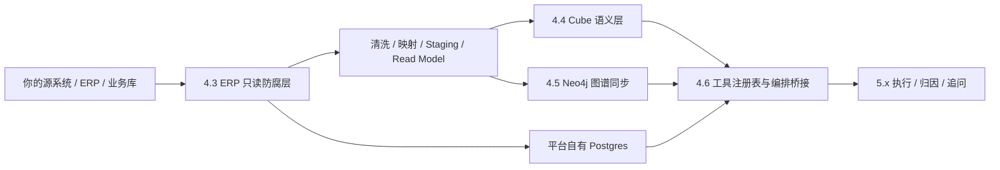

# 数据接入协作蓝图

## 1. 这份文档解决什么问题

这份蓝图不是讲“系统要开发什么”，而是明确：

- 你需要在哪一步提供什么业务信息
- 我会把这些信息落成哪些系统能力
- 真实业务数据会先进入哪一层
- `Postgres / Cube / Neo4j` 分别承接什么职责
- 当前阶段是否需要后台导入页面

## 2. 先说结论

### 推荐协作方式

当前项目推荐采用 **系统对系统接入**，而不是先做人工导入页面。

也就是说：

1. 你提供真实业务表结构、字段语义、指标口径、实体关系、权限规则。
2. 我们在服务端建立读取、清洗、映射、同步和查询能力。
3. 平台再把数据分别送入：
   - 平台自有 `Postgres`
   - `Cube`
   - `Neo4j`

### 不推荐的默认方式

- 不推荐你先手工把所有数据直接灌进 `Cube / Neo4j / pg`
- 不推荐把“数据清洗”推迟到执行 story 再边做边补
- 不推荐当前先做“后台 Excel/CSV 导入页面”，除非第一批数据根本不在现有系统里

## 3. 角色分工

### 你负责提供

- 第一批要接入的业务域
- 源表清单
- 字段含义
- 主键 / 关联键
- 指标口径
- 实体关系
- 权限规则
- 已知数据问题
- 脱敏样例数据

### 我负责落地

- ERP 只读接入边界
- 字段映射与清洗方案
- staging / read model 方案
- Cube 语义层建模
- Neo4j 节点 / 边建模
- 同步任务与查询 adapter
- 产品侧调用链与权限控制

## 4. 接入路径总览



## 5. 什么时候提供什么

### 阶段 A：开始 4.3 前

你要提供：

- 第一批业务域范围
  - 例如：收费、工单、投诉、满意度
- 源表清单
- 字段说明
- 关联关系
- 业务权限规则
- 脱敏样例数据

我会产出：

- ERP 读取边界设计
- 字段映射草案
- 清洗 / staging 草案
- 第一批接入优先级

### 阶段 B：开发 4.3 时

你要补充：

- 字段歧义解释
- 历史口径差异
- 哪些字段不可用 / 不可信
- 哪些表是事实主表，哪些只是辅助表

我会产出：

- 只读 adapter
- scope 过滤方案
- 清洗 / 映射 / staging 实现
- 平台内部统一 read model

### 阶段 C：开发 4.4 时

你要提供：

- 指标定义
- 维度定义
- 时间粒度
- 过滤规则
- 口径说明

我会产出：

- Cube semantic model
- metric query contract
- 指标查询 adapter

### 阶段 D：开发 4.5 时

你要提供：

- 实体定义
- 关系定义
- 哪些关系是事实关系
- 哪些关系是候选影响关系
- 哪些因果边只是经验规则

我会产出：

- Neo4j 节点 / 边模型
- 图谱同步规则
- graph query adapter

### 阶段 E：开发 4.6 时

你通常不需要再手工整理底层结构，只需要确认：

- 哪些能力应对外作为分析工具暴露
- 哪些结果可用于解释
- 哪些结果不能直接展示给用户

我会产出：

- 统一 tool registry
- orchestration bridge
- 后续执行 story 的真实能力底座

## 6. 你最先要填的内容

### 6.1 第一批业务域选择

建议一次先接 `1-2` 个业务域，不要全量铺开。

**推荐优先级示例：**

1. 收费
2. 工单
3. 投诉
4. 满意度

**当前你的选择：**

- 第一优先业务域：
- 第二优先业务域：
- 暂不纳入第一批的业务域：

### 6.2 源表清单模板

请按下面格式填写：

| 业务域 | 表名 | 用途 | 主键 | 关键关联键 | 时间字段 | 备注 |
|---|---|---|---|---|---|---|
| 示例：收费 | fee_bill | 账单主表 | bill_id | project_id, owner_id, room_id | bill_month, created_at | 历史数据口径有变化 |
|  |  |  |  |  |  |  |
|  |  |  |  |  |  |  |

### 6.3 字段说明模板

对关键表补下面信息：

| 表名 | 字段名 | 含义 | 类型 | 是否必填 | 是否脏字段 | 示例值 | 备注 |
|---|---|---|---|---|---|---|---|
|  |  |  |  |  |  |  |  |
|  |  |  |  |  |  |  |  |

### 6.4 实体关系模板

| 左实体 | 关系 | 右实体 | 来源 | 是否稳定事实 | 备注 |
|---|---|---|---|---|---|
| 项目 | 包含 | 楼栋 | ERP 主数据 | 是 |  |
| 楼栋 | 包含 | 房间 | ERP 主数据 | 是 |  |
| 房间 | 关联 | 业主 | ERP 主数据 | 是 | 历史业主变更需说明 |
| 工单 | 发生于 | 项目 | 工单主表 | 是 |  |
| 投诉 | 影响 | 满意度 | 业务规则 | 否 | 候选因果边 |

### 6.5 指标定义模板

| 指标名 | 业务定义 | 计算公式 | 主事实表 | 时间粒度 | 维度 | 过滤规则 | 备注 |
|---|---|---|---|---|---|---|---|
| 收缴率 | 实收 / 应收 | paid_amount / receivable_amount | fee_bill | 月 | 项目、区域 | 剔除作废单 |  |
|  |  |  |  |  |  |  |  |

### 6.6 权限规则模板

| 对象 | 权限切片维度 | 规则说明 | 来源系统 | 备注 |
|---|---|---|---|---|
| 分析用户 | 组织 | 用户只能看所属组织 | ERP 权限 |  |
| 分析用户 | 项目 | 用户只能看授权项目 | ERP 权限 |  |
| 分析用户 | 区域 | 区域权限可叠加 | ERP 权限 |  |

### 6.7 数据问题模板

请列出你已知的数据问题：

| 表名 | 问题类型 | 问题描述 | 影响范围 | 建议处理 |
|---|---|---|---|---|
|  | 空值 |  |  |  |
|  | 重复 |  |  |  |
|  | 状态码混乱 |  |  |  |
|  | 历史口径变化 |  |  |  |

## 7. 三种数据落点分别干什么

### 平台自有 Postgres

用途：

- 平台自己的会话、计划、执行记录、结论、审计、反馈
- 少量平台 read model
- 不是你的 ERP 原始业务库替代品

你通常不需要手工往这里灌业务底层事实表。

### Cube

用途：

- 指标治理
- 聚合查询
- 同口径度量
- 维度钻取

适合放：

- 收缴率
- 投诉率
- 工单时效
- 满意度趋势
- 项目 / 区域 / 时间粒度聚合结果

不适合放：

- 复杂实体关系推理
- 任意脏表直接裸查

### Neo4j

用途：

- 实体关系
- 候选因素扩展
- 关系路径
- 因果边 / 影响边

适合放：

- 项目 -> 楼栋 -> 房间 -> 业主
- 项目 -> 工单 -> 投诉 -> 满意度
- 业务认可的候选影响关系

不适合放：

- 主要指标聚合计算
- 报表式 group by 查询

## 8. 当前是否需要后台导入页面

### 默认答案

当前 **不建议先做后台导入页面**。

原因：

- 你的数据已经在真实业务系统里
- 当前主线问题是“如何正确接入、清洗、建模和同步”
- 不是“让业务人员手工上传文件”

### 什么时候才考虑导入页面

只有以下情况才建议补导入页面 story：

- 第一批数据不在 ERP / 数据库，只在 Excel / CSV
- 需要业务人员手工维护少量映射表
- 图谱因果边需要人工维护后台

如果出现这些情况，再单独补 story，不建议混在主线里。

## 9. 推荐的实际协作节奏

### 你现在最应该做的

先不要想着把 `Cube / Neo4j / pg` 自己处理完。

你只需要先给我：

1. 第一批要接入的 `1-2` 个业务域
2. 这几个业务域的源表清单
3. 每张表的关键字段说明
4. 3-10 条脱敏样例数据
5. 你认定最重要的 `3-5` 个指标
6. 你认定最关键的实体关系
7. 权限规则

### 我收到后会做什么

1. 帮你整理成平台字段映射
2. 划出哪些进 `4.3`
3. 划出哪些进 `4.4`
4. 划出哪些进 `4.5`
5. 再把它们转成可开发任务

## 10. 第一轮建议范围

如果你希望尽快落地，我建议第一轮就做：

- 业务域：收费 + 工单
- 指标：
  - 收缴率
  - 工单响应时长
  - 工单关闭时长
- 关系：
  - 项目 / 楼栋 / 房间
  - 房间 / 业主
  - 项目 / 工单
  - 工单 / 投诉

这样最容易先跑通：

- ERP 读边界
- Cube 指标层
- Neo4j 关系层
- 后续归因分析链路

## 11. 你回填时的最小清单

你下一次给我内容时，最少给下面这些就够了：

```text
1. 第一批业务域：
2. 表清单：
3. 每张表主键和关联键：
4. 核心时间字段：
5. 3-5 个最重要指标及公式：
6. 项目/区域/组织权限规则：
7. 3-10 条脱敏样例数据：
8. 已知数据坑：
```

## 12. 对应当前故事线

- `Story 4.3`
  - 真实 ERP 数据第一次进入产品
  - 完成只读接入、字段映射、清洗、权限切片
- `Story 4.4`
  - 把适合做指标语义层的数据接入 Cube
- `Story 4.5`
  - 把适合做关系和候选因素的数据接入 Neo4j
- `Story 4.6`
  - 把这些真实能力统一挂成分析工具

---

如果你愿意，下一步我可以直接根据这份蓝图，再帮你起一份
**“第一批业务域接入问卷”**
版本，让你更容易一次性把需要的信息给我。
