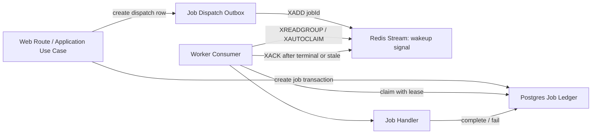
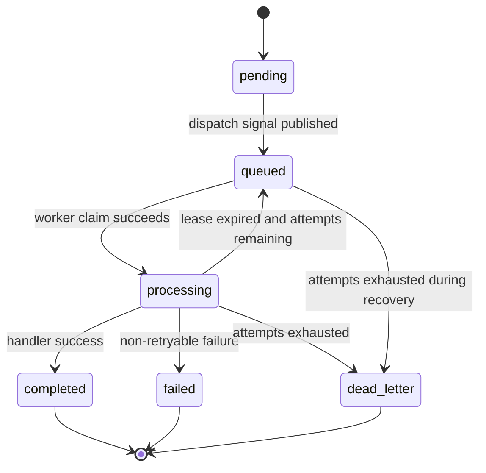

# Postgres-backed Durable Job Ledger Architecture

## 背景

当前 worker job queue 已从 `lPush + rPop` 升级为 Redis Streams consumer group，解决了 worker 崩溃后 Redis pending entry 可重投递的问题。但 job 的完整状态、结果、错误和 attempt 计数仍然保存在 Redis key 中，Redis 仍承担事实源职责。

这对生产交付仍不够稳健：

- Redis 持久性取决于部署配置，AOF/RDB 窗口内仍可能丢失 job 事实。
- Redis Stream pending list 只能证明“消息未 ack”，不能作为长期审计 ledger。
- 任务完成、失败、DLQ、重试、worker lease 等关键状态需要可查询、可审计、可恢复。
- 未来分析执行、follow-up、审计和运维排障都需要围绕同一个 job 事实源收敛。

因此需要把 job 的最终事实源迁到 Postgres，Redis 只保留唤醒和分发职责。

## 决策

采用 `Postgres durable job ledger + Redis dispatch signal` 架构。

- Postgres 是 job 的 canonical source of truth。
- Redis Streams 只保存轻量分发信号，stream message 只携带 `jobId` 和必要的 trace metadata。
- worker 消费 Redis 信号后，必须到 Postgres 原子 claim job，claim 成功才允许执行。
- job 状态、attempt、lease、结果、错误、DLQ、事件审计全部写入 Postgres。
- Redis ack 失败不改变 job 事实；重复 Redis 信号必须通过 Postgres 状态机幂等处理。
- Postgres 写入失败时不能 enqueue Redis，必须 fail loud。

目标语义是 `at-least-once dispatch + Postgres-authoritative execution state`。这不等于 exactly-once，业务 handler 仍必须保持幂等。

## 目标状态

### 逻辑组件



### 分层边界

- `domain/job-contract`：保留 job 类型、payload 校验、状态语义。新增状态必须从这里定义。
- `application/job`：定义 durable job orchestration port，不暴露 Redis 细节。
- `infrastructure/postgres`：实现 ledger、event store、outbox store。
- `infrastructure/job`：实现 `PostgresBackedJobQueue`，组合 Postgres ledger 与 Redis dispatcher。
- `worker`：只依赖 application use cases；不直接操作 ledger 表。
- `app/api`：submit path 只调用 application use cases；不直接写 Redis。

## 数据模型

新增平台自有表，位于现有 `platform` schema。Drizzle schema 与 migration 必须同步提交。

### `platform.jobs`

| 字段 | 类型 | 说明 |
| --- | --- | --- |
| `id` | `text primary key` | job id；analysis execution 当前可继续使用 execution id |
| `type` | `text not null` | job type，例如 `health-check`、`analysis-execution` |
| `status` | `text not null` | `pending`、`queued`、`processing`、`completed`、`failed`、`dead_letter` |
| `payload` | `jsonb not null` | job data，保留原 `Job.data` 语义 |
| `result` | `jsonb` | terminal success result |
| `error` | `text` | terminal failure 或 DLQ 原因 |
| `attempt_count` | `integer not null default 0` | 已 claim 执行次数 |
| `max_attempts` | `integer not null default 3` | 最大执行次数 |
| `available_at` | `timestamptz not null` | 支持延迟重试和补偿调度 |
| `locked_by` | `text` | 当前 worker consumer name |
| `locked_until` | `timestamptz` | Postgres authoritative visibility timeout |
| `redis_stream_entry_id` | `text` | 最近一次 Redis stream entry id，仅用于排障和 ack |
| `dispatch_status` | `text not null default 'pending'` | `pending`、`dispatched`、`acknowledged`、`dispatch_failed` |
| `owner_user_id` | `text` | 可选审计维度，从 payload 提取 |
| `organization_id` | `text` | 可选审计/运维查询维度 |
| `session_id` | `text` | analysis job 查询维度 |
| `origin_correlation_id` | `text` | 跨进程 trace 维度 |
| `created_at` | `timestamptz not null` | 创建时间 |
| `updated_at` | `timestamptz not null` | 更新时间 |
| `started_at` | `timestamptz` | 首次开始处理时间 |
| `completed_at` | `timestamptz` | 完成时间 |
| `failed_at` | `timestamptz` | 失败或 DLQ 时间 |

建议索引：

- `jobs_status_available_at_idx(status, available_at)`
- `jobs_locked_until_idx(locked_until)` where status = `processing`
- `jobs_owner_user_id_idx(owner_user_id)`
- `jobs_session_id_idx(session_id)`
- `jobs_dispatch_status_idx(dispatch_status, updated_at)`
- `jobs_created_at_idx(created_at)`

### `platform.job_events`

用于审计和排障，不替代 `jobs` 当前状态。

| 字段 | 类型 | 说明 |
| --- | --- | --- |
| `id` | `text primary key` | event id |
| `job_id` | `text not null references platform.jobs(id)` | job id |
| `event_type` | `text not null` | `created`、`dispatched`、`claimed`、`completed`、`failed`、`lease_expired`、`dead_lettered` |
| `from_status` | `text` | 状态迁移前 |
| `to_status` | `text` | 状态迁移后 |
| `worker_id` | `text` | worker consumer name |
| `message` | `text` | 人类可读原因 |
| `metadata` | `jsonb not null default '{}'::jsonb` | attempt、stream entry、error kind 等 |
| `created_at` | `timestamptz not null` | 事件时间 |

建议索引：

- `job_events_job_id_created_at_idx(job_id, created_at)`
- `job_events_event_type_created_at_idx(event_type, created_at)`

### `platform.job_dispatch_outbox`

推荐采用 transactional outbox，避免 `jobs` commit 成功但 Redis `XADD` 失败导致 job 没有唤醒信号。

| 字段 | 类型 | 说明 |
| --- | --- | --- |
| `id` | `text primary key` | outbox event id |
| `job_id` | `text not null references platform.jobs(id)` | job id |
| `status` | `text not null` | `pending`、`published`、`failed` |
| `attempt_count` | `integer not null default 0` | publish 尝试次数 |
| `last_error` | `text` | 最近一次 publish 错误 |
| `redis_stream_entry_id` | `text` | XADD 返回值 |
| `created_at` | `timestamptz not null` | 创建时间 |
| `updated_at` | `timestamptz not null` | 更新时间 |
| `published_at` | `timestamptz` | 成功 publish 时间 |

建议索引：

- `job_dispatch_outbox_status_updated_at_idx(status, updated_at)`
- `job_dispatch_outbox_job_id_idx(job_id)`

## 状态机



状态约束：

- `completed`、`failed`、`dead_letter` 是 terminal 状态。
- terminal 状态不能重新 claim；重复 Redis signal 只允许 ack 后忽略。
- `attempt_count` 只在 Postgres claim 成功时递增。
- `locked_until` 是恢复判断的权威字段，Redis pending idle time 只作为辅助分发机制。

## 核心流程

### Submit

推荐实现为单个 Postgres transaction：

1. 校验 job payload。
2. 插入 `platform.jobs`，状态为 `pending`。
3. 插入 `platform.job_events(created)`。
4. 插入 `platform.job_dispatch_outbox(pending)`。
5. transaction commit。
6. outbox publisher 执行 Redis `XADD`，message 至少包含 `jobId`。
7. publish 成功后更新 `jobs.status = 'queued'`、`dispatch_status = 'dispatched'`、`redis_stream_entry_id`，并写入 `job_events(dispatched)`。

如果 Redis 暂时不可用，job 仍保留在 Postgres `pending + outbox.pending`，后续 outbox publisher 会重试。Web submit 可以返回已创建 job，也可以根据产品语义返回“已接收但等待调度”。不能把 Redis publish 失败伪装成已完成。

### Consume / Claim

Redis Stream message 只是一条 wakeup signal。worker 拿到 message 后执行 Postgres claim：

```sql
update platform.jobs
set
  status = 'processing',
  attempt_count = attempt_count + 1,
  locked_by = $worker_id,
  locked_until = now() + $lease_interval,
  started_at = coalesce(started_at, now()),
  updated_at = now()
where id = $job_id
  and status in ('pending', 'queued', 'processing')
  and available_at <= now()
  and (locked_until is null or locked_until < now())
  and attempt_count < max_attempts
returning *;
```

claim 结果：

- 返回 1 行：worker 获得执行权，开始执行 handler。
- 返回 0 行且 job 是 terminal：这是重复或过期 Redis signal，worker 应 `XACK` 并忽略。
- 返回 0 行且 job 仍被其他 worker lock：不要执行，保留 Redis pending 或 ack 后依赖 recovery 重新 dispatch。推荐 ack 并依赖 Postgres recovery，避免 Redis pending list 成为第二事实源。
- attempts 已耗尽：在 Postgres 标记 `dead_letter`，写事件，然后 ack Redis signal。

### Complete / Fail

worker handler 完成后：

1. 在 Postgres 更新 job terminal 状态，写 `result` 或 `error`。
2. 清空 `locked_by`、`locked_until`。
3. 写 `job_events(completed|failed|dead_lettered)`。
4. 再执行 Redis `XACK`。

如果 Postgres terminal update 成功但 Redis `XACK` 失败，系统仍以 Postgres terminal 状态为准。Redis 后续重投递同一个 `jobId` 时，worker 会发现 job 已 terminal，直接 ack 并忽略。

### Recovery

需要一个轻量 recovery loop，可放在 worker 进程内，也可作为独立 CLI/cron：

- 发布 `job_dispatch_outbox.status = 'pending'` 或 `failed` 且达到重试间隔的 outbox rows。
- 将 `processing` 且 `locked_until < now()` 的 job 重新置为 `queued`，写 `lease_expired` 事件，并重新 dispatch。
- 将 `attempt_count >= max_attempts` 且非 terminal 的 job 标记为 `dead_letter`。
- 定期扫描 `dispatch_status = 'dispatch_failed'` 的 job，保留真实错误并继续重试或报警。

Recovery 必须以 Postgres 为准，不依赖 Redis 中是否还有旧 stream entry。

## Application Port 设计

为降低迁移风险，第一阶段可以保留现有 `JobQueue` port 形状：

```ts
export interface JobQueue {
  submit(submission: JobSubmission): Promise<Job>;
  consume(): Promise<Job | null>;
  updateStatus(jobId: string, update: JobStatusUpdate): Promise<void>;
  getById(jobId: string): Promise<Job | null>;
}
```

但 infrastructure 实现应拆成两个内部 port：

```ts
export interface JobLedger {
  create(submission: JobSubmission): Promise<Job>;
  claimNext(input: ClaimJobInput): Promise<ClaimJobResult>;
  markCompleted(input: CompleteJobInput): Promise<void>;
  markFailed(input: FailJobInput): Promise<void>;
  getById(jobId: string): Promise<Job | null>;
  recoverExpiredLeases(input: RecoveryInput): Promise<RecoveryResult>;
}

export interface JobDispatcher {
  publish(jobId: string, metadata?: Record<string, string>): Promise<DispatchResult>;
  receive(): Promise<DispatchSignal | null>;
  acknowledge(signal: DispatchSignal): Promise<void>;
}
```

`createPostgresBackedJobQueue()` 组合两者，对 application 层继续暴露 `JobQueue`。等迁移稳定后，再把 `JobLedger` 提升为 application port，用例层显式表达 claim、lease、DLQ。

## 迁移计划

### Phase 1: Schema and Ledger Store

- 新增 Drizzle schema：`jobs`、`job_events`、`job_dispatch_outbox`。
- 生成并提交 migration。
- 新增 `PostgresJobLedger`，覆盖 create/get/claim/complete/fail/recover。
- 增加 Postgres 集成测试，优先验证状态机和 lease。

### Phase 2: Postgres-backed Queue Adapter

- 新增 `RedisJobDispatcher`，只处理 `XADD`、`XREADGROUP`、`XAUTOCLAIM`、`XACK`。
- 新增 `PostgresBackedJobQueue`，实现现有 `JobQueue`。
- 保留 `RedisJobQueue` 作为临时 fallback，但默认不应继续作为生产事实源。
- 通过 `JOB_QUEUE_BACKEND=postgres-ledger` 做切换开关；稳定后设为默认。

### Phase 3: Worker and Web Wiring

- `src/infrastructure/job/runtime.ts` 同时创建 Postgres ledger 和 Redis dispatcher。
- `src/worker/main.ts` 使用 Postgres-backed queue。
- submit path 保持调用 `jobUseCases.submitJob()`，不泄露底层实现。
- worker 日志增加 `attemptCount`、`lockedBy`、`lockedUntil`、`dispatchStatus`。

### Phase 4: Operational Cutover

- 部署前停止旧 worker，等待 Redis-only in-flight jobs 完成或明确丢弃。
- 执行 Drizzle migration。
- 启动 outbox publisher/recovery。
- 启动新 worker。
- 观察 `pending`、`queued`、`processing expired`、`dead_letter` 指标。
- 确认稳定后移除 Redis job data key 写入。

当前 Redis-only job 没有可靠的历史事实源，不建议伪造“无损迁移”。如果生产中已有关键 in-flight job，应先 drain，再 cutover。

## 测试要求

最小验收测试集：

- `tests/story-2-8-postgres-backed-job-ledger.test.mjs`
  - submit 后 Postgres 存在 job、event、outbox。
  - worker claim 成功后 `attempt_count + 1`，并设置 lease。
  - 未 terminal 且 lease 过期后可被其他 worker reclaim。
  - terminal job 不可被 reclaim。
  - attempts 耗尽后进入 `dead_letter`。
- `tests/story-2-8-postgres-redis-job-dispatch.test.mjs`
  - Redis duplicate signal 不会导致重复执行 terminal job。
  - Redis publish 失败后 outbox row 保留，后续 publisher 可补发。
  - Postgres terminal update 成功但 Redis ack 失败时，重投递会被 ack 忽略。
- 现有 `tests/story-2-6-worker-skeleton.test.mjs`
  - 更新断言，确认生产 job queue 不再把 job data 存在 Redis。

如果测试需要真实 Postgres/Redis，应沿用现有 story-based 集成测试组织，并使用唯一 test prefix / test ids 隔离数据。

## Observability

新增日志字段：

- `jobId`
- `jobType`
- `attemptCount`
- `maxAttempts`
- `lockedBy`
- `lockedUntil`
- `dispatchStatus`
- `redisStreamEntryId`
- `originCorrelationId`

新增 metrics：

- `jobs.submitted`
- `jobs.dispatched`
- `jobs.dispatch_failed`
- `jobs.claimed`
- `jobs.completed`
- `jobs.failed`
- `jobs.dead_lettered`
- `jobs.lease_expired`
- `jobs.redis_duplicate_acked`
- `jobs.outbox_retried`

健康检查建议增加：

- Postgres job ledger 可写性。
- Redis dispatcher 可 publish/consume 自检。
- outbox pending backlog 数量。
- expired processing jobs 数量。
- dead-letter jobs 最近窗口数量。

## 风险与约束

- 这是 at-least-once 设计，不承诺 exactly-once。handler 必须以 `job.id` 或 `executionId` 做幂等边界。
- Postgres 变成 job 事实源后，schema/migration 纪律更重要；任何 schema 变更必须与 Drizzle migration 同步。
- Redis 不再保存 job data，排障必须转向 Postgres ledger 和 `job_events`。
- recovery loop 是架构必需组件，不是可选增强；没有 recovery，Redis publish 或 worker crash 后仍会留下不可自动推进的 job。
- 对现有 Redis-only in-flight jobs 不做虚假保证；cutover runbook 必须要求 drain 或接受明确丢弃。

## 推荐实施顺序

1. 先实现 schema + `PostgresJobLedger` + ledger tests。
2. 再实现 `RedisJobDispatcher` + outbox publisher/recovery。
3. 然后实现 `PostgresBackedJobQueue`，保持 application use case 调用不变。
4. 最后切换 runtime wiring 和部署文档，删除 Redis job data 事实源职责。

这个顺序能先锁住事实源和状态机，再处理 Redis 分发细节，避免在 worker 主循环里堆临时兼容逻辑。
