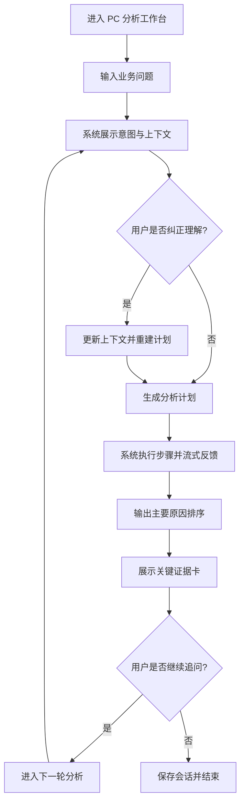
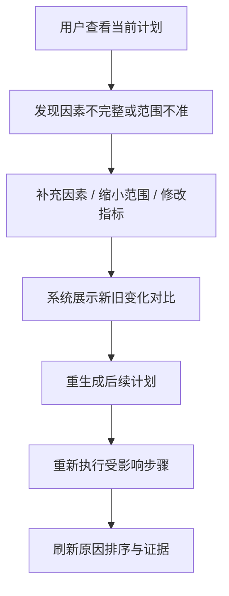
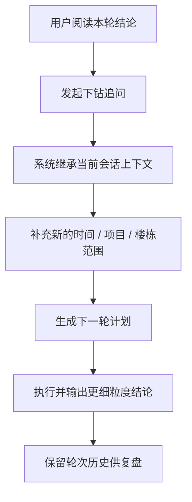
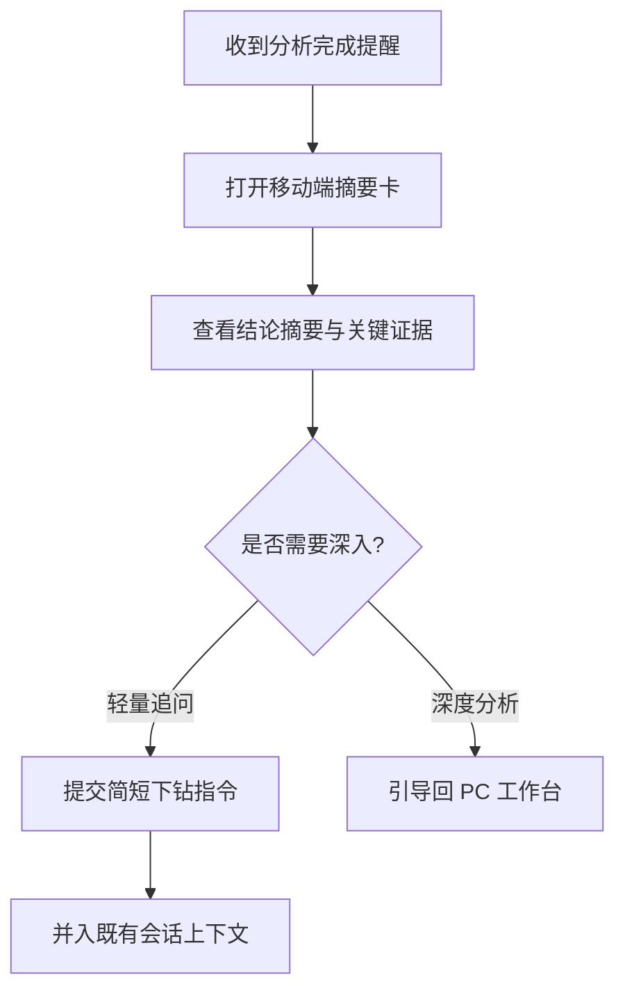

---
stepsCompleted:
  - 1
  - 2
  - 3
  - 4
  - 5
  - 6
  - 7
  - 8
  - 9
  - 10
  - 11
  - 12
  - 13
  - 14
lastStep: 14
inputDocuments:
  - {project-root}/_bmad-output/planning-artifacts/prd.md
  - {project-root}/_bmad-output/planning-artifacts/architecture.md
  - {project-root}/_bmad-output/planning-artifacts/epics.md
---

# UX Design Specification ontology-agent

**Author:** Delldi
**Date:** 2026-03-25

---

## Executive Summary

### Project Vision

`ontology-agent` 的 UX 目标不是把传统 BI 报表换成聊天框，也不是把复杂 Agent 编排直接暴露给用户，而是把“提出问题、理解问题、展开证据、得出归因、继续追问”设计成一套高可信、低负担、可复盘的分析体验。

从产品角色上看，它更接近一张“智能分析指挥台”，而不是普通的物业后台。用户进入系统后，最核心的感受不该是“我在操作一个功能很多的 SaaS”，而应该是“我正在与一位懂业务、懂数据、会推理的高级分析助理并肩工作”。

品牌层面，`DIP3 - 智慧数据` 将建立一套兼具现代感与高级感的视觉语言。它不走深色黑客风，也不走传统 ERP 风，而是采用明亮、克制、精确、清透的高端企业科技表达，形成与物业行业现有产品明显不同的识别度。

### Target Users

**核心用户**

- 物业公司的数据分析师
- 数字化负责人 / 数据团队负责人
- 需要跨收费、工单、投诉、满意度等业务主题做问题定位的业务分析人员

**次级用户**

- 项目负责人、区域负责人、经营管理者
- 主要在移动端查看结果摘要、关键提醒和轻量追问

**用户特征**

- 业务理解强，但不希望频繁切换 SQL、Excel、ERP、BI 多个系统
- 关心“为什么变了”，而不只是“现在是多少”
- 对 AI 有兴趣，但对黑盒结果天然不完全信任
- 希望系统更快、更清晰、更有证据，而不是更炫技

### Key Design Challenges

1. 需要把复杂的 AI 分析链路翻译成清晰可读的界面层级，避免黑盒感。
2. 需要在“高级品牌感”与“企业可信度”之间取得平衡，不能像传统 ERP 一样笨重，也不能像概念 demo 一样飘。
3. 需要明确区分 `PC 深度分析工作台` 与 `移动端轻量摘要体验`，不能简单复制一套界面。
4. 需要让“证据、计划、结论、追问”形成稳定的信息结构，帮助用户快速建立判断。
5. 需要从物业行业语境出发建立专属视觉语义，而不是复用通用 BI 大盘模板。

### Design Opportunities

1. 把 `DIP3 - 智慧数据` 打造成“城市数据智能”的品牌母题，用城市、楼宇、数据流和透明层叠来表达分析能力。
2. 通过明亮蓝白基调、轻玻璃感、细腻留白和精准图表密度，建立高端企业分析产品的视觉稀缺性。
3. 在 PC 端构建“分析指挥台”布局，让对话、计划、证据、归因形成强识别度结构。
4. 在移动端延续同一品牌语言，但专注于摘要、提醒、确认和追问，不复制深度分析操作。
5. 把“可解释性”本身设计成产品优势，让证据链成为界面主角，而非附属信息。

## Experience Strategy

### Defining Experience

`ontology-agent` 的定义性体验是：

**“提出一个经营问题，系统像懂业务的高级分析师一样，把问题拆开、沿证据推进，并给出可追问的归因判断。”**

用户不是来“查一个字段”，而是来发起一场分析。系统的任务不是只给答案，而是帮用户建立问题结构、显化分析路径，并通过逐步证据让结论变得可信。

### Platform Strategy

- **PC Web 为绝对主战场**：承载完整分析链路、证据阅读、重规划、多轮追问和复盘。
- **移动端为轻量延展**：承载提醒、结果摘要、轻追问，不承担完整计划编辑与复杂分析阅读。
- **交互模式**：PC 以鼠标键盘高效率操作为主，支持高信息密度；移动端以单手浏览、低认知负担为主。

### Effortless Interactions

以下交互必须做到近乎“零思考”：

- 输入问题后立即理解系统在做什么
- 看懂当前分析到了哪一步
- 从结论跳到证据，再从证据返回结论
- 发起追问或纠偏，不需要重开新会话
- 在历史会话中快速找到上次分析内容

### Critical Success Moments

1. 用户输入问题后，5 秒内看到结构化反馈或计划骨架，意识到系统“懂我在问什么”。
2. 用户第一次看到排序后的主要原因与关键证据，感受到系统不是黑盒。
3. 用户补充因素或缩小范围后，系统顺滑重规划，让用户感受到“我在控制分析方向”。
4. 用户在历史会话中回到上一次分析，不必重做，感受到系统“有记忆、可复盘”。

### Experience Principles

1. **解释优先于结论**：用户必须始终知道系统为什么这样分析。
2. **结构化优先于炫技**：界面首先服务理解，其次才是视觉表现。
3. **一次只让用户关注一个判断层级**：问题、计划、证据、结论分层清晰。
4. **深度在 PC，轻量在移动端**：端能力边界必须清楚。
5. **让用户感到自己变强，而不是被 AI 接管**。

## Desired Emotional Response

### Primary Emotional Goals

系统希望让用户产生的首要感受是：

- **冷静而掌控**：面对复杂问题时不慌，知道下一步该看什么
- **被增强而不是被替代**：感觉自己像拥有了一个更聪明的分析搭档
- **可信与安心**：结论不是“AI 说的”，而是“证据支持的”

### Emotional Journey Mapping

- **首次进入工作台**：感觉清爽、现代、专业，而不是传统物业后台的拥挤感
- **输入问题时**：感觉门槛低，不需要先知道字段和报表
- **等待分析时**：感觉系统在积极推进，而不是无反馈等待
- **看到结论时**：感觉豁然开朗，而不是被抽象术语淹没
- **继续追问时**：感觉顺手自然，像延续一段已有思路
- **再次回来时**：感觉系统是有连续性的工作空间，而不是一次性工具

### Micro-Emotions

- 用输入门槛替换“畏难感”
- 用结构化计划替换“困惑感”
- 用证据摘要替换“怀疑感”
- 用追问能力替换“中断感”
- 用历史会话替换“遗忘感”

### Design Implications

- **信任** 对应：证据卡、过程可见、结论分层、明确状态反馈
- **高级感** 对应：高亮度留白、细腻阴影、克制色彩、优雅动效
- **掌控感** 对应：明显的当前状态、清晰的下一步入口、可回退和可重规划
- **效率感** 对应：稳定的信息区块、固定阅读路径、少层级跳转

### Emotional Design Principles

1. 界面应让用户从“不确定”逐步进入“明朗”。
2. 每个关键交互都要降低焦虑，而不是增加悬念。
3. 产品不靠情绪化动画制造新鲜感，而靠秩序和清晰制造高级感。
4. 高级感的来源是克制、比例、留白和精确，而不是炫目的视觉堆叠。

## UX Pattern Analysis & Inspiration

### Inspiring Products Analysis

本次设计主要从用户提供的参考图中提炼视觉模式，同时结合高端企业 SaaS 与现代数据产品的共同特点做升级。

**从参考图提炼出的有效设计特征**

- 高亮度蓝白基调，整体气质轻盈且可信
- 大圆角卡片与软阴影形成温和友好的系统感
- 搜索框、模块入口、公告卡、底部导航具备强结构秩序
- 建筑 / 城市场景插画形成“数字城市运营”语义
- 信息分组明确，适合业务用户快速扫读

**需要升级的部分**

- 参考图偏移动端运营工具气质，适合工单与应用入口，不足以承载复杂分析
- 图标和模块呈现较轻运营化，需要提升为更高端的数据产品语气
- 对话、计划、证据、归因等 AI 原生结构在参考图中并不存在，需要重新定义

### Transferable UX Patterns

**可迁移的模式**

- 清透浅色背景与品牌蓝渐变作为主基调
- 卡片式模块分区，适合复杂信息层级
- 圆角搜索 / 输入入口，降低进入门槛
- 城市与楼宇视觉母题，可升级为“数据天际线”
- 轻量图标 + 明确标签，便于业务用户理解功能

**需要改造后迁移的模式**

- 首页应用宫格不适合 PC 分析工作台主界面，应改为“工作区入口 + 最近分析 + 快速问题”
- 移动端底部导航模式不适合 PC，应转化为左侧导航 / 顶部主控区
- 插画不应喧宾夺主，应更抽象、更高端，作为品牌背景层而非主内容

### Anti-Patterns to Avoid

- 过度深色、赛博、霓虹式 AI 视觉
- 传统 ERP 式高密度表格堆叠
- 纯聊天界面导致证据和结论难以阅读
- 把图表堆满屏幕却缺乏叙事结构
- 在移动端复制 PC 深度分析界面，造成认知负担

### Design Inspiration Strategy

**保留**

- 蓝白明亮科技感
- 轻玻璃感与空气感
- 城市数据化视觉意象
- 模块分区清晰、可快速扫读

**升级**

- 更精细的品牌字体层级
- 更高级的渐变和材质控制
- 更适合 PC 分析任务的三栏式工作台布局
- 更强的证据与结论叙事能力

**避免**

- 移动端运营工具式密集功能入口
- 通用 BI 仪表盘模板感
- 过度装饰性插画与重拟物

## Design System Foundation

### 1.1 Design System Choice

采用 **Themeable System** 路线，以 `Tailwind CSS 4.1 + shadcn/ui + 自定义品牌 Token 层` 作为设计系统基础。

### Rationale for Selection

1. 当前项目需要强品牌表达，但又需要快速进入实现，不适合从零搭建纯自研组件库。
2. `shadcn/ui` 提供良好的无样式 / 半样式基础，适合在 Next.js + Tailwind 体系内做高定制品牌化。
3. 产品需要大量自定义分析组件，如证据卡、计划时间线、原因排序面板，这类组件天然适合在现成基础上做二次封装。
4. 后续 PC 与移动端需要共享一套设计 Token，但不共享完全相同的布局模式，这种路线最灵活。

### Implementation Approach

- 基础交互组件：使用 `Button / Input / Card / Tabs / Dialog / Sheet / Badge / Tooltip / Table` 等基础件
- 品牌层：通过 `CSS Variables + Tailwind Tokens` 注入颜色、圆角、阴影、间距和动效
- 业务组件层：单独构建分析工作台专属组件
- 图表层：保持品牌化配色与统一图例规则，不做默认图表库皮肤直出

### Customization Strategy

- 品牌唯一性主要由 **颜色、材质、布局、图标语气、信息节奏** 建立
- 不在基础表单组件上做过度奇怪变体，保持输入与阅读效率
- 把“高级感”集中在容器层、信息密度控制和视觉节奏上，而不是让每个按钮都很花

## Defining Core Interaction

### 2.1 Defining Experience

产品的定义性交互不是“聊天”，而是：

**“问题驱动的分析协作。”**

用户抛出一个问题后，系统立即把它拆解成：
1. 我理解你在问什么
2. 我准备怎么分析
3. 我目前发现了什么
4. 我为什么这么判断
5. 你要不要继续追问

### 2.2 User Mental Model

用户当前的真实心智模型不是“我要用一个 AI 工具”，而是：

- “我想找出原因”
- “我想知道该先看哪几个因素”
- “我希望有人替我组织分析路径”
- “我必须能看懂结论依据”

因此系统的界面不应让用户像在编排 Agent，而应让用户感觉自己在和一个懂业务的分析师对话与协作。

### 2.3 Success Criteria

- 用户能在输入问题后立刻理解系统识别出的意图
- 用户能看见分析计划而不是黑盒等待
- 用户能把主要原因与关键证据一一对应
- 用户能顺畅发起下一轮追问，无需重启流程
- 用户能在 1 个会话里持续推进分析，而非频繁跳页

### 2.4 Novel UX Patterns

这是一个**熟悉模式的创新组合**，而不是完全陌生的新交互：

- **熟悉的部分**：输入框、卡片、标签、时间线、排序列表、历史会话
- **创新的部分**：把对话、计划、证据和归因结论组合成一个统一分析界面
- 从 `Epic 5` 开始，中央主区应进一步升级为“流式分析画布”，把执行轨、阶段结果块、证据块和结论块组织成连续阅读体验，而不是只停留在静态卡片堆叠
- **独特之处**：用户不是只“问一句”，而是在一个分析画布中逐步推进判断

### 2.5 Experience Mechanics

**1. Initiation**

- 用户从工作台输入一个业务问题
- 页面即时回显问题并进入结构化理解状态

**2. Interaction**

- 系统展示意图、上下文和分析计划
- 用户可以确认、补充或纠偏

**3. Feedback**

- 系统逐步展示执行状态、阶段发现和证据摘要
- 重要结果优先出现在主视区，不强迫用户滚动找答案

**4. Completion**

- 系统给出排序后的主要原因和证据
- 用户可直接选择继续追问、缩小范围、回看历史或结束本轮分析

## Visual Design Foundation

### Color System

**推荐主方向：Skyline Intelligence**

| Token | Color | Usage |
|---|---|---|
| `brand-900` | `#123B88` | 深层标题、品牌深色锚点 |
| `brand-700` | `#2463FF` | 主按钮、激活态、核心品牌识别 |
| `brand-500` | `#5A97FF` | 强调线、链接、可视化高亮 |
| `brand-300` | `#B8D7FF` | 辅助底色、轻标签 |
| `sky-100` | `#EAF4FF` | 大面积浅背景 |
| `mist-0` | `#F8FBFF` | 页面主背景 |
| `glass` | `rgba(255,255,255,0.68)` | 浮层 / 卡片玻璃面 |
| `ink-900` | `#19263D` | 主文本 |
| `ink-600` | `#607089` | 次级文本 |
| `line-200` | `#DCE7F5` | 边框与分隔线 |
| `success-500` | `#31B982` | 成功 |
| `warning-500` | `#FFB648` | 警告 / 待确认 |
| `danger-500` | `#FF6A6A` | 错误 / 风险 |

**色彩策略**

- 以蓝白为主，不使用紫色作为核心品牌色
- 重点强调“清透、可信、理性”，不是“神秘、赛博、炫技”
- 图表色采用蓝系为主轴，辅以玉绿色、金橙色、冰青色做辅助区分

### Typography System

**字体策略**

- 品牌标题 / 英文数据标题：`Sora`
- 中文界面正文：`Noto Sans SC`
- 数据标签 / Trace / 小型技术标识：`JetBrains Mono`

**层级建议**

- H1：36/44，`Sora`，用于工作台页首或关键结果标题
- H2：28/36，`Sora`
- H3：22/30，`Noto Sans SC`
- Title：18/26，`Noto Sans SC`
- Body：14/22，`Noto Sans SC`
- Caption：12/18，`Noto Sans SC`
- Data Large：32/36，`Sora`
- Data Medium：24/28，`Sora`

**排版原则**

- 大标题负责品牌与判断，正文负责清晰，数字负责精确
- 不使用过细字重，避免亮底环境下发虚
- 关键信息通过字号、间距和位置层级表达，不依赖过多颜色

### Spacing & Layout Foundation

- 采用 `8pt` 栅格体系
- 卡片内边距以 `20 / 24 / 32` 为主
- 模块之间保持明显空气感，避免传统后台“块块相贴”
- 页面宽屏布局建议使用 `12-column grid`
- PC 主工作台采用 **左导航 + 中央分析主区 + 右证据侧栏** 的三段结构

### Accessibility Considerations

- 默认满足 `WCAG AA`
- 正文文本对比度不低于 `4.5:1`
- 所有交互元素触控尺寸不小于 `44x44`
- 激活、焦点、选中、禁用状态必须通过颜色以外的方式区分
- 图表颜色不作为唯一信息来源，必须辅以标签或形状

## Design Direction Decision

### Design Directions Explored

1. **Skyline Intelligence**
   以蓝白清透和城市数据天际线为核心，强调品牌识别和高端感。
2. **Editorial Analytics**
   更像数据杂志，信息层级强，适合深度阅读，但品牌张力稍弱。
3. **Precision Panels**
   更偏专业控制台，理性精准，但略显冷硬。
4. **Soft Operations Board**
   更接近参考图的轻运营感，友好但不足以承载 AI 分析高级感。

### Chosen Direction

选择 **Skyline Intelligence** 作为主方向，并吸收 `Precision Panels` 的结构秩序感。

### Design Rationale

- 最符合 `DIP3 - 智慧数据` 的品牌潜力
- 与物业行业的“城市 / 社区 / 楼宇”语境自然相连
- 既能保留参考图的轻盈科技感，又能升级为分析产品的高级表达
- 适合同时覆盖 PC 主工作台与移动端摘要卡

### Implementation Approach

- PC 端：首页和工作台使用大面积雾白背景 + 蓝色光感容器
- 关键分析区使用玻璃化卡片和高层级分栏
- 城市线稿 / 数据天际线作为插画母题，用于欢迎区、空状态和品牌封面
- 移动端延续同色系与圆角容器，但更注重摘要密度而非层级复杂度

**Supporting Visual Assets**

- 颜色主题可视化：[ux-color-themes.html]({project-root}/_bmad-output/planning-artifacts/ux-color-themes.html)
- 设计方向展示：[ux-design-directions.html]({project-root}/_bmad-output/planning-artifacts/ux-design-directions.html)

## User Journey Flows

### 归因分析主旅程

用户从“我想知道为什么”进入，到“我看懂了主要原因和证据”结束。

### 纠偏与重规划旅程

### 多轮追问旅程

### 移动端摘要旅程（Growth）

### Journey Patterns

- 所有旅程都从“明确当前状态”开始
- 用户总能看到下一步操作，而不是被结果终止
- 错误恢复优先通过“纠偏”而不是“重来”
- 历史会话与当前会话必须保持连续性

### Flow Optimization Principles

1. 让用户在主视区完成最关键判断，不逼迫跨区寻找答案
2. 每轮分析只突出最重要的 1-3 个发现
3. 把确认、纠偏、追问设计成低摩擦操作
4. 所有长任务都必须有阶段反馈

## Component Strategy

### Design System Components

**优先复用的基础组件**

- Button
- Input / Textarea
- Card
- Tabs
- Badge
- Tooltip
- Dialog / Drawer / Sheet
- Table
- Dropdown Menu
- Toast / Alert
- Skeleton

### Custom Components

#### 分析输入台

**Purpose:** 作为工作台首页和会话页的核心发起入口  
**Usage:** 输入自然语言问题、补充条件、触发分析  
**Anatomy:** 输入框、作用域标签、快捷问题、提交按钮、状态提示  
**States:** 默认、聚焦、提交中、被范围拦截、输入错误  
**Accessibility:** 支持键盘提交、标签朗读、错误提示关联

#### 意图上下文芯片组

**Purpose:** 显示目标指标、时间范围、比较维度、实体对象  
**Usage:** 用户确认 / 修改系统理解  
**States:** 普通、待确认、已修改、冲突警告

#### 计划时间线面板

**Purpose:** 展示分析计划、依赖顺序和执行进度  
**Usage:** 会话主区的核心结构件  
**States:** 待执行、执行中、完成、失败、重规划后更新

#### 流式分析画布

**Purpose:** 承载执行轨、阶段结果块、工具状态块和最终结论块  
**Usage:** PC 主工作台中央主区  
**States:** 初始化、流式更新中、阶段完成、最终结论、回放模式

#### 证据堆栈卡

**Purpose:** 用卡片方式呈现一条证据与对应结论关系  
**Usage:** 结果阅读、追问前判断、历史复盘  
**States:** 摘要、展开、对比、高亮引用

#### 原因排序面板

**Purpose:** 展示归因结果的优先级与权重顺序  
**Usage:** 结果区顶部主结论模块  
**States:** 默认、展开证据、被追问定位、无明显原因

#### 会话历史栏

**Purpose:** 快速回看与切换历史分析  
**Usage:** 左侧导航或工作台二级区  
**States:** 最近、置顶、进行中、已完成、超权限隐藏

#### 移动端摘要卡

**Purpose:** 在小屏中摘要展示结论和关键提醒  
**Usage:** 移动端首页和详情页  
**States:** 正常、告警、高优先级、待查看

### Component Implementation Strategy

- 基础组件来自 `shadcn/ui`
- 自定义组件全部使用统一 Token 层封装，避免页面散写样式
- 自定义组件优先围绕“分析结构”而不是“业务模块”命名
- 图表容器也视为组件体系的一部分，需要统一标题、图例、注释和洞察说明样式

### Implementation Roadmap

**Phase 1**

- 分析输入台
- 会话历史栏
- 计划时间线面板

**Phase 2**

- 流式分析画布
- 原因排序面板
- 证据堆栈卡
- 意图上下文芯片组

**Phase 3**

- 移动端摘要卡
- 高级图表容器
- 历史轮次对比模块
- 同源 render schema 的移动端结果投影

## UX Consistency Patterns

### Button Hierarchy

- **Primary**：品牌蓝实心按钮，只用于单个最主要操作，如“开始分析”“继续追问”
- **Secondary**：浅底描边按钮，用于“查看证据”“重试”“展开”
- **Tertiary**：文本按钮，用于低风险跳转或次级说明
- **Danger**：只用于破坏性确认，不在分析主链路中泛用

### Feedback Patterns

- 成功：用绿色点 / 勾与简短描述，不做大面积成功页
- 警告：用金橙色提示信息缺失、范围冲突、证据不足
- 错误：错误卡明确告诉用户“哪里出错 + 可怎么恢复”
- 进行中：统一采用时间线状态 + 轻骨架 + 文本反馈

### Form Patterns

- 输入框以单一主输入为核心，不同时堆很多字段
- 高级筛选通过折叠或抽屉展开，避免首页过载
- 验证错误就地提示，不使用全局难定位报错
- 已识别上下文通过 Chip 呈现，便于低成本修正

### Navigation Patterns

- PC：左侧导航承担一级结构，顶部承担页面级上下文与全局操作
- PC 会话页：中区是主要分析流，右侧是证据 / 结论辅助阅读区
- 移动端：底部导航只保留 3-4 个稳定入口，核心是“摘要 / 工作台 / 我的”

### Additional Patterns

- 空状态必须给出下一步建议
- 无权限状态要明确解释“不显示什么”和“为什么”
- 搜索、筛选、排序的视觉模式保持一致
- 标签系统统一：作用域标签、状态标签、证据标签不能混成一种语义

## Responsive Design & Accessibility

### Responsive Strategy

- **Desktop-first**：MVP 以大屏工作台为先，充分使用多栏空间
- **Tablet**：保留两栏布局，缩短右侧证据区，增强触控可达性
- **Mobile**：只保留摘要、状态、关键证据和轻量追问，不承载完整分析编排

### Breakpoint Strategy

- `>= 1440px`：宽屏分析工作台，三栏完整展开
- `1200px - 1439px`：标准桌面，三栏但右栏压缩
- `1024px - 1199px`：小桌面 / 横屏平板，转双栏
- `768px - 1023px`：平板纵向，重点保留主内容 + 抽屉式辅助区
- `< 768px`：移动端摘要布局

### Accessibility Strategy

- 目标为 `WCAG AA`
- 所有主要流程支持键盘导航
- 分析进度和状态变化可被屏幕阅读器感知
- 重要图表与排序必须有文本摘要
- 焦点态清晰可见，不能只依赖 hover

### Testing Strategy

- 在真实桌面与真实手机上验证关键旅程
- 验证 Chrome、Safari、Edge 基本兼容
- 使用自动化无障碍检查工具进行基础扫描
- 人工验证键盘导航、焦点顺序、对比度、触达面积
- 对移动端摘要页进行户外亮屏可读性验证

### Implementation Guidelines

- 使用 `rem`、百分比和栅格系统，不用硬编码像素布局
- 动效克制，优先使用淡入、位移、渐显，不使用浮夸弹跳
- 玻璃感只用于容器层，不应用于全部文本背景
- 图表与卡片必须共享相同的边距、标题和说明规范
- 保持 PC 与移动端品牌一致，但允许信息密度完全不同

## Workflow Completion Notes

- 本 UX 规格已覆盖品牌设计语言、核心体验、视觉基础、流程、组件和响应式规则。
- 支撑文件已生成：
  - [ux-color-themes.html]({project-root}/_bmad-output/planning-artifacts/ux-color-themes.html)
  - [ux-design-directions.html]({project-root}/_bmad-output/planning-artifacts/ux-design-directions.html)
- 当前 UX 规格已可作为后续实现对齐输入，但在正式开发前仍建议做一次实施一致性检查。
