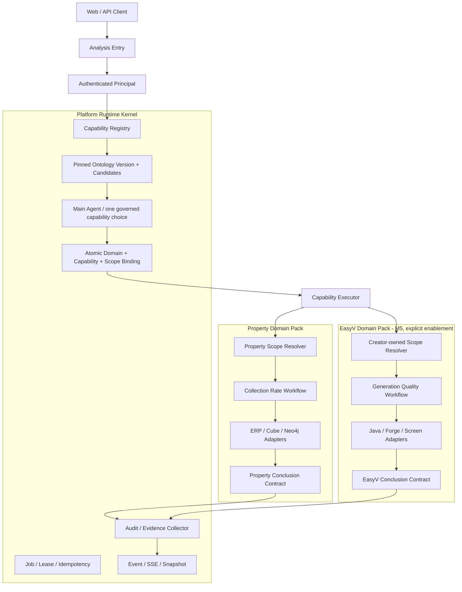

# Multi-domain Runtime Architecture

> 状态：Baseline（2026-08-31）
> 适用范围：Ontology Agent 的分析运行时、Domain Pack 与未来 Action Runtime
> 实施状态：M3-M6 已落地并完成源码与契约验收；Property 与 EasyV 已成为两个真实可执行 capability。EasyV 已通过真实 OpenAI-compatible 模型与 test PostgreSQL 联合门禁。EasyV 使用 `creator-owned` scope、只读 facts adapter，并由 `dip3.easyv.enabled` 显式开关控制，默认关闭；Ontology v2 已发布。test/开发环境观测不代表生产部署或生产数据结论。
> 配套 Java 分层规则：[Java Architecture Baseline](./java-architecture-baseline.md)
> 首个新领域实例：[EasyV AI 大屏生产领域 Ontology V1](../data-contracts/easyv-ai-generation-ontology-v1.md)

## 1. 目标

Ontology Agent 的目标不是把每个行业做成一套独立 Agent，也不是把业务表暴露给 LLM，而是形成一个**领域可装载、版本受控、权限隔离、证据可追溯的 AI 原生语义与执行平台**。

平台成功的判断标准是：

> 接入第三个领域时，只新增该领域的 Ontology、ScopeResolver、typed adapters、Capability、Workflow、Conclusion Contract 和测试；不再修改通用 Session/Job/Event/SSE/lease/audit 主链。

物业是现有回归领域，EasyV 是第二个真实领域。第二个真实调用者只证明当前必要的公共边界，不为未知行业预建动态插件市场。

## 2. 当前事实

### 2.1 已存在的平台控制面

| 控制面 | 当前能力 | 跨领域判断 |
|---|---|---|
| Session/Follow-up | 保存问题、上下文与追问历史 | 可复用，scope payload 需领域化 |
| Job/Worker | durable job、lease、attempt、idempotency | 可复用 |
| Event/SSE/Snapshot | 进度、终态、回放与 UI projection | 可复用，结果校验需去物业化 |
| Ontology Governance | definition/version/change/review/publish | 可复用，发布校验需按 capability 扩展 |
| Version Pin | submit 写入 ontologyVersionId，Worker 按 pin 加载 | 必须保留 |
| Audit | agent/tool invocation 与错误记录 | 可复用 |
| Graph Sync | PostgreSQL canonical facts、Neo4j projection | 模式可复用，领域 source 不可混用 |
| Spring AI Adapter | ChatClient、Memory、Tool Calling、Structured Output | 技术能力可复用 |

### 2.2 当前已有两个领域能力，物业与 EasyV 均归入 Domain Pack

- `AnalysisService` 的初始入口已使用显式 candidate selection；零候选、不支持和多候选均 fail loud，不依赖注册顺序；
- `AnalysisRuntimeCapability`、`SpringAiMainAgent`、`AnalysisWorkflow`、三类 evidence/claim 与追问语义已位于 `property.internal`；
- `AnalysisWorker` 按 descriptor 校验 invocation/evidence/claim，不再写死物业 Tool、证据源或 claim；
- Ontology publish validation 已通过 Capability Registry 委托对应 registration；
- Follow-up 按来源 execution 的冻结 binding 定位 Domain Policy，不再使用 `onlyRegistration`；
- `CanonicalOntologyBaseline` 与 bootstrap 已发布 `ontology-java-multidomain-v2`，包含 Property 与 EasyV 的联合 catalog；已 pin 的旧版本仍可读取。

因此当前准确状态是：

> 通用 Capability、binding、result、snapshot 与 Follow-up 分派边界已经由 Property 与 EasyV 共同验证；EasyV 只读 scope/facts/workflow/result 已实现，仍不通过 YAML 或 `if/else` 动态接入未知领域。

## 3. 核心架构

> 以下是目标职责模型，截至当前版本尚未全部存在于源码；必须经过 M1-M3 的代码与回归门禁后，才可视为已实现。`Platform Runtime Kernel` 是职责概念，不要求创建 `kernel` 包、公共框架或独立 Maven module。



### 3.1 Platform Runtime Kernel

平台内核只负责跨领域真正共有的机制：

- authenticated principal；
- session/execution identity；
- domain/capability registry；
- ontology lifecycle 与 version pin；
- Job、lease、attempt、idempotency；
- 一次受治理 Tool Call；
- audit/evidence envelope；
- platform-level result invariants；
- Event/SSE/Snapshot；
- 可观测性和稳定失败码。

平台内核不认识：

- `project`、`area`、`space`、`team`；
- `collection-rate`、`generation-success-rate`；
- ERP、Forge 表或 Screen Packet；
- 某领域必须有哪三种 evidence；
- 某领域允许哪些 claim；
- 领域指标分子、分母和终态归并规则。

### 3.2 Domain Pack

Domain Pack 是一个编译期 Java feature 加一组受治理 Ontology 定义，不是动态 JAR 插件。

```text
Domain Pack
├── domainKey / capability descriptor
├── ontology definitions and bindings
├── ScopeResolver
├── typed request / facts / result
├── fact ports and outbound adapters
├── capability validator
├── deterministic workflow
├── evidence consistency rules
├── conclusion contract
└── optional actions                         V1 不启用
```

Domain Pack 负责：

- 本领域有哪些可执行能力；
- 如何把可信身份解析成领域 scope；
- 哪些实体、指标、时间、因素和关系可用；
- 如何读取事实并计算指标；
- 如何判定完成、失败、未知和数据不完整；
- 哪些 evidence 可以支撑哪些 claim；
- 哪些结论只能表述相关性，不能表述因果；
- 未来哪些 Action 可以执行及其安全契约。

## 4. 最小运行时契约

以下为职责基线，不是要求本轮立即建立所有 Java 类型。最终 API 应在 Property 成为第一个真实实现、EasyV 成为第二个真实实现时由测试共同收敛。

### 4.1 Capability Descriptor

最小描述：

```text
domainKey
capabilityKey
displayName
supportedOntologyDefinitionKeys
requiredEvidenceTypes
allowedClaimKinds
```

用途：registry、publish validation、Agent 能力广告和结果校验。`requiredEvidenceTypes/allowedClaimKinds` 属于 capability 级约束，不强迫同一 domain 的多个 capability 共享。它不包含数据库凭据或可执行 SQL。

V1 不给每张 Ontology definition 表增加 `domainKey`，也不依赖未经 schema 校验的 `metadata.domainKey`。领域归属由已注册的 Capability Descriptor 对 definition business keys 的完整引用集合确定；新增领域的 business key 必须使用稳定领域前缀，现有物业 key 作为 legacy compatibility 保留。Catalog validator 必须拒绝跨 descriptor 的 business key 冲突、悬空引用和同一 key 的歧义归属。若真实需求证明 definition 需要跨 capability 共享或独立领域发布，再通过正式 Flyway migration 扩展 schema。

### 4.2 Analysis Capability

概念契约：

```java
interface AnalysisCapability {
    CapabilityId id();
    CapabilityValidation validate(CapabilityRequest request,
                                  RuntimeOntology ontology);
    CapabilityResult execute(AnalysisExecutionContext context);
}
```

约束：

- `id` 至少包含 domainKey + capabilityKey；
- `validate` 不产生外部写操作；
- `execute` 接收已 pin ontology、可信 principal 与 resolved scope；
- 一个执行只选择一个 capability；
- capability 不能访问另一个领域的 internal 类型；
- 领域输入、事实和结果保持强类型。

### 4.3 Capability Registry

Registry 是 Spring Bean 的静态注册表，不是动态 classloader。

V1 只注册两个真实实现：Property 与 EasyV。Registry API 在两者共同验证后冻结；在此之前不承诺动态扩展协议、外部 SPI 或配置热加载。

职责：

1. 保证 `(domainKey, capabilityKey)` 唯一；
2. 根据 pinned ontology/version 查找兼容 capability；
3. 发布前调用对应 capability catalog validator；
4. 只向 Main Agent 暴露当前用户可执行、当前版本已激活的能力；
5. 未注册、重复注册、版本不兼容时 fail loud。

一个 capability 可执行必须同时满足：Java 实现已注册、pinned Catalog 中对应 descriptor/binding 已发布且激活、所需 provider/data adapter 可用、当前 principal 能解析出非空 scope。V1 不新增独立动态 lifecycle 表；这些条件由 Bean registry、已发布 Catalog 与运行时依赖检查共同判定。

禁止：

- 按类名反射加载任意实现；
- 从数据库执行动态 Java/SQL；
- 找不到 capability 时回退到物业；
- 多个 capability 都可能匹配时静默选第一个。

### 4.4 Ontology Catalog Versioning

V1 保留当前**单一已发布 Catalog Version**，一个 version 可以同时包含多个 domain 的定义；`domainKey` 用于选择该 Catalog 中属于某个 Domain Pack 的能力子集。

```text
ontologyVersionId = 全局可审计语义快照
domainKey         = 快照内的领域边界
capabilityKey     = 领域内的可执行能力
```

暂不引入“每个领域独立 current version”，因为当前发布事务、Job pin、追问继承和管理 UI 都围绕一个 current catalog。只有不同领域出现真实的独立发布节奏、所有权和回滚需求时，才设计 per-domain version stream。

单一 Catalog 的含义是：每次发布任一领域变更，都会生成新的**全局** version。新提交读取新的 current version，已 pin 的 Job/追问继续读取原 version，不受影响。未完成的 EasyV draft 保持 unpublished/unactivated，因此不能阻塞当前 Property 能力。

发布校验分两层：

- 全局结构校验：definition/tool/evidence 引用均属于同一 version，business key 唯一且无悬空引用；
- capability 可执行校验：version 中每个已激活 capability 均有实现，并通过自己的 catalog validator；
- 兼容校验：新全局 version 必须保留并验证所有当前已激活 capability，不能因发布 EasyV 而使 Property 失效；
- 广告校验：未发布或未激活的候选定义不能成为可执行能力。

迁移时新增 `CapabilityCatalogValidator`：Property validator 先委托现有 `AnalysisWorkflow.validateCatalog`，Ontology governance 再遍历 Registry 中当前激活 capability 的 validator；完成等价测试后，才能移除 governance 对物业静态方法的固定依赖。

### 4.5 Scope Resolver

公共语义：

```java
interface ResolvedScope {}

interface ScopeResolver<S extends ResolvedScope> {
    S resolve(AuthenticatedPrincipal principal,
              RequestedScope requestedScope);
}
```

`ResolvedScope` 应采用领域强类型实现：

```text
PropertyResolvedScope(organizationId, projectIds, areaIds)
EasyVResolvedScope(userId, accessMode="creator-owned")
```

平台只负责持久化并传递带 `domainKey + schemaVersion` 的 scope snapshot；EasyV 当前冻结形状只有可信 `userId` 与 `accessMode=creator-owned`，没有已确认的 `spaceIds/teamIds`。未来若授权来源被真实确认，再由 EasyV Domain Pack 扩展其独立 snapshot，不能映射到物业 `projectIds/areaIds`。

Property 迁移期间，现有 organization/project/area 字段先转换成 `PropertyResolvedScope` 并双向校验；历史 Job 的兼容读取、数据回填和回归通过前，不删除旧字段。

规则：

- principal 来源可信认证，不由模型生成；
- requested scope 必须是 resolved allowed scope 的子集；
- 每个 fact adapter 都必须接收 resolved scope；
- 追问默认继承原 execution scope；
- 不允许把 `teamId` 填入 `projectIds` 复用物业代码；
- scope 无法解析或为空时明确失败。

### 4.6 Evidence Envelope

当前 `Evidence(source, title, rows)` 可作为兼容起点，但多领域 envelope 至少需要：

```text
domainKey
capabilityKey
evidenceType
sourceSystem
sourceKeys
ontologyVersionId
scopeSnapshotRef
timeRange / timezone / cohort
sourceUpdatedAt / ingestedAt / freshness
typed payload or schema-validated payload
query/audit reference
```

平台级一致性：

- evidence 属于当前 domain/capability/version；
- scope 与执行一致；
- evidence reference 指向真实 source/row/field 或稳定 sourceKey；
- 所有结论有引用；
- 数据缺失、过期或部分来源失败不得伪装完整。

领域级一致性：

- 必需 evidenceType；
- 指标分子/分母；
- 任务终态归并；
- 时间 cohort；
- 允许的 claim/evidence 对应关系。

Evidence 生命周期规则：

- 当前 `Evidence` 结构仅作为 Property 兼容入口；第二个真实 capability 只增加表达多领域所必需的最小 envelope，不借机重写物业 payload；
- 成功执行的 evidence snapshot 对该 execution 不可变，后续源数据变化不得改写历史结果；
- evidence reference 同时保存当时使用的值与稳定 `sourceKey`，使历史结论可复核；
- `collected` evidence 必须先通过 platform/domain validator 才能成为 `accepted`；被拒绝的 evidence 进入审计或失败详情，不进入成功 snapshot；
- V1 不支持 partial-success conclusion：任一 required source 失败、required evidence 缺失或超过 Domain Pack 规定的 freshness 上限，execution 明确失败；
- freshness policy 由 Domain Pack 定义，平台只执行并记录结果。

### 4.7 Capability Result Contract

Worker 不再硬编码物业 evidence source 和 claim kind，而是执行两层校验：

```text
Platform Result Invariants
├── selected capability matches job
├── pinned ontology matches result
├── evidence non-empty and scoped
├── claims have valid references
└── result is serializable/auditable

Domain Result Contract
├── required evidence types
├── allowed claim kinds
├── domain-specific consistency
└── render projection
```

`CapabilityResult` 至少携带：

```text
domainKey
capabilityKey
ontologyVersionId
scopeSnapshotRef
plan
evidence
claims
renderBlocks
sourceFreshness
```

### 4.8 Conclusion Contract

概念契约：

```java
interface ConclusionContract<R, C> {
    C conclude(R typedResult, EvidenceSet evidence);
}
```

可由 Spring AI provider 生成候选结构，但领域 contract 必须在服务端验证：

- claim kind 在允许集合；
- 引用来源、行、字段和值存在；
- 数字与真实 evidence 一致；
- 必需 evidence 全部被覆盖；
- 未证明因果时不能渲染成因果；
- provider 失败时不产生默认成功结论。

物业继续使用 `collection-rate/erp-balance/charge-structure`；EasyV 必须定义自己的 claim，不复用物业名称。

## 5. 元数据、Java 与 LLM 的职责

| 内容 | Ontology 元数据 | 强类型 Java | LLM |
|---|---:|---:|---:|
| entity/relationship/metric/factor 声明 | 主责 | schema 校验 | 只读理解 |
| metric variant/time semantic/tool binding | 主责 | 发布与兼容校验 | 受限选择 |
| 同义词/展示名/解释文本 | 主责 | 安全呈现 | 可用于理解 |
| authenticated principal | 禁止决定 | 主责 | 不可修改 |
| scope 解析与越权判断 | 只声明类型 | 主责 | 只能选已授权子集 |
| 查询参数、SQL/API 调用 | 可声明映射 | 主责 | 不执行 |
| 跨库 Join 与终态归并 | 不直接执行 | 主责 | 不执行 |
| 指标分子/分母和计算 | 声明口径 | 主责验证/执行 | 不计算最终事实 |
| workflow 顺序和失败语义 | 可声明 plan template | 主责 | 选择能力，不改状态机 |
| evidence consistency | 声明约束 | 主责 | 不得绕过 |
| claim 候选 | 声明 kind | 主责校验 | 可结构化生成 |
| Action 权限/确认/幂等 | 声明契约 | 主责 | 只能请求 |

原则：

> 元数据驱动“选择与解释”，Java 保证“权限、计算、执行与失败”，LLM 负责“理解与受约束表达”。

## 6. 请求生命周期

### 6.1 Initial Request

```text
1. Web adapter 认证用户并规范化问题
2. Runtime 获取当前 published ontology version
3. Registry 计算该版本、该用户可执行的 capability candidates
4. Application 的受治理路由在 candidates 中确定一个 capability；歧义时不入队
5. Domain scope resolver 从可信 principal 解析已授权 scope，Job 与 binding 一起入队
6. Worker revalidate binding；Main Agent 必须且只能调用该 binding 对应的一次 workflow tool
7. Tool adapter 将不可信业务输入转成选中领域的 typed request
8. Capability 校验 ontology、scope、时间、参数和数据前置条件
9. Deterministic workflow 调用 typed fact adapters
10. Domain consistency + platform consistency 双重校验
11. Conclusion contract 生成/校验 claims
12. Worker 在同一事务中原子写入 terminal event、snapshot 与 result；invocation audit 由现有 recorder 单独持久化并通过 execution/invocation id 关联
```

选择规则：

- 显式、合法的 domain hint 优先；
- 没有 hint 时只能在 registry 返回的 candidates 中选择；
- 0 个候选明确返回 unsupported；
- 多个候选且问题不足以判定时进入 clarification/replan，不猜测；
- 不能选择未发布、未激活或当前用户无 scope 的 capability。
- audit 写入失败继续保留当前 `INVOCATION_AUDIT_FAILURE` 语义，不把独立审计写入伪装成 terminal transaction 的一部分。

### 6.2 Job Pin

M2 采用更窄的提交时绑定：Job 进入队列前必须同时固定 ontology、capability 与可信 scope snapshot，队列中不存在“等待 Worker 猜测领域”的合法状态。

1. Application 在提交前取得 published `ontologyVersionId`；
2. Registry 只基于已注册 capability、该版本 Catalog 与可信 principal 生成 binding；
3. Job 原子持久化 `(domainKey, capabilityKey, ontologyVersionId, resolvedScope)`；
4. Worker claim 后重新验证 binding、pinned Catalog 与由 Job 所有权字段重建的 trusted principal；
5. retry 与追问只能复用既有 binding，不得重新路由；
6. 缺失、歧义、版本漂移或 scope 篡改全部明确失败，不允许物业 fallback。

当前只有一个已注册能力，所以 Registry 暂时提供 `bindOnly`。注册第二个能力前必须增加显式的提交前路由输入/策略；一旦候选数大于一，`bindOnly` 会以 `CAPABILITY_SELECTION_AMBIGUOUS` 拒绝，避免把临时单能力选择悄悄变成默认物业路由。

绑定后，Job/Snapshot/Audit 必须固定：

```text
domainKey
capabilityKey
ontologyVersionId
resolvedScope/schemaVersion
```

Worker 只能按 Job 中的 pin 执行，不能在重试时重新选择 current version 或另一个 capability。

当前 Java version 读取规则保持：

- 新提交选择最新已发布 `approved` version；
- 已 pin 执行可以读取已发布 `approved/deprecated` version；
- 未发布、不存在或 retired version 明确拒绝。

### 6.3 Follow-up

追问默认继承：

- domainKey；
- capabilityKey；
- ontologyVersionId；
- resolved scope；
- 已冻结时间上下文；
- referenced execution/conclusion。

V1 不支持在原 Session 中跨领域切换。用户要查询另一个领域或 capability，必须创建新 Session/初始请求并重新解析 scope、版本和完整上下文；原追问只能沿用既有 binding，不能混合两个领域 evidence。

## 7. Property Domain Pack 迁移基线

Property 是通用边界的第一个实现与回归样本，不进行指标重写。

```text
Property Collection Rate Capability
├── current question eligibility policy
├── PropertyResolvedScope
├── current AnalysisRuntimeCapability validation
├── ERP / Cube / Neo4j evidence adapters
├── current deterministic workflow ordering
├── current evidence consistency rules
└── current property conclusion contract
```

必须保持：

- 物业初始问题限制和既有错误码；
- organization/project/area scope；
- `java-initial-v1`、`java-follow-up-v1`；
- Main Agent 一次 workflow tool call；
- current published ontology 与 Job pin；
- Cube、ERP、Neo4j 三证据；
- 空证据拒绝和一致性检查；
- 三类物业 claim 与 evidence reference；
- lease、attempt、idempotency、audit、SSE、snapshot；
- API JSON 和 UI render blocks。

迁移策略：新 `PropertyCapability` 首先委托现有 validator/workflow/provider；行为等价后再按 [Java Architecture Baseline](./java-architecture-baseline.md) 内聚文件。禁止在同一阶段重写算法、改口径或顺便优化 UI。

Spring AI 是 adapter 技术，不要求不同 Domain Pack 共享同一业务 prompt。Property 与 EasyV 各自的
`internal.adapter.out.llm` 只持有本领域 entity/metric/scope 常量；平台 Registry、Worker、Follow-up
和公共 result contract 不持有这些常量。EasyV 的 adapter 仅执行一次受约束 Tool Call，结论仍由
确定性 workflow 生成。

## 8. 新领域接入标准流程

### D0：真实契约冻结

- 明确 source owner、表/API、主键、时区、历史保留和 freshness；
- 明确授权服务和 domain scope；
- 明确指标分母、终态、取消、未知、多次尝试；
- 用脱敏样本人工核对；
- 区分源码事实、开发数据和生产未知项。

### D1：只读事实产品

- 提供稳定只读 view/API/ETL/CDC；
- 记录 sourceKey、sourceUpdatedAt、ingestedAt；
- 为指标建立 golden query 和边界样例；
- PostgreSQL 存 canonical analytical facts，Neo4j 只存可重建 projection；
- 发布该领域 ontology draft/version。

### D2：Domain Pack

- 实现 typed scope、request、facts 和 result；
- 实现 validator、workflow、evidence rules、conclusion contract；
- 注册 domain/capability；
- 增加跨领域、越权、空数据、部分失败和版本测试。

### D3：运行与展示

- UI 展示 domain、capability、plan、evidence、freshness 和 failure；
- 进行断源、越权、版本 deprecated/retired 和重试演练；
- 冻结 binding 进入 session aggregate 与 workspace home，完成态契约按 Property/EasyV 分别校验 scope、plan、evidence source 与 claim kind；
- M6 的源码、契约和 UI 投影验收已完成；生产验证仍单独记录，不以开发库代替。

### D4：Action（可选）

只有在只读问数闭环后，才设计业务写动作。

## 9. EasyV 开发数据库验证边界

`easyv-ai-java` 项目配置提供了开发环境数据库连接入口，M4 已完成基础只读验证。本文只记录开发环境观测，不将其扩展为生产结论。

M4 实际连接遵循并验证了以下边界：

1. 先确认目标是开发环境而非生产；
2. 首选由 source owner 提供脱敏只读 fact view/API；本次直连使用 READ ONLY 事务与 allowlist schema/view；开发账号权限较高时仅可通过显式 development override 放行角色检查；
3. 获得 source owner/安全责任人的读取范围确认，由 RLS、scope view 或服务端谓词强制权限边界，不能只靠自然语言约定；
4. 第一次仅做 schema、count、null/duplicate、时间范围和少量脱敏样本检查；
5. 明确禁止 `INSERT/UPDATE/DELETE/TRUNCATE`、DDL、锁表、长事务或全表大结果导出；
6. 凭据只存在服务端/本地受控配置，不进入前端，也不复用业务应用的通用写账号；
7. 不把密码、URL、token 写入文档、命令回显、Git 或 Agent 结果；
8. 查询记录 source、时间、scope 和行数，不记录敏感业务内容；
9. 开发库结果只标记为“开发环境观测”，不能推断生产数据、权限配置和部署状态；生产仍未知。

EasyV 的基础数据验证必须分别回答：

- 源码声明了什么；
- 当前开发库实际有什么；
- 生产环境仍未知什么。

## 10. Action Runtime（未来目标，当前未实现）

当前没有建立 Action 平台的真实调用者，V1 只读分析不新增相关 schema 或框架。

未来最小 Action Definition 至少包含：

```text
actionKey + version
domainKey + targetType
typed input/output schema
permission binding
preconditions
risk/confirmation policy
idempotency rule
adapter/timeout
audit payload
success/failure semantics
```

LLM 只能请求 Action；Java 必须重新校验身份、scope、目标状态和确认。现有 HTTP endpoint 不能直接等同于可供 Agent 调用的 Action。

## 11. 结构性验收标准

### 11.1 一次性平台改造完成后

- Registry 能注册 Property 和测试用第二 capability；
- Job/Snapshot/Audit 固定 domain + capability + ontology version；
- 平台 Capability/Worker/Follow-up 不包含物业实体、指标和 scope 常量；Property Main Agent 作为领域 adapter 可以包含；
- Worker 不硬编码物业 evidence source/claim；
- Ontology publish validation 委托 capability validator；
- Property 全部行为回归不变；
- 未注册/无权限/版本不兼容/ambiguous 明确失败；
- 平台级 evidence/claim invariants 对所有 capability 生效。

### 11.2 接入第三个领域时不得修改

M3/M5 稳定后，新增第三领域不应修改：

- Session/Follow-up 的通用生命周期；
- Job claim、lease、attempt、idempotency；
- Event/SSE/Snapshot persistence；
- Audit recorder；
- 通用 Web API 契约（允许一次性改造内部路由实现，但不得要求调用方为每个领域改协议）；
- 通用 Worker 主循环；
- Capability/Follow-up 公共 Port 与通用执行结果校验；
- Property Domain Pack；
- 其他 Domain Pack。

允许新增/变更：

- 新领域 feature；
- 该领域 Ontology definition/change request；
- registry registration；
- 该领域 source adapter/config；
- 该领域 migration/read model；
- 该领域 tests/UI mapping。

如果每接一个领域都需要修改 `AnalysisService` 的领域 `if/else`、`AnalysisWorkflow` 的 source 顺序、`AnalysisWorker` 的 evidence 集合或 `SpringAiConclusionProvider` 的 claim switch，则本基线未实现。

## 12. 实施顺序

只有 `M0-M7` 是本项目可执行的主阶段；`J*` 是 Java 分层子阶段，`D*` 是任意新领域模板，`P*` 是 EasyV 实例子阶段。映射如下：

| 主阶段 | Java 基线 | 新领域模板 | EasyV 实例 | 退出门禁 |
|---|---|---|---|---|
| M0 | J0 | - | 设计基线 | 两份架构基线与 EasyV 领域提案互相引用 |
| M1 | J1 | - | - | 架构测试与 capability contract tests 不改变行为 |
| M2 | J2 | - | - | Registry、Job binding、scope/evidence/result envelope 可测试 |
| M3 | J3 | - | - | Property delegation 全量行为等价 |
| M4 | J4 起点 | D0-D1 | P0-P1 | 契约冻结与只读开发数据验证完成 |
| M5 | J4 | D2 | P2 | EasyV 成为第二个真实 capability |
| M6 | - | D3 | P3 | 跨领域、失败与展示验收通过 |
| M7 | - | D4 | P4 | 只读闭环后再单独审批 Action/血缘 |

```text
M0  两份架构基线                               本轮
M1  ArchUnit + capability contract tests        不改变运行行为
M2  Registry + generic execution/result envelope
M3  Property Domain Pack delegation             行为等价 gate
M4  EasyV D0/D1 read-only verification          可连接开发库
M5  EasyV Domain Pack                           第二真实领域
M6  Cross-domain acceptance                     证明可扩展性
M7  Optional Action                             只读闭环之后
```

每个阶段独立测试。M1/M2 不启用第二领域；M3 物业等价门禁通过后进入 M4/M5，M6 再验证跨领域读契约、失败语义与展示投影。以下阶段说明保留为历史实施记录；当前 M6 已完成源码、契约与 EasyV test 环境联合验收。

截至 2026-09-01（历史阶段记录与当前收口）：

- M1 已建立 9 条 ArchUnit 规则和 4 条物业 capability contract tests；定向门禁 13/13、物业主链 characterization 67/67 通过；
- M2 已增加静态 Registry、Property registration、提交时 immutable Job binding、版本化 scope snapshot、通用 evidence/result envelope，以及 `V2` 历史 Job 回填；
- M3 已完成 Property internal 分包、descriptor-driven invocation、完整 snapshot/follow-up binding、`V3` migration 与按冻结 binding 的 Follow-up Domain Policy 分派；
- Worker 校验 required evidence、allowed claim、result binding 与 `scopeSnapshotRef`；完整 binding 进入成功/失败 snapshot、agent audit、terminal event 与 completion result；
- M3 核心定向门禁 125/125 通过；`AnalysisFollowUpPersistenceTest` 6/6 通过；Java 21 `clean test` 全量门禁 44 个测试类、256/256 通过（0 failures、0 errors、0 skipped）；
- M4 已完成 EasyV 开发库 READ ONLY 核验，开发库高权限角色仅通过显式 development override 使用；生产权限、部署版本和数据完整性仍未知。
- M5 已注册并实现 EasyV 第二 capability，使用 `ontology-java-multidomain-v2`、creator-owned scope、只读 facts adapter、确定性 claims 和一次 Tool Call；EasyV 默认由 `dip3.easyv.enabled` 关闭。
- M6 已把冻结 binding 投影到 session aggregate 与 workspace home；前端对 Property/EasyV 完成态实施严格的 binding、scope、plan、evidence source 与 claim kind 校验，并在分析页展示 domain、capability、ontology version、scope、plan、freshness、coverage 和失败诊断。
- `V4` 历史 binding 修复只接受 execution/session/owner/version/scope/contract 一致的可证明记录，冲突或畸形数据保持 `legacy/unknown`。
- `LiveEasyVProviderIT` 已真实贯通 Session、Registry、冻结 binding、Worker、Spring AI 精确一次 Tool Call、EasyV test PostgreSQL 四源读取和完成态 Snapshot；首次运行暴露的单日日期契约缺口已修复并回归。
- Java 21 全量测试 312/312、EasyV live gate 1/1、Web 契约与故事测试 50/50（5 个容器 smoke 跳过）、TypeScript、lint 与 Next.js production build 均通过；本节仍不宣称生产验证完成。

## 13. 非目标

- 不创建动态插件/classloader；
- 不创建远程 Domain Pack 市场；
- 不实现通用 NL2SQL；
- 不让 LLM 执行权限、SQL、Join 或指标计算；
- 不新增第二套 Agent loop、Graph/Supervisor；
- 不把所有领域对象统一成一个大 Map/DTO；
- 不提前实现 Action Ontology；
- 不把 EasyV 开发库观测当作生产验证；
- 不用开发环境观测证明生产可用。

## 14. 源码索引

- `backend-java/src/main/java/com/dip3/ontologyagent/capability/api/`：M2 capability identity、descriptor、binding、scope 与 result/evidence envelope；
- `backend-java/src/main/java/com/dip3/ontologyagent/capability/internal/application/StaticCapabilityRegistry.java`：静态注册唯一性、单能力绑定与执行前 revalidation；
- `backend-java/src/main/java/com/dip3/ontologyagent/property/internal/application/PropertyCapabilityRegistration.java`：Property descriptor、catalog 委托与 scope snapshot 校验；
- `backend-java/src/main/java/com/dip3/ontologyagent/analysis/AnalysisService.java`：submit version pin、可信 scope 子集校验与 capability binding；
- `backend-java/src/main/java/com/dip3/ontologyagent/property/internal/domain/AnalysisRuntimeCapability.java`：物业实体、指标、时间和 Cube 映射；
- `backend-java/src/main/java/com/dip3/ontologyagent/property/internal/adapter/out/llm/SpringAiMainAgent.java`：物业能力广告、一次 Tool Call 与独立审计失败语义；
- `backend-java/src/main/java/com/dip3/ontologyagent/property/internal/application/AnalysisWorkflow.java`：固定 Cube/ERP/Neo4j workflow 与 publish validation；
- `backend-java/src/main/java/com/dip3/ontologyagent/property/internal/adapter/out/llm/SpringAiConclusionProvider.java`：物业 claim 文本与 evidence reference 验证；
- `backend-java/src/main/java/com/dip3/ontologyagent/capability/api/FollowUpPolicy.java`：按 capability 分派的追问上下文、调整、重规划与执行上下文 Port；
- `backend-java/src/main/java/com/dip3/ontologyagent/property/internal/application/PropertyFollowUpPolicy.java`：物业追问语言、项目范围与重规划策略；
- `backend-java/src/main/java/com/dip3/ontologyagent/execution/AnalysisWorker.java`：Job binding revalidation、一次 Tool Call、descriptor 结果校验与终态审计；
- `backend-java/src/main/java/com/dip3/ontologyagent/execution/ExecutionRepository.java`：initial/follow-up Job payload、immutable binding 序列化与严格读取；
- `backend-java/src/main/java/com/dip3/ontologyagent/ontology/governance/OntologyGovernanceService.java`：发布校验通过 Capability Registry 分派；
- `backend-java/src/main/java/com/dip3/ontologyagent/ontology/OntologyRepository.java:16-60`：current/pinned version 读取；
- `backend-java/src/main/java/com/dip3/ontologyagent/ontology/OntologyMapper.java:15-26`：approved current 与 approved/deprecated pinned version SQL；
- `backend-java/src/main/java/com/dip3/ontologyagent/ontology/bootstrap/CanonicalOntologyBaseline.java:6-23`：当前 Java baseline；
- `backend-java/src/main/java/com/dip3/ontologyagent/tooling/Evidence.java`：当前通用 evidence 外壳；
- `backend-java/src/main/java/com/dip3/ontologyagent/tooling/EvidenceProvider.java`：当前 evidence port；
- `backend-java/src/main/java/com/dip3/ontologyagent/tooling/ConclusionProvider.java`：当前 conclusion port；
- `backend-java/src/main/resources/db/migration/V1__init.sql:535-737`：Ontology/Metric/Tool/Plan/Evidence 注册表；
- `backend-java/src/main/resources/db/migration/V2__bind_java_analysis_jobs_to_property_capability.sql`：合法历史 Java Job 的幂等 Property binding 回填；异常旧 Job 不伪造 binding，claim 时 fail loud；
- `backend-java/src/main/resources/db/migration/V3__persist_capability_binding_snapshots_and_follow_ups.sql`：snapshot/follow-up binding 历史标记与新写 fail-loud 约束；
- `docs/java-backend-phase-3-operational-closure.md:7-13`：Java 唯一运行时与一次 Tool Call 的既有决定；
- `docs/data-contracts/easyv-ai-generation-ontology-v1.md:378-433`：EasyV Domain Pack 与最小 Capability 边界；
- `docs/data-contracts/easyv-ai-generation-ontology-v1.md:460-509`：EasyV 分阶段接入门禁。
