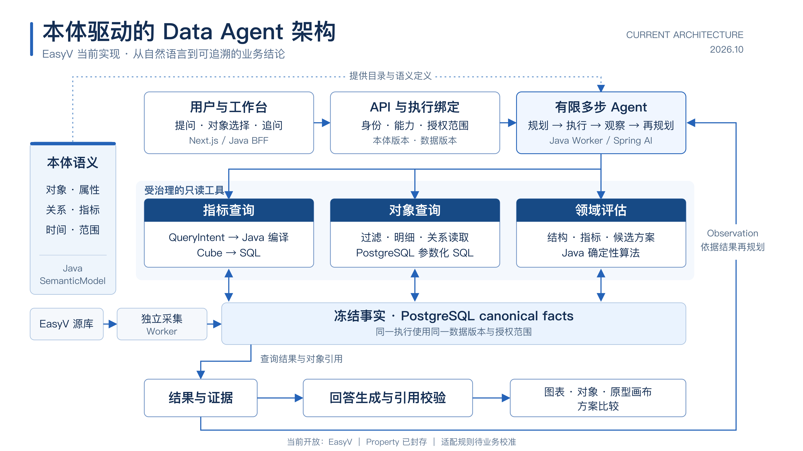

# Ontology Agent Runtime：本体契约 + 受治理工具 + 多步智能体

> 状态：Baseline（2026-09-24）；2026-09-29 补充经用户确认的原型设计分析与可复用呈现路线（§11）。
> 实施状态（2026-10-10）：A、原型对象/画布/选择追问、方案适配评估、有限多步编排及第二组合场景已发布；B4 的限定统计下钻、B5 排名结论修正及组件结构覆盖修复已验收，见 §13.5–§13.8；B6 首批对象组件构成与数据出处、B7 首批动态选型/通用集合详情/筛选排序/图表表格切换已发布并通过本次真实账号验收，见 §14.5、§14.10。easyv-dev Web 为 `06ded4f`、Java API/分析 Worker 为 `8a4b206`，healthy；release-worker 仍为 `8039482`，平台库沿用 V26。完整 B 的评分业务校准、原始输入认证、其他业务指标与正式事件时间线等仍未关闭；配置化接入与 C 动作闭环未实施。
> 当前交付：B7.5 首批及 §14.11 图形点位修复已发布；§14.12 历史入口修复与公司 453 条组件集合的 23 页验收已完成。§14.13 结论标识、末页停止与小屏账户入口已在本地 3000 验证，尚未发布公司环境。本地快照及环境隔离见 §14.10 和 [环境说明](../environments.md)。图形缺口与跨领域覆盖仍保留，不能宣称通用完备。业务校准与上游输入留存按 §13.3 的独立依赖并行推进。§13–§14.12 保留各批历史计划和交付证据。
> 适用范围：分析运行时的语义层、时间语义、Agent 工具与执行模型；产品对标 Palantir Ontology / AIP / Actions
> 与现有基线关系：沿用 [Multi-domain Runtime Architecture](./multi-domain-runtime-architecture.md) 的 Capability、binding、Job pin、证据与审计主链，
> 并按本文 §7 调整其中“Main Agent 只调用一次 workflow tool”等约束；Java 分层继续遵循 [Java Architecture Baseline](./java-architecture-baseline.md)。

## 1. 为什么调整

2026-09-24 真实部署端到端验收暴露的问题不是单点缺陷，而是结构性不灵活：

| 现状 | 位置 | 后果 |
|---|---|---|
| 时间由服务端正则识别（本周/上周/近7天/本月/ISO） | `EasyVDateRange`、`EasyVFollowUpPolicy`、追问建议改写 | “最近30天”等常见说法失败；未识别时静默放大为全量（fail hidden） |
| 20 条无参数固定 SQL | `EasyVQueryCatalog` + `EasyVCanonicalFactAdapter.boundRows` | 无法按周/月、过滤、Top N、对比；每个新问法都要写 Java |
| 每个问题先过“生成质量快照”全部不变量 | `EasyVGenerationWorkflow.requireFacts` | 与问题无关的口径校验（反馈 cohort）导致整体失败 |
| 规划失败回退默认查询集；主 Agent 仅复读服务端参数 | `planKeys` / `EasyVSpringAiMainAgent` | fail hidden；多一次模型调用约 9 秒 |
| 语义只以指标为中心 | 全链路 | 只能回答“多少/趋势”，无法看业务对象、穿透关系、执行动作 |

## 2. 业界做法调研（2026-09 查证）

| 系统 | 模型生成什么 | 时间如何处理 | 可借鉴 |
|---|---|---|---|
| Palantir AIP Agent Studio Object Query Tool | 受约束本体查询 DSL（`OBJECT_TYPE / FILTER / TRAVERSE_TO / AGGREGATE`），解析失败回传错误重试 | 注入当前日期，模型自行换算为 ISO 日期；官方建议“求和/最近 N 天”等计算交给确定性 Function 工具 | 本体为中心；对象穿透；工具失败重试；计算不交给模型 |
| Cube（REST/AI API） | Cube 查询 JSON（measures/dimensions/filters/timeDimensions），不生成原始 SQL | `dateRange` 接受相对表达（`last 2 weeks`），按查询时区确定性换算 | 语义层约束模型；时间粒度/对比原生支持；`/meta` 自动导出目录 |
| Snowflake Cortex Analyst | 在 YAML 语义模型约束下生成 SQL | `CURRENT_DATE` + 日期函数由数据库计算 | 已验证查询库（verified queries）作为质量门禁 |

参考：Palantir 社区 [Object Query 规则](https://community.palantir.com/t/important-improvements-needed-to-automated-prompt-instructions/4858)、[AIP Logic 时间计算建议](https://community.palantir.com/t/can-aip-logic-query-timeseries/906)；[Cube 查询格式](https://docs.cube.dev/reference/core-data-apis/rest-api/query-format)。

共识：语义契约 → 模型生成受约束查询 → 确定性计算 → 校验失败回传重试 → 向用户展示理解 → 评测集门禁。
本项目采用结构化时间表达与确定性解析，不以不断追加关键词规则扩展时间能力。

2026-09-29 补充的 Palantir 官方依据与本项目取舍见 §11.8；产品分层借鉴官方能力，具体技术选型与阶段划分是本项目设计。

## 3. 目标架构

当前已部署的 EasyV 只读主链（2026-10-08，验收见 §12.3 B2.6–B2.7）：



[PPT 用 16:9 PNG](assets/easyv-data-agent-architecture.png) · [SVG 矢量版本](assets/easyv-data-agent-architecture.svg)。下方为后续目标架构，动作与通用配置能力不表示已实施。

```
                   Ontology（唯一契约；版本冻结、审计）
     Object Type / Property（含时间属性与时区）/ Link / Metric / Function / Action Type
                              │ 派生（生成物入库，漂移测试守护）
      ┌───────────────────────┼────────────────────────┐
  指标查询工具              对象查询工具                 动作工具
 （Cube：聚合/粒度/对比，    （过滤/穿透/明细，            （参数/权限/人工确认/
   JWT + queryRewrite        PostgreSQL facts + Neo4j）     幂等/审计）
   强制冻结版本）
      └───────────────────────┼────────────────────────┘
   Agent Loop：模型在限定步数内多步调用工具；每步校验、审计、可重放
   领域函数工具：结构相似度、约束检查、候选评估（声明输入输出与版本，领域实现）
   呈现：工具证据 / 对象引用 → 视图描述 + 应用状态 → 图表 / 原型画布 / 比较视图
   时间：结构化 TimeExpression → Java 确定性解析 → 绝对日期进入每个工具调用
```

### 3.1 职责边界

| 内容 | Ontology | Java（确定性） | Cube | 模型 |
|---|---|---|---|---|
| 对象/属性/关系/指标口径 | 声明（唯一来源） | 校验、生成 Cube 模型 | 执行聚合 | 只读理解 |
| 时间语义 | 声明时间属性、时区、默认口径 | 解析 TimeExpression、校验覆盖范围 | 按绝对 `dateRange` 执行 | 输出 TimeExpression |
| 冻结版本绑定 | — | 签发含 productVersionIds 的 JWT | `queryRewrite` 强制注入，缺失即拒绝 | 不可见 |
| 查询选择 | 声明可组合性 | 校验意图、结构化错误回传 | — | 生成 QueryIntent |
| 领域函数 | 声明输入输出、对象约束与版本 | 执行领域算法，保留规则依据与结果证据 | 聚合已物化的评估结果 | 选择工具与参数，不编造评分 |
| 视图与应用状态 | 引用对象类型和成员；视图配置独立于业务语义 | 校验对象权限、版本、证据引用；前端按组件契约渲染 | 提供统计结果 | 选择与组合已有视图、解释结果 |
| 动作 | 声明 Action Type | 权限、确认、幂等、审计、执行 | — | 只能请求 |

原则不变：元数据驱动选择与解释，Java 保证权限、计算、执行与失败，模型负责理解与受约束表达。

## 4. 时间语义规范

模型只描述时间语义，不做日期运算；Java 以执行锚点（`anchoredAt`，业务时区 Asia/Shanghai）确定性解析。

```text
TimeExpression
  sourceText   原话（审计与展示，必填）
  kind         relative | calendar | to-date | absolute | all | ambiguous
  unit         day | week | month | quarter | year     （relative/calendar/to-date）
  n            正整数                                   （relative：最近 n 个单位，含当天）
  offset       ≤ 0 的整数                               （calendar：0=本期，-1=上期）
  from, to     ISO 日期                                 （absolute：节假日、“9月上旬”等兜底）
  candidates   [TimeExpression]                         （ambiguous：交给用户澄清）
```

解析规则（全部由表驱动测试固定）：

- `relative day n`：`[anchor-(n-1), anchor]`；`relative week/month n`：`[anchor-n 个单位+1 天, anchor]`。
- `calendar week` 以周一为起点；`calendar month/quarter/year` 取自然区间；`offset=0` 截止到 anchor。
- `to-date`：本期起点至 anchor。
- `absolute`：校验合法与先后顺序；保留 `sourceText` 说明依据。
- `all`：显式“全部数据”，必须在回答与界面展示“未指定时间，按截至 X 的全部数据”。
- `ambiguous`：不执行查询，返回澄清候选。
- 覆盖校验：与冻结版本内对应时间属性的 `[min, max]` 求交；部分越界照常回答并注明覆盖区间，完全越界明确告知，不报技术错误。
- 追问：模型输出相对上一轮 QueryIntent 的增量（如仅改粒度），不再用正则重锚。

## 5. 查询意图（指标查询工具）

QueryIntent 是 Cube 查询的受限子集，由模型经 JSON Schema 结构化输出：

```text
measures[]      本体指标 key
dimensions[]    本体属性 key
filters[]       {member, operator ∈ equals|notEquals|contains|gt|gte|lt|lte|set|notSet, values}
time            {dimension（时间属性 key）, expression: TimeExpression, granularity?: day|week|month|quarter|year}
compare?        {expression: TimeExpression}            （环比/同比）
order[], limit  limit ≤ 5000；达到上限视为截断失败
```

校验失败返回结构化错误（不存在的成员、不可组合、越界）供模型一次纠正；仍失败则 fail loud 或进入澄清，禁止回退默认查询集。

## 6. 分阶段目标与退出门禁

| 阶段 | 目标 | 退出门禁 |
|---|---|---|
| **A0 验证（已完成）** | 本体声明 EasyV 应用、生成任务（属性/时间属性/关系/指标）→ 生成 Cube 模型；`queryRewrite` 强制版本；TimeExpression 解析器 | 与现有 SQL（`forge-task-by-status`、`forge-failure-reasons`、`forge-duration-summary`、`application-by-day`）在同一冻结集逐行一致；缺版本上下文被拒绝；按周粒度与环比查询可执行 |
| **A 语义问数（已完成并部署）** | 已接入的 EasyV 生产过程对象入本体并生成模型；QueryIntent 结构化规划 + 纠错 + 澄清；按查询校验覆盖与新鲜度；删除正则、快照门禁、默认回退、复读调用；界面“我的理解”与澄清；评测集 | 原 20 个查询可由意图等价表达；时间表达式 30+ 用例；真实模型评测集准确率报告；Java 全量与 Web 门禁通过 |
| **A 扩展 + B1 原型设计分析（主体已发布，评分验收未关闭）** | 接入原型结构与选型，复用 A 聚合查询；实现 B 的对象查询、有限多步分析、原型呈现与对话联动（§11） | 真实原型可复原、结果可追溯、诊断可定位；第二组合场景已验收。规则业务校准与历史原始输入认证仍待完成 |
| **B 对象与智能体（当前只读工具已发布，通用能力按清单保留）** | 对象查询/穿透工具；Agent Loop（限定步数）；对象浏览器与对象详情；结论下钻到对象 | 已完成当前场景多步评测、审计回放、越权与上限验证，以及 §13.5 限定形状的统计下钻、§14.5 原型/区域组件家族构成；其他业务指标、正式事件时间线及超出当前下钻范围的通用能力仍保留待办 |
| **C 动作闭环** | Action Type（工单/通知/标记）；人工确认、幂等、审计 | 权限、重复提交、失败语义测试；真实环境演练 |
| **D 运营化** | 定时发布（增量 + 周期对账）、血缘与数据健康、看板 | 部署环境持续运行观测 |

当前顺序：保持已发布 A/B 与 B6 首批能力回归 → B7 动态呈现与通用对象视图（§14.6）；B1.4 业务校准和新增生成输入留存（§13.3、§14.4）按独立依赖并行推进 → 按实际重复定义推进 §11.5 的配置化；C 从一个具有真实目标 API 的动作开始。D 中健康、血缘和发布验证随各次交付落实。正式事件时间线先核对来源，完整 B 仍按实际门禁关闭。

### 6.1 分阶段实施清单

每项完成标准：完成与影响范围匹配的测试、构建和契约验证；发布前完成约定的 Java/Web 门禁。涉及部署的项需记录真实环境验证；纯文档调整不运行应用测试。

**A 语义问数**（A0 已完成，见 §9；1–8 已完成，结果见 §10）

- [x] 本体补齐原型任务、流水线节点、反馈对象与关系；生成器支持派生指标（成功率等）与反馈双时间口径（操作时间 / 应用创建时间）。
- [x] Java Cube 适配器：签发含冻结 `productVersions` 的 JWT；识别 `SEMANTIC_VERSION_*`；`/meta` 校验本体成员；Cube 部署从 Property profile 拆出，数据库来源统一为 `JAVA_DATABASE_URL`，使用 facts 只读角色。
- [x] QueryIntent JSON Schema + 校验器（成员存在、可组合、limit、时间覆盖）+ 结构化错误；单次结构化规划、一次纠错、澄清分支；删除 `DEFAULT_KEYS` 回退与主 Agent 复读调用。
- [x] 删除 `requireFacts` 全局门禁，改为按查询校验覆盖与新鲜度；证据记录 QueryIntent、解析后时间、Cube 生成 SQL 与结果行。
- [x] 追问改为增量 QueryIntent；删除 `EasyVDateRange` 正则、`EasyVFollowUpPolicy` 重锚、追问建议相对时间改写。
- [x] 契约（JSON Schema / Zod / fixtures）与界面：“我的理解”条（时间、粒度、口径、覆盖区间，可修改）、澄清选项、覆盖不足提示。
- [x] 评测集 50–100 题（时间说法、粒度、过滤、对比、追问、歧义）；确定性部分单测，真实模型评测出准确率报告作为发布门禁。
- [x] easyv-dev 部署与真实账号端到端验收（含 9/24 失败的三类问题回归）。

**A 扩展 + B1 原型设计分析（主体已发布，评分验收未关闭）**

属于 A 的领域建模扩展与 B 的首个完整业务场景，不另建 Agent 主链。当前验收与部署证据以 §12.3 B2.6–B2.7 为准：

- [x] 原型结构、指标绑定、方案库与组件几何接入；正式 V26 迁移及九产品发布对账。
- [x] 原型、区域、组件的对象读取、画布和选择追问；真实账号及桌面/390px 验收。
- [x] 固定输入与候选集合的适配评估、比较呈现和独立计算复核；规则仍标注待校准。
- [x] 真实模型多步分析、第二组合场景、历史与权限边界，以及 easyv-dev 发布。
- [ ] 用完整渲染与业务可读性标注校准并版本化适配规则。
- [ ] 明确历史原始生成输入可认证范围，并由上游保留新增生成的不可变输入、规则、候选与结果证据；已覆盖的历史输入不承诺恢复。

**B 对象与智能体**

> B6 首批已验收发布：原型/区域组件家族的全量构成、精确组件选择追问与冻结数据出处见 §14.5；其他业务指标及正式事件时间线仍待独立需求与来源认证。

> B7 首批已验收发布：动态选型、原型与 AI 应用共用集合/详情、筛选排序和图表表格切换见 §14.10。本地范围账号的 453 条组件集合已验证；公司规模复验及跨领域真实验收仍保留；不宣称任意对象或全部图形覆盖完成。

- [x] 当前原型、区域、组件的对象查询工具：按本体过滤、排序、分页与关系穿透；PostgreSQL facts 执行，强制冻结版本。只有实际多跳查询需求与验证证据支持时再增加 Neo4j 投影。
- [x] Agent Loop：指标查询、对象读取、关系穿透与领域评估，时间由 Java 确定性解析；限定调用次数与超时，每步事件、审计与可重放，越权与上限 fail loud。
- [x] 当前原型、区域、组件的对象浏览器、属性/关系详情、画布与选择联动。
- [ ] 通用对象详情的相关指标与时间线。
- [x] 统计结果打开支撑原型集合，再查看区域和组件（§12.3 B2.6）。
- [x] 当前三类原型对象的实例 count：无分组或本对象属性分组，统计项精确下钻与证据联动（§13.5）。
- [ ] 超出上述范围的通用下钻：派生指标、关联维度、时间分桶和比较期等；按真实需求单独确定口径，不能把当前 count 下钻视为全面覆盖。
- [x] 当前场景多步问题评测与真实演示剧本；第二组合场景复用 §11 的对象引用、函数工具和界面状态联动。

**C 动作闭环**

1. Action Type 声明（参数 schema、目标对象、权限、前置条件、风险与确认策略、幂等键、超时、审计载荷）。
2. Action 执行服务：服务端重校验身份与目标状态、人工确认、幂等、失败语义、审计；首批动作：创建排查工单、通知负责人、标记异常应用。
3. 模型只能提出动作请求，界面展示影响与确认；现有“动作建议”升级为可执行请求。
4. 真实环境演练：重复提交、权限拒绝、下游失败与重试。

**D 运营化**

1. 定时发布：每小时增量、每日 RECONCILE，经现有发布队列与幂等键；界面显示各数据产品新鲜度。
2. release-worker 看守与告警（部署文档方案落地）。
3. 血缘与数据健康面板：结论 → 证据 → 数据产品版本 → 源批次 → 源行。
4. 看板：固定回答到看板，按新冻结版本刷新并保留历史快照。

### 6.2 遗留待确认（2026-09-24 自原前端计划进度日志迁入）

- EasyV 用户映射（2026-09-28 已确认）：仅按 EasyV `user_id` 限定数据；平台账号经 `identity.subject_bindings`（V20，通用于各接入源）绑定 EasyV `user_id`，`EasyVScopeResolver.dataScope` 解析：`PLATFORM_ADMIN` 为全部数据，其余账号限定为绑定值，未绑定即拒绝（已在 A 分析链路生效）。语义层 `Scope.restricted({userId})` 已由 Cube 访问策略强制。
- 反馈 cohort 口径（原 P1-2，2026-09-28 已确认）：默认按操作时间 `operated_at`；可按 `application.createdAt` 关联时间切换。当前源库为测试环境，开发阶段按真实业务场景使用，后续切换正式地址。
- 管理员 Web 改密入口为 `/admin/accounts`，复用已有管理员 API；普通用户自助改密尚未提供。
- Property（物业收缴率分析）尚未恢复：2026-09-29 easyv-dev 查库，物业账单、项目与用户表均为空，Neo4j 未运行；需完成真实 ERP 接入与投影验收，不能仅打开领域开关。
- 历史进度、部署与验收证据以 git 历史为准（原 `docs/superpowers/plans/2026-09-08-frontend-capability-alignment.md`）。

## 7. 对现有基线的调整

- Multi-domain 基线“Main Agent 必须且只能调用一次 workflow tool”调整为：A 阶段单次结构化规划；B 阶段起允许限定步数的多步工具调用。Job pin、binding、Worker revalidate、审计与终态原子写入不变。
- EasyV 领域包内 `EasyVDateRange` 正则、`EasyVQueryCatalog` 固定 SQL、`requireFacts` 全局门禁已在 A 阶段移除，由 `EasyVSemanticAgent`（规划 → `SemanticQueryCompiler` 校验编译 → `SemanticQueryPort` 执行 → 引用校验）替代；领域不变量改为按查询/指标声明。计划模式为 `semantic-query-read-only`，范围快照为 schema v2；历史 `deterministic-read-only` / `question-driven-read-only` 执行保留只读展示，不支持追问（`FOLLOW_UP_LEGACY_EXECUTION`）。
- Cube 从 Property 专属 profile 中拆出为平台语义查询引擎；Cube 模型为本体生成物，不手写。
- Property 域维持封存，不在本轮迁移；原因与恢复条件见 §6.2。
- §11 的原型设计分析已在 B2.6–B2.7 完成当前场景验收与发布：复用 EasyV 领域，不因新增表或视图就拆新 Domain Pack；完整 B 的剩余项见 §6.1。

## 8. 风险与约束

- Cube 模型随部署发布：以“本体生成 + 入库 + 漂移测试 + 发布时 `/meta` 校验”保证与本体版本一致；口径变化新增成员，不改旧成员。
- 版本绑定不能依赖调用方自觉：`queryRewrite` 对每个被引用 cube 注入 `productVersionId` 过滤，上下文缺失直接拒绝。
- 运行依赖增加 Cube / Cube Store；需纳入健康检查与部署文档。
- 模型不确定性：以结构化输出、纠错重试、澄清分支与评测集门禁约束，不以默认值兜底。

## 9. A0 验证结果（2026-09-24，已通过）

实现（尚未接入分析链路，现有行为不变）：

- 平台 `semantic.api`：`TimeExpression` / `TimeExpressionResolver` / `ResolvedTimeRange` / `TimeCoverage`；本体声明类型 `OntologyObjectType` / `OntologyProperty` / `OntologyLink` / `OntologyMetric`；`CubeModelGenerator`（YAML + `versioned-cubes.json`）。
- EasyV `EasyVOntologyModel` 声明应用、生成任务；生成物 `cube/conf/model/easyv/*.yml`、`cube/conf/versioned-cubes.json` 入库，`EasyVCubeModelDriftTest` 守护（`-Dsemantic.regenerate=true` 重新生成）。
- `cube/conf/cube.js` `queryRewrite`：对 `versioned-cubes.json` 中被引用的 Cube 注入 `productVersionId = JWT.productVersions[productKey]`；缺失即拒绝；调用方引用版本维度即拒绝；物业 Cube 不受影响。

验证：

- 单元：时间解析 46 例（月末截断、闰年、跨年周、上海时区边界、非法表达式、覆盖计算）；生成器 6 例；queryRewrite Node 测试 4 例（纳入 `test:web`）；Java 全量 487 例通过，Web 门禁 76 例（71 通过、5 容器测试按开关跳过）。
- 真实数据（easyv-dev 临时隔离 Cube 1.6.31 容器，冻结集 `ed9b4650`，验证后已删除）：`forge-task-by-status`、`forge-failure-reasons`、`forge-duration-summary`、`application-by-day` 在“全部数据”与 09-18~09-24 两个窗口与原 SQL **逐行一致**（8/8）；缺版本、缺部分版本、引用版本维度均被拒绝；生成 SQL 含两个冻结版本参数；按周粒度与环比（`queryType=multi`）可执行且与直接 SQL 核对一致——两者原 20 条 SQL 均无法表达。

A 阶段需处理的发现：

- `queryRewrite` 抛错时 Cube 返回 HTTP 500；Java 适配层须按 `SEMANTIC_VERSION_*` 错误码识别并 fail loud，或改为抛出 Cube `UserError` 返回 4xx。（已解决：保持 HTTP 500 + `SEMANTIC_*` fail loud 映射，不引入 Cube UserError。）
- `compose.easyv-dev.yaml` 的 Cube 使用 `PLATFORM_POSTGRES_*`，在当前部署与 backend 实际库（`JAVA_DATABASE_URL`）不一致；启用 Cube 前须统一来源。（已解决：`scripts/easyv-dev` 统一从 `JAVA_DATABASE_URL` 派生 `CUBE_DB_HOST/PORT/NAME` 注入 Cube，删除 `PLATFORM_POSTGRES_*`。）
- Cube 目前复用平台库应用账号；生产应为 Cube 配置仅能读取 `facts` 的只读角色。（已解决：`CUBE_DATABASE_*` 独立只读角色，DBA 经 `scripts/sql/create-facts-reader-role.sql` 创建，migrate 幂等授权。）
- `versioned-cubes.json` 为全局索引，当前仅由 EasyV 漂移测试生成；第二个本体生成领域接入前改为汇总所有领域声明生成。（A1 已解决：由 `SemanticModel.discover()` 汇总全部 `OntologyModelContribution` 生成 `semantic-access-policy.json`。）
- 派生指标（如成功率 = completed / terminal）需扩展生成器支持引用其他指标。（A1 已解决：`OntologyMetric` 比率指标。）

## 10. A 阶段实施与评测结果（2026-09-29）

实现（§6.1 A 1–7）：

- 结构化澄清：模型 `clarify` 与 `ambiguous` 时间经 `BackendException.clarification` 透传，失败快照写入 `planSnapshot._clarification{question, options≤6}`；界面展示问题与候选项。首轮澄清以“原问题（补充：所选项）”新建会话承接，追问轮澄清在当前会话作为新追问执行；首轮未完成的会话发送消息同样新建会话。
- 「我的理解」：完成快照写入 `_understanding`（对象、指标、维度、过滤、原话→解析区间、粒度、对比期、Top N、数据覆盖 full/partial/none）与 `_editorCatalog`（编译器可接受的成员路径）；综合回答输入带 `coverageStatus` / `effectiveRange`。
- 结构化调整：`POST /api/analysis/sessions/{id}/follow-ups/structured` 以用户编辑后的查询意图创建追问（`FollowUpPolicy.structuredPlan` 校验编译，计划含 `_queryOverride`），执行时跳过模型规划直接编译，违规 `EASYV_OVERRIDE_INVALID` fail loud。
- 部署：Cube/Cube Store 成为 EasyV 运行依赖（脱离 property profile，纳入 easyv 健康组）；Cube 库地址由 `JAVA_DATABASE_URL` 派生，账号为 DBA 预创建的 facts 只读角色，migrate 入口幂等授权（`FactsReaderGrants`）。

评测门禁（`EasyVPlanningEvalIT`，`-Plive-integration`；评测集 `backend-java/src/test/resources/eval/easyv-planning-eval.json`，80 题：指标 8、时间 25、粒度 7、对比 5、维度/排行 8、过滤 7、时间属性 3、追问 8、澄清 4、不支持 5；锚点 2026-09-24 Asia/Shanghai）：

- 判分：状态一致；查询按对象、指标（期望⊆产出）、维度/过滤集合、粒度、时间属性、解析区间、对比区间逐项命中；等价写法以 anyOf/alternatives 显式列出。门禁：整体 ≥ 90%，time 标签题时间正确率 100%。
- 过程：首轮基线 69/80（86.3%）、时间 54/55。失败归因为规划提示词缺陷（单值问题附加粒度、“昨天”误用 relative、time.expression 嵌套错误、追问对比丢失 compare）与校验反馈不可纠正，已在提示词与 `QueryIntentCodec` 违规信息中修复根因；未以放宽判分规则换取通过（仅补充语义等价写法：失败数指标带冗余状态过滤、P50 指标带冗余主链过滤、两个月份拆成两条查询）。
- 最终（模型 `deepseek-flash`，同一代码连续 3 轮）：80/80 时间 55/55、80/80 时间 55/55、79/80 时间 54/55。未通过的 1 题为“上周末有多少生成任务？”模型选择澄清（未给出错误数字）；门禁按单轮判定，3 轮中 2 轮通过，模型输出存在波动，发布前应重跑评测。

easyv-dev 部署与真实账号验收（§6.1 A 8，2026-09-29）：

- 发布：`91c71f5`（web）+ `636ca0c`（backend / release-worker），发布目录 `/opt/ontology-agent-releases/<rev>`，旧目录 `/opt/ontology-agent` 与 `session-delete` 镜像保留用于回滚；发布前备份目录与平台库（`/opt/ontology-agent-backups`）。Flyway V18 → V20，facts 只读角色 `ontology_facts_reader`（DBA 权限账号创建，LOGIN、无 SUPERUSER/CREATEDB/CREATEROLE），migrate 授权成功；Cube/Cube Store 首次随 EasyV 启动，easyv 健康组（含 cube）UP。
- 验收（经 Web BFF，冻结集 `ed9b4650`，锚点 2026-09-29）10/10 通过：“最近30天每天”解析为 08-31~09-29 按日并提示部分覆盖（数据 09-07~09-23）；“上个月成功率与失败原因”不再受反馈口径门禁影响，区间完全无数据时明确告知；反馈默认按操作时间；“成功率是多少”返回结构化澄清与三个口径候选；自然语言追问“改成按周”；结构化调整（最近7天按日，跳过模型规划）与非法意图创建即拒绝；绑定 EasyV 用户 8 的账号只见本人数据（37 个应用，与平台库直查一致）；未绑定账号 `EASYV_USER_BINDING_REQUIRED` 拒绝。
- 验收中发现并修复：区间内无数据时比率指标 0/0 返回单行 null 被视为可引用证据导致 `EASYV_ANSWER_UNGROUNDED`（`636ca0c`）。
- 验收账号 `acceptance-admin` / `acceptance-scoped`（绑定 EasyV 用户 8）/ `acceptance-unbound`，凭据仅存于服务器 `/root/.ontology-acceptance`（600）。


## 11. 原型设计分析与可复用呈现路线（2026-09-29 经用户确认；结构统计已发布，B1 待实施）

### 11.1 业务目标与当前起点

目标：让用户围绕 AI 大屏的真实原型，在对话中查看选型结构、布局构造、指标分布，诊断重复与匹配问题，沿对象继续追问并比较候选方案。演示必须以真实数据、可定位对象和可解释评估支撑，不能用预制截图或模型虚构分数代替链路。

首个业务范围为 **EasyV 领域内的原型设计与质量分析**。仅在业务语义、权限或数据生命周期确有独立边界时再拆分新领域，不按源表数量划分领域。

源码核查起点（不等于新增功能已实现）：

- `EasyVOntologyModel.PROTOTYPE` 当前只有应用关联、时间与数量；V8 的原型数据集声明排除了 XML、模板 JSON、原型 JSON 等结构字段。首先扩展实际数据接入，单独加 Cube 指标无法补出这些事实。
- EasyV 工作台已有 `PrototypeLayoutState`、XML/JSON parser 与布局呈现。评估复用其中只读解析和渲染能力，不整体搬入编辑器；原编辑器的空输入兜底不能被分析链路当作真实结构。
- 源端 `ThemeBlockMatchingEngine` 已产生匹配分、兼容度、候选方案等结果。需要核实持久化位置、字段含义和历史覆盖；源码存在输出字段，不等于历史数据已保存。
- 当前前端已有 `AnalysisInteractionUiRendererRegistry`，支持 chart/table/graph 等类型；尚无原型画布与通用对象选择联动。当前本体由 Java 声明，不宣称已支持配置界面动态建模。

用户给出的选型矩阵是业务规则讨论素材：指标数量、宽高形态、排列方式、图表组合可成为约束；图中着色、推荐与禁用含义须结合现有选型定义核实，不根据颜色自行推断。

### 11.2 建模与数据接入

最小业务对象链：

```text
大屏应用 → 原型版本 → 布局区域 / Block 实例 → 指标实例
                            │
                            ├─ 采用的选型方案定义 → 组件类型与排列结构
                            └─ 选型评估 → 候选方案、评分分项、规则版本
```

- 区分可复用的方案定义、原型中的具体实例、针对实例的评估记录。不是每个 JSON 字段都建独立对象；只有需要独立查询、关联或审计的实体才提升为对象。
- 保留原始结构快照，同时提取分析所需的区域、几何信息、组件类型、指标语义与关系。通过对象 ID 将统计结果、结构图与原始证据对应起来。
- 复用 source ingestion → canonical product → 冻结 Dataset Version Set 链路；Agent 和前端不绕过平台事实库直接读取源库。新增 schema 使用 V21 或后续实际未占用的迁移编号，不修改已执行的 V8。
- 标识包含源连接/环境、源对象标识与版本语义，禁止把不同 EasyV 环境的同数字 ID 当作同一对象。保留已有权限与父应用归属；对象列表、结构内容、缩略图和聚合使用一致的数据范围。
- 先核实源端是否保留原型修订和选型过程。若只有最新状态，从接入时开始保留快照并注明覆盖起点；禁止把平台采集版本冒充源端完整编辑历史。
- 区分原型结构还原与最终大屏运行效果。只有结构时展示结构与图表类型占位，不伪造真实业务图表数据或声称还原最终渲染。

### 11.3 指标、规则与算法边界

| 问题 | 计算依据 | 执行位置与结果要求 |
|---|---|---|
| 指标分布、方案使用率、区域占比 | 区域与指标实例、方案引用、几何结构 | Cube 聚合；明确实例数与去重指标数、分母及采集覆盖 |
| 精确结构重复 | 明确归一化规则后的结构签名 | 领域函数/物化步骤计算，Cube 汇总；声明是否忽略名称、位置或尺寸 |
| 布局近似、组件组合或语义重复 | 分别定义结构、组合、指标语义的相似标准 | 独立评估口径，返回相似对象与差异依据，不能混成一个不透明“重复率” |
| 选型适配 | 区域尺寸、指标数量/类型、候选方案约束 | 先硬约束筛选，再按可解释规则排序；返回分项及未满足约束 |
| 方案比较 | 固定指标、候选集合、规则与原型版本 | 只读分析，展示构造变化与评分差异，不自动写回源原型 |

规则优先复用现有业务算法。历史评估与按新规则重新计算的评估必须区分；记录候选集范围、算法/规则版本和输入版本。最优仅指“当前候选集与规则下排名最高”，不宣称全局最优或将启发式分数表达成概率。

首轮只选有真实数据依据的指标；缺失历史评分时明确“不可核验”，需要重算时标明重算。语义相似度若使用模型，应独立标注并以人工标注样本验证，不能替代确定性结构判定。大规模相似搜索的索引或预计算按实测规模与延迟决定，不先建通用向量平台。

### 11.4 智能体与呈现联动

复用现有执行、冻结版本、证据和 SSE 链路，按当前场景补齐指标查询、对象查询、领域函数三类工具；引入有限步数的工具编排，禁止为每个问法写专用工作流。查询对象和评估函数均校验作用域，不能靠模型自行遵守。

呈现分成三个部分：

1. **业务结果**：工具输出真实对象引用、结果集与证据；统计或评分不由视图生成。
2. **视图描述**：声明渲染类型、结果/对象引用、字段映射、排序、着色与高亮参数。复用现有 render block 契约；确需新增时才扩展，不预建另一套通用 UI DSL。
3. **应用状态**：当前原型版本、选中区域、筛选条件和比较对象。工具返回结果驱动视图更新，用户点击对象成为后续对话的明确上下文。

约束：

- 优先用工具输出确定性更新对象集合；模型可选择视图和已注册参数，不生成对象 ID、数据或未经注册的执行逻辑。
- 结果引用可追溯至本轮执行及冻结版本；画布、图表和文字指向相同对象。跨版本比较必须显式选择两侧版本，不能静默切到最新数据。
- 一套原型结构渲染能力读取数据绘制不同结构；增加方案、指标或同类布局不新增页面模板。原型画布、对象列表、图表和比较视图可组合，也能单独使用。
- 无效结构、未知渲染类型、失效引用明确展示错误及上下文，不以空白画布表示分析成功。
- 新的专业视觉能力作为可复用组件注册，声明输入与选择等事件，保留版本和发布验证。未来可用 AI 辅助开发组件，但生成代码须经过预览、测试与发布，不在普通分析对话中直接执行任意代码。
- 渲染组件只负责呈现与交互；数据读取、计算及授权留在后端，不把领域规则写进画布。
- 呈现依据问题意图、属性语义、实际结果规模/分布与可用空间选择；同一对象集合可复用表格、列表、汇总、图表或专业视图，不按领域名称固定控件。聚合总量与对象明细分别表达，当前页长度不能代替全量。
- 常规对象集合、属性、关系和选择交互由已校验的本体元数据与对象引用驱动；新增对象通过声明、映射、权限及必要 adapter 接入，不追加对象名称分支。超出现有视觉能力的专业场景才注册新组件，声明适用条件、输入和事件，复用验收见 §14.6。
- 模型可建议已注册的合法视图，后端校验字段、结果形状、引用与作用域；用户切换视图保持同一筛选及冻结版本。历史执行读取保存的结果与视图描述，不在重开时重新随机选型。

### 11.5 配置化与后续领域接入

采用“真实场景验证边界 → 可声明定义驱动运行 → 管理界面维护”的顺序。配置化是减少同类接入的重复研发，不承诺任何新算法或全新表现形式零开发。

| 扩展内容 | 目标接入方式 | 何时需要代码 |
|---|---|---|
| 同一结构的新指标、维度、约束阈值 | 本体/规则定义及校验发布 | 现有表达能力无法覆盖的新语义 |
| 新对象与关系 | 源字段映射、对象声明、作用域声明 | 新连接器或复杂结构解析 |
| 同类图表、原型结构与视图组合 | 已注册组件的字段、参数、事件绑定 | 全新的专业交互或表现形式 |
| 新领域算法 | 有输入输出契约的函数注册 | 实现和验证新算法本身 |
| 新领域 | 领域声明、映射、权限与必要 adapter | 仅增量领域能力，不复制 Session/Job/Agent/UI 主链 |

第一步继续利用现有本体声明、生成器和渲染注册表，集中可变定义，不为此次交付先造配置后台。
随后用第二个真实分析组合检验复用：新增定义与参数即可完成查询和呈现，通用编排/页面无按场景分支。
第二组合场景只证明已验收范围内的组合复用，不能作为新增对象类型或跨领域复用的证据。插入 §14.6 B7：先用已有真实的非原型对象与原型对象验证同一集合/详情视图，专业画布作为可组合能力保留；再以实际重复定义决定配置化范围。数据规模及视图切换门禁同时成立，不能只用固定几个对象的截图证明通用性。
基于该证据，再把稳定的定义转为可持久化配置，接入既有治理链路：草稿 → 校验/预览 → 发布激活 → 版本固定 → 可回滚；旧执行仍使用原定义。
最后提供字段映射、规则参数和视图绑定的管理界面。配置发布能实际驱动运行、生成模型并校验漂移，才算完成配置平台；仅保存 JSON 或新增表单不算。

源连接、权限、映射、本体和结果契约共同构成接入；不是只扩展 Cube schema。已有 Cube 模型继续由本体生成，不能变成手工维护的第二份业务定义。暂不建设插件市场、任意脚本热加载或覆盖未知领域的万能建模器。

### 11.6 下一交付的顺序与退出门禁

以下保留 2026-09-30 的交付快照；第 3–4 步当前已完成首个场景和第二组合场景验收与发布，最新证据见 §12.3 B2.6–B2.7。评分校准与输入认证尚未关闭；下一阶段以 §13 为准。

2026-09-30 续接交付：第 1 步已完成，第 2 步的 ingestion/本体/Cube 实现、真实源验证和 easyv-dev 全量/增量发布已完成，Java 镜像为 `ontology-agent-java:f8f555a`。第 3–4 步待实施；原型画布与区域高亮未实现。不改变 §9–10 的历史验收结论。

| 顺序 | 交付内容 | 退出门禁 |
|---|---|---|
| 1. 源数据与口径核查（2026-09-30 已完成，证据与口径见 §11.9） | 核实部署实际源库中的原型结构、方案库、指标、评分持久化与历史；形成字段映射和真实样本 | 源记录 → 结构解析 → 对象关系逐项核对；明确缺失字段、权限与版本边界；冻结首轮指标口径 |
| 2. A 扩展：结构与统计 | 在现有 ingestion/本体/Cube 链路增加最小对象及关系，完成分布统计与明确口径的重复分析 | 同一冻结集下统计与独立查询/人工标注一致；解析失败可定位；更新/删除、父应用范围与重跑一致性通过 |
| 3. B1：对象分析与可视化 | 对象查询、领域评估函数、有限多步分析；原型画布、候选比较、选择/高亮联动 | §11.7 在真实账号下走通；每个数字与高亮可定位证据；未授权对象不可读；错误、超时/步数限制、未知视图可诊断 |
| 4. 复用与发布 | 第二个真实组合场景复用工具/组件，发布到 easyv-dev | 变更指标、对象集合、着色或布局组合不改通用 Agent 与页面主链；浏览器交互、窄屏、契约和相关测试通过；原 A 评测发布前重跑 |

函数评测覆盖准确性和边界条件；模型评测覆盖对象指代、关系查询、工具选择、澄清及不支持问题，不能只验证答案措辞。

第 2 步已实现的边界：V21 为现有 `easyv-prototype-task` 源数据集增加布局 XML 与原型 JSON，schema 升为 v2；三个新增产品为版式、区域、图表组件，与原五个产品组成同一冻结集。没有新增重复源数据集。首次接入必须 FULL/RECONCILE，旧 v1 源链继续做增量物化会明确拒绝；既有冻结 facts 不受影响。版式保留解析状态与错误码，失败记录的计数/签名为 null，不产出子事实；facts 不保存标题、描述、指标名称等自由文本。区域未标注的尺寸保留 null，展示为“未标注”，尚未实施尺寸推导。新对象通过父应用绑定授权、active cohort 与冻结版本；原生成质量能力仍要求原五个产品，不额外改变已有能力契约。

发布前补齐冻结集解析边界：`latestFrozen` / `requireFrozen` 要求集合包含全部必需产品，返回整个冻结集，且所有产品仍须 published。原五产品能力因此能选中新的八产品集合；缺失必需产品仍拒绝。该边界有持久化测试与真实接入测试覆盖，不通过另发一份五产品旧集合绕过。

部署实测补齐 Worker 证据边界：能力的 required 产品是集合选取条件，证据可以引用同一冻结集中的新增产品。完成态校验复用执行前已校验的 manifest，逐项检查证据的 product key 与 version ID；未知产品、其他版本、其他冻结集或本体仍拒绝。避免 Cube 已返回结构统计却在最终落库时被原五产品列表误拒绝。

接入产品列表的唯一运维配置是 `compose.easyv-dev.yaml` 的 ingest 命令（8 产品），`scripts/easyv-dev ingest` 复用该配置，无单独列表。Cube 模型与访问策略由本体生成，漂移门禁保留。部署后的真实冻结集查询与父应用删除范围已对账；真实非管理员账号权限、浏览器完整交互验收仍待完成。部署顺序见 `docs/easyv-dev-deployment.md` 的 V21 章节。

2026-09-30 验证证据：

| 门禁 | 本次结果 |
|---|---|
| Java 单元/Testcontainers 测试（Java 21） | Surefire 528 项，0 失败、0 错误、0 跳过；全量执行后修正新增测试缺失的计划契约，再定向重跑 Worker 18 项通过。覆盖 V21 新库/旧库迁移、八转换器装配、解析错误事实、增量替换子组件、RECONCILE 删除、旧 v1 链拒绝、重跑/顺序无关哈希、Cube 漂移及冻结集证据版本校验 |
| Web `pnpm test:web` | 88 通过，5 个可选容器测试跳过；覆盖结构对象父应用授权/版本约束、compose 产品清单对齐和显式 ingest mode 优先级 |
| TypeScript / ESLint / Web 与 Java 构建 | `pnpm exec tsc --noEmit`、`pnpm lint`、`pnpm build`、Java `mvn -DskipTests package` 通过 |
| 真实源 `LiveEasyVIngestionIT` | 使用部署机当前只读源配置，经 5 源 → 8 产品 → 同一冻结集物化到一次性 PostgreSQL；120 原型全部 ok，777 区域、1617 图表组件，与独立源 JSON 展开 SQL 一致；FULL/INCREMENTAL/RECONCILE 内容哈希和行数一致，源计数及状态分布前后不变 |
| 运维配置 | compose 配置解析、脚本语法、`git diff --check` 通过 |
| easyv-dev 发布 | 平台库 V21、facts-reader 授权完成；FULL 冻结集 `ingest-947f5eb3-8ece-404e-8144-ba912d9ce1f5`，INCREMENTAL 冻结集 `ingest-c1678964-0ed2-475b-b1d1-6ef377b3d021`，8 产品行数/哈希全部相同。120 原型全部 ok，777 区域、1617 组件；v2 增量源版本正确继承 v2 FULL 父版本。backend/web/Cube healthy，release-worker 已更新 |
| 部署后实际提问 | 管理员会话 `d56abd13-bd66-4c7b-a018-14d4eee68892`，执行 `193e6d98-e846-3adb-bf0e-9ce96460d8d3` 的 job/snapshot 均 completed；真实模型 → Cube → 回答/图表落库完成。查询使用最新 INCREMENTAL 冻结集，active cohort 为 119 原型/770 区域/1601 组件，5 类布局逐行与独立 facts SQL 一致；较原始 120 少 1 个已删除父应用对应的原型（7 区域、16 组件）。登录页浏览器可访问，完整登录后交互仍待人工验收 |

Java 默认测试不包含真实模型调用。额外执行 `mvn clean verify` 时 Failsafe 触发四个 live IT，因未注入真实源/LLM 配置而失败；带当前源配置单独执行的 `LiveEasyVIngestionIT` 已通过，原 A 的模型规划/端到端 live 评测未在本次重跑，仍属于发布前门禁。测试门禁通过不能替代部署环境 Cube 查询、真实账号权限与浏览器验收。
数据接入缺口优先解决，不为了视觉效果先接虚构结果。当前阶段完成分析与方案比较后停止，写回编辑进入 C 的动作设计；新增动作必须定义真实目标 API、参数、权限、前置条件和审计。

### 11.7 首个演示与验收路径

1. “最近生成的大屏，哪些布局重复明显？”——给出统计范围、口径、实际原型集合及缩略结构；样本不足如实说明。
2. “打开这一组，重复在哪里？”——沿结果下钻，高亮对应区域，展示结构或指标的相同与不同。
3. 选中区域追问“为什么选这种构造，匹配得好吗？”——携带选中对象与版本，展示约束、已记录或明确重算的评分及候选。
4. “保持指标不变，比较其他构造。”——只读展示候选差异；没有可行方案时说明具体约束，不生成伪候选。
5. 切换到“指标分布/选型使用情况”——复用同一对象集合、权限、工具与视图组合，验证场景变化无需重写页面。

验收同时包含无数据、结构损坏、评分缺失、无可行候选、越权对象引用和旧版本回看。
产品价值以“真实对象可查看、结论可定位、比较可解释、追问可连续”为准，不以图表数量或截图效果判定完成。

### 11.8 官方实践依据与项目取舍

2026-09-29 查阅的 Palantir 官方资料：

- [Ontology overview](https://www.palantir.com/docs/foundry/ontology/overview)：对象、属性、关系、函数、动作与权限共同构成业务操作层。项目据此保持本体、聚合引擎与领域函数分工。
- [Chatbot tools](https://www.palantir.com/docs/foundry/chatbot-studio/tools)：对象查询、函数、动作、应用变量等工具可组合。项目先交付只读对象分析与评估，写回按 C 阶段治理。
- [Application state](https://www.palantir.com/docs/foundry/chatbot-studio/application-state)：对象集合与应用变量连接对话和其他视图，推荐工具结果确定性更新变量。项目据此实现对象选择与画布联动。
- [Custom widgets](https://www.palantir.com/docs/foundry/custom-widgets/overview)：专业视图可由自定义组件扩展。项目据此采用通用视图复用与专业组件注册，而非每个场景固定一套页面。
- [Pilot build a widget](https://www.palantir.com/docs/foundry/pilot/build-a-widget)：AI 可辅助生成组件，经参数/事件连接宿主并发布，组件在受限环境运行。项目将 AI 辅助组件开发作为后续效率手段，不混同于分析时执行模型生成代码。

上述是已核实的产品分层依据；Cube、Java 领域包、A 扩展/B1 划分以及配置化推进顺序是本项目基于现有边界的设计，并非 Palantir 的具体内部实现。

### 11.9 源数据与口径核查结果（2026-09-30）

方法：经只读会话查询 easyv-dev 源库 `easyv_saas`（未写库，仅结构统计）并对照 `easyv-ai-java` 源码。数字仅代表本次快照（原型创建于 2026-09-07 ~ 09-24）。

**原型结构（`ai_screen_prototype`，每应用一行，无修订历史）**

- 120 行：`screen_structure_xml` 全部可解析；XML 与 `screen_prototype_json` 的 Block ID 集合逐行一致；5~10 个 block/原型，1~7 个图表/block，使用 41 种方案，5 类布局（凹形 39、dashboard_02 39、左中右 32、左右 5、半包围 5）。
- XML 提供布局骨架（`block_type_id`、`blockSize`、`span`、`weight`）；JSON 的 `page-N.blocks[blockId]` 提供 `schemeId`、`boundMetrics` 与 `components[]`（`chartFamily`、`gridPosition`）。
- 缺口：页眉/页脚类 Block 共 121 个没有 `blockSize`（其余 small 72 / medium 514 / large 70），尺寸须由 `block_type_id + span + 所在容器` 推导，不能只依赖 `blockSize`。
- `span` 相对父容器的排布方向：水平容器为宽度占比，垂直容器为高度占比（由 `ai_template_layout.layout_style` 推导，未与前端渲染核对，实现前须核对）。

**方案库（`ai_block_data` 70 个、`ai_block_type` 4 行、`ai_block_internal_data` 6 行、`ai_template_layout` 22 行）**

- 方案按 `(block_type_id, chat_count 1~7)` 索引，含槽位几何 `position`、角色、模式（`kpi_grid` / `stacked_main` / `main_plus_summary` / `summary_plus_main`）；槽位图表类目约束在 `ai_block_internal_data`。
- 4 种 `block_type_id` × 7 档图表数在库中全部存在方案，因此“方案库有无”不能筛出不合适的组合；`ai_block_type.config` 只有 `padding`，无尺寸约束。

**评分持久化**

- 历史查询位置：`ai_pipeline_node_record`（`step_name='PipelineCompleted'`）的事件输出 → `output.raw.regenContextSnapshot.step5Candidates.step4Output.blockAssignments[]`，含 `matchScore`、`bestSchemeScore` 与五项分解；当时查得 159 条快照，按 `ai_screen_app.generation_task_id` 关联到 119/120 个原型，每任务仅一份。数据库 `output` 列保存完整事件，实际列内路径有两层 `output`：`output.output.raw.regenContextSnapshot`。这些数量是当时查询证据，不能据此认证快照为不可变的生成时状态；2026-10-04 源码核对发现的覆盖路径见下。
- 753 个 block 中 730 个有分数（最低 38.6、均值 72.6、最高 100），23 个 `comboScoreBreakdown` 为空。
- 58/120 个原型在快照之后被对话编辑；45 个 block 的方案与快照不一致（含 17 个编辑时新增、快照中不存在）。

**现有组合逻辑不看尺寸**：`ThemeBlockMatchingEngine`（Step4）与 `Step5CandidateScoringEngine`（Step5A）只使用指标数、模式、位置优先级和图表类目；`blockSize` 仅作为提示词上下文透传，不参与硬约束或评分。产品选型矩阵（指标量 × 宽高形态）中“是否推荐”的判定在现有代码与库中没有落地，须由平台侧新增的适配评估函数承担（见下）。

**首轮口径（已确认）**

1. **评分**：产品目标仍是只展示可核验的“生成时评分”，不重算、不外推。原先提出的“当前方案、指标与图表匹配 `currentFilledBlocks` 即可展示”判据不足：2026-10-04 核对本地源 checkout 发现编辑会覆盖该上下文。必须先证明评分阶段的原始输入及来源不可变，再逐项核对当前 block；暂未取得此证据时只保留“评分观测、输入尚未核验”。Step4 最优候选分与最终选中方案也必须分开，不将方案一致当作评分归属一致。
2. **选型适配（新增，独立于生成时评分）**：平台领域函数，输入为位置、指标数与类型、图表、区块物理尺寸；先硬约束（方案存在、指标可落入槽位类目、槽位物理尺寸不低于图表类目最小可读尺寸），再输出可解释分项与未满足约束，规则带版本，与生成时评分分列展示。尺寸阈值以矩阵为校准样本并用编辑行为（被替换/删除的 block）做旁证，但阈值属启发式，须在规则版本中标注，不表述为概率或全局最优。
3. **重复**：分层展示，不合并为单一“重复率”——L1 布局骨架相同（92/120 涉及，最大组 24，主要由 39 种模板骨架决定）、L2 骨架+方案相同（4/120）、L3 再加图表数（4/120）、L4 再加图表族（0/120）。

**已知边界**：产品矩阵为 5 种宽高形态，方案库仅 4 种 `block_type_id`，且 type 3 同时出现 small/large、type 4 出现 medium/large，二者不一一对应，映射须在第 2 步建模时显式定义；生成侧未见历史编辑记录（`ai_screen_prototype` 仅保留最新态），此后的修订快照从平台接入时开始保留并注明覆盖起点。

## 12. 进度核对与交付记录（起始于 2026-10-03）

本节开头与 §12.1–12.2 保留 2026-10-03 的历史快照。当前完成清单见 §6.1，最新真实源、账号与发布证据见 §12.3 B2.6–B2.7。

核对基线为 `main` 的 `e9c770c`。首次拉取因 GitHub DNS 失败，后续 `git pull --ff-only` 成功并返回 `Already up to date`。easyv-dev SSH 与平台数据库的实际协议连接仍不可用；TCP 建连不能作为内网恢复的证据。用户确认内网不可达，改用独立本地 PostgreSQL（`ontology_agent_local`，端口 55432），通过正式 Flyway 入口初始化至 V21；新版 Web 在端口 3000 启动。该本地库没有内网历史会话和 EasyV 业务 facts，新版 UI 未发布至 easyv-dev。

| 工作项 | 2026-10-03 当时状态与边界 |
|---|---|
| A 语义问数与原型结构统计 | 已实现，2026-09-30 接入、部署与对账证据见 §10–11.6；本次未重跑 Java、真实源或模型评测 |
| shadcn/ui 基座与 AI Elements 接入 | `85b12ce` 已实现：vendored 对话、消息、输入、工具等组件；`e9c770c` 已移除旧 workbench 基础控件与引用。`ai` 仅作为类型依赖；现有 Java/SSE 与 ViewModel 保留 |
| 新版工作台与分析会话 | `e9c770c` 已实现：左侧会话导航、中央消息流、按需右侧详情；侧栏折叠/宽度保存、设置弹窗、Conversation 自动跟随、PromptInput 与工具状态展示。代码完成不等于浏览器与部署验收完成 |
| B1 对象分析与原型呈现 | 尚未实现：原型对象查询、画布、区域选择/高亮、候选比较和有限多步分析；UI 框架迁移没有补齐这些业务能力 |

本次本地验证：`pnpm test:web` 101 通过、5 个可选容器测试跳过；`pnpm exec tsc --noEmit`、`pnpm build` 通过；`pnpm lint` 为 0 错误、9 条 warning，来自 vendored `message.tsx` / `prompt-input.tsx` 的 Hook 依赖、未使用参数、图片与无效 disable 注释。未进行新版 UI 浏览器验收、Linux 镜像构建或 easyv-dev 发布。

### 12.1 新版工作台验收与发布收尾（2026-10-03 历史计划，已发布）

2026-10-08 状态：新版工作台已完成当前场景的真实账号、SSE/历史、桌面/390px 验收并发布，证据见 B2.6–B2.7。下文保留 2026-10-03 的原始计划与当时验证边界，不再作为当前待实施状态。

目标：将已实现的 shadcn/ui + AI Elements 工作台交付为真实账号可用的版本，停止继续扩展 UI 套件。

1. 本地已拉取至最新，先完成本地新版工作台验收；内网恢复后核对部署镜像并以真实数据复验，只将实际构建、发布、验证过的版本记录为已部署。
2. 以真实账号检查新建分析、首个进度前等待、流式回答、追问、澄清、失败与断连、历史回放；检查输入框间距、发送状态和消息跟随，用户阅读历史时不能被强制拉回底部。
3. 检查侧栏折叠/宽度恢复、设置与主题、右侧详情、键盘关闭/焦点以及窄屏溢出；确认管理员入口与数据范围仍遵守 Java 权限。核对剩余 lint warning 和依赖补丁，不通过禁用规则掩盖实际问题。
4. 完成受影响测试、生产镜像和 easyv-dev 浏览器验收，保留原 A 模型评测与非管理员越权验证门禁。

2026-10-03 本地未就绪状态修复：首轮表单执行遇到 `ONTOLOGY_NOT_PUBLISHED` 或 `DATASET_VERSION_SET_NOT_PUBLISHED` 时，由 Java 返回 303 至原会话，附错误码与 traceId；其他权限/资源错误保留原 API 语义。会话显示“分析暂未就绪”、保留问题，提供按角色显示的管理入口、重新检查与返回工作台，诊断信息折叠展示，停止等待与自动执行。移除跨页面持久化的自动执行尝试标记：旧版提交失败后未创建执行也会被浏览器判定“已提交”，导致历史回访永久等待；现在由服务端执行状态与已有幂等键控制，组件内仍去重，失败会话回访可重新检查环境；不创建虚假执行或分析结果。链接基础样式移入 CSS base layer，修正 shadcn 主按钮链接的文字颜色。验证：Java `AnalysisControllerTest` 与 `AnalysisServiceTest` 共 20 通过；Web 102 通过、5 个可选测试跳过，自动执行行为测试 12 通过；tsc、相关 ESLint、生产构建通过。本地浏览器已验证新建、刷新、重新检查及历史回访；当前仍为无业务 facts 的本地库，未发布至 easyv-dev。

退出标准：完成/失败状态与后台一致、无空白执行框或输入框遮挡、滚动和窄屏交互可用，记录真实账号、发布版本与验收结果。缺少发布环境或浏览器证据时保持“代码已实现、验收待完成”。

### 12.2 B1 对象查看与画布联动（2026-10-03 历史计划，已完成并发布）

2026-10-08 状态：本段对象查看、区域/组件选择和画布联动已验收并发布，证据见 B2.6–B2.7。生成评分认证与适配规则校准仍按 §6.1 保留待办；下文保留原始交付目标。

第一段交付目标：从“哪些布局重复明显”的统计回答打开支撑原型集合，再查看一个真实原型的区域与组件，并选择/高亮对应对象。所有查询、对象引用和呈现使用同一冻结版本与父应用授权范围。

实现前先核对现有结构 facts 是否足以还原画布，补齐实际缺失的几何/关系字段；对象查询沿现有 Java application/port/adapter 扩展，Web 消费结果与选择状态。不另建 Agent 主链，不在 UI 直接读取 EasyV 业务源库。尺寸方向、未标注区域与来源覆盖按 §11.9 的已知边界核实，不能猜测补全。

第一段退出标准：真实账号能够从统计下钻到对象列表和原型画布；对象 ID、区域/组件与证据逐项一致；越权引用拒绝，损坏结构、缺字段、无数据与历史版本有明确反馈。之后继续 §11.6 的评估函数、候选比较与有限多步分析，再按 §11.7 用第二个真实组合场景验证复用。生成时评分须按 §11.9 可核验口径展示，不能混用当前方案与旧快照。

### 12.3 B 阶段执行计划（2026-10-03 开始）

目标保持 §6 与 §11 的完整范围：对象查询与关系穿透、可追溯的原型呈现和对话选择、领域评估与候选比较、有限多步工具编排，以及第二个真实场景的复用和发布。按下面的依赖顺序交付，第一段通过不表示整个 B 已完成。

| 顺序 | 具体工作与复用边界 | 验收证据 | 状态 |
|---|---|---|---|
| B1.0 画布结构事实 | 保留 XML 的页面尺寸、嵌套布局容器、顺序、span、方向、gap、padding、主视觉引用，继续丢弃名称/描述/指标等自由文本；在现有版式产品增加结构树，使用 V22 和新版转换定义 | 解析测试、正式迁移与物化测试；结构树可还原嵌套关系，错误行无伪结构；旧冻结事实不可变，新内容参与 hash；原统计签名保持原口径 | B2.6 真实源 120 条结构与物化对账通过，V26 已部署 |
| B1.1 对象读取 | 复用本体对象/属性/关系声明、现有冻结集合与 EasyV 范围。先实现原型列表、详情、区域与组件关系查询，再接入统一对象查询工具；所有调用显式携带本轮执行与冻结集合，禁止默认切到最新 | Java/API/Web 契约；同一集合列表、详情、关系一致；分页稳定；跨用户、父应用删除、版本伪造、无数据和解析错误测试 | B2.6 实际非管理员对象/关系读取、越权和版本边界验收通过 |
| B1.2 原型呈现与选择 | 在既有 renderer registry / render block 中接入对象列表、结构画布与详情。读取结构树绘制，不为每种布局写模板；保留原型/区域/组件引用，列表与画布选择相互高亮 | 浏览器：查询范围 → 原型 → 区域/组件；两个不同布局共用渲染器；键盘/窄屏、缺尺寸、坏结构与旧版本明确反馈 | B2.6 两种真实布局、组件高亮、桌面/390px 浏览器验收通过 |
| B1.3 选择进入对话 | 用户选中的对象和版本成为明确请求上下文，服务端重校验；工具返回的真实对象引用确定性驱动视图，模型不生成对象 ID | 同一对象连续追问、切换原型与取消选择；错版本、越权引用拒绝；SSE/历史回放与证据一致 | B2.6 真实账号选择追问、取消范围、冻结版本及历史/BFF 事件验收通过 |
| B1.4 评估与候选 | 按 §11.9 分开显示可核验的生成时评分与带规则版本的适配评估；接入方案/槽位所需事实，硬约束在领域函数内执行，比较固定输入与候选范围 | 输入与快照逐项核验；评分缺失/方案被编辑/不可读尺寸/无候选的失败路径；规则分项、候选集和输入版本可审计 | B2.6 真实 30 区域适配评估与候选验收通过；159 条生成输入仍未认证，业务评分校准未完成 |
| B2 有限工具编排 | 在现有 Java Agent/Worker 内串行编排指标查询、对象查询、关系穿透、时间解析与领域函数；限定步数与超时，每步真实事件及审计，避免按问法编写专用流程 | 多步问题集、对象指代与工具选择评测；越权、上限、超时、工具失败、澄清与重放测试；原 A 回归 | B2.6 真实源/账号/模型的多步闭环通过；原 A 规划 80/80、时间 55/55、对比回归 7/7 |
| B3 复用与发布 | 按 §11.7 真实剧本完成重复诊断、原型查看、匹配解释与方案比较；第二个真实组合场景复用相同工具/组件；发布 easyv-dev | Java 全量、Web/构建/契约门禁；真实账号、独立 SQL/源结构对账；第二场景不改 Agent/页面主链；发布版本、截图和验收记录 | B2.6 重复诊断、第二组合场景及 easyv-dev 8039482 发布完成；完整 B 保留 B1.4 评分校准缺口 |

B2 当前阶段目标与顺序（2026-10-04；先完成 B2.0 主链，再扩展工具）：

1. 先在现有指标主链完成结果回传、再次规划、明确结束、次数/时间预算与逐次审计（B2.0）。随后复用 `EasyVObjectReadService`、`EasyVSchemeAssessmentService` 与本体关系，将指标查询、对象列表、对象详情、关系读取和适配评估纳入同一只读工具协议。模型只能引用服务端从真实结果注册的对象句柄，不能提供执行 ID、版本 ID 或自行生成对象 ID；用户选择继续由 Java 强制约束。
2. 沿用 `EasyVSemanticAgent` / Worker 主链，读取真实结果后再次规划。最多 8 次工具调用，其中指标查询仍最多 4 次；总时长预算包含规划、工具和回答；模型流按剩余预算取消，同步工具在调用前后核验预算并沿用各自传输/数据库超时，不宣称取消了仍在远端运行的查询。时间表达式继续由语义编译器按冻结锚点解析。超限、超时、工具失败明确终止；结构化调整保留确定性执行。
3. 每次工具调用保留输入、实际输出、父调用和成功/失败审计，并发出真实执行事件。对象及评估结果成为可引用证据，确定性驱动现有对象视图与比较呈现；历史回放和对象轮次追问保持可读取。
4. 验证多步结果依赖、伪造句柄/版本、选择范围、冻结输入、无数据、未知工具、澄清、步数与超时，以及原 A 查询/时间/引用回归；跑对应 Java、Web 契约和构建门禁。正式库仍不注入测试业务数据。真实模型、真实源及非管理员验收和第二场景/发布归 B3，不能以本地测试代替。

B 阶段开始时的代码基线：V21 的 `easyv_prototype_block` 仅保存直接父容器 tag/id/direction，版式表没有布局树。它不足以表达嵌套 `Layout` / `Sider` / `Footer` / `Content`、页面尺寸和 gap/padding；不能从这份扁平事实猜测画布。EasyV 原型编辑器的实际消费者 `prototype-layout-parser.ts` 依据父容器方向拆分 span，并读取布局宽高、位置、padding 与间距；B1.0 以此保留结构输入，后续绘制仍需核对组件网格与留白口径。

边界：先交付只读结构视图，不把图表类型占位描述为最终大屏效果；新树不读取运行时源库。旧 V21 冻结集没有树时明确标记结构尚未接入，不在读取时解析 staging 或猜测坐标。内网不可达不阻止本地代码、正式迁移、Testcontainers 和契约推进；真实源重新发布、非管理员范围、模型评测与部署验收仍须补齐，不能用测试 fixture 代替。当前本地空库不注入演示业务数据作为已发布能力。

B1.0 本次证据：Java 全量 535 项，0 失败/错误/跳过；Web 102 通过、5 个可选容器测试跳过。覆盖有序嵌套树、尺寸/跨度/主视觉引用、属性白名单与不可变结果、属性顺序无关序列化、几何变化内容哈希及旧 facts 不可改写、错误记录无伪树、V21 → V22/空库/重复初始化迁移与 Cube 漂移。本地 `ontology_agent_local` 已通过独立 migrate 入口升至 V22，版式注册为 `easyv-prototype-layout-v2` / schema 2；本地版式 facts 仍为 0 行，未用 fixture 伪造接入。当时对象查询、画布与 Agent 多步能力尚未实现；后续对象读取进度见下段，真实源与远端发布仍未验证。


B1.1 对象读取证据（2026-10-03）：

- `ObjectQueryPort` 直接读取冻结 canonical facts，列表/详情/关系共用本体属性与关系声明；过滤和排序仅接受结果对象的属性 key，值使用 SQL 参数。列表默认 50、最多 200，offset 最多 10000；追加主键排序、用 limit+1 返回 hasMore，空列表保持为空。成员资格复用 requiredLinks/baseFilter，并对每个涉及产品强制冻结版本。
- 本体补齐版式→区域/组件、区域→版式/组件、组件→区域关系；区域与组件使用 source_id + block_id 组合关联，不以跨原型可能重复的 block_id 关联。补充布局树节点 ID、组件 ID、起始网格行列，Cube 模型由本体重新生成，漂移测试及本地 Cube metadata 编译通过；没有新增事实表、迁移或产品。
- `POST /api/analysis/sessions/{sessionId}/objects/query` 必须携带 executionId、datasetVersionSetId。objectId 为空读取列表，指定 ID 读取详情，再指定 relation 穿透声明关系；显式核对会话与执行归属、已发布本体和原冻结集合，禁止最新版本替代。当前角色/绑定重新解析后与提交时范围取交集：撤权与跨用户拒绝，权限增加不扩大旧执行范围。对象引用携带 objectKey/objectId/productVersionId，响应携带执行、本体、冻结集合，读取日志保留绑定与返回数量。
- 版式详情在授权对象已存在后读取同产品版本的 layout_structure：available / not_retained / parse_failed 三态，不解析 staging、不补造旧版树或坏结构。区域/组件详情返回声明属性，全部自由文本继续排除。Web 新路由仅透明代理；JSON Schema、严格 Zod 和 Java 序列化 fixture 共用契约；错误继续保留 code/traceId。
- 验证：Java 全量 548 项，0 失败/错误/跳过，随后新增装配测试 2 项通过；Web 105 通过、5 个可选容器测试跳过；tsc、相关 ESLint、Web 生产构建通过。正式物化后的 PostgreSQL 测试覆盖稳定翻页、冻结父应用软删除、跨用户范围、同名区域/组件不串原型、属性/数值/时间过滤、SQL 注入值与非法成员、错误原型无子对象；API/服务测试覆盖冻结集合伪造/不可用、权限收窄/撤销/绑定变更、三种结构状态及未认证。
- 边界：Agent 尚未调用对象查询端口；本次之后的原型呈现进度见 B1.2，下钻条件扩展、选择进入对话与有限多步编排继续按 B1.3/B2 实施。新版 Java API/Worker 已在本地 8080 启动且 health=UP，Web 3000 的对象 BFF 实际返回 401/AUTH_REQUIRED（未认证读取被拒绝）；本地 Cube 新模型已加载。当前本地正式库的 layout/block/component 均为 0 行，真实对象、非管理员浏览器链路、真实源重新发布和 easyv-dev 部署仍待验证。测试 fixture 仅在测试数据库，不写入本地正式库作为业务展示。


B1.2 原型呈现证据（2026-10-03，本地，尚未发布 easyv-dev）：

- Java 按实际语义查询确定性追加 `object-browser` render block，携带来源冻结集合、原型对象类型和可精确保留的根属性过滤。有界时间转换为业务时区的起点 GTE / 次日零点 LT，ALL 不补造日期过滤；按当前期查看对象范围，明确不将聚合分组、排名、TopN 当作对象筛选。一跳关联或 HAVING 过滤暂不产生入口，缺少四个原型相关产品的旧集合也不产生不可用入口。
- 聊天结果通过原有 render block → interaction part → renderer registry 接入“查看原型”侧面板。修正了 view model 丢失事件/历史来源 sessionId、executionId 的问题，SSE 与历史恢复都绑定原轮次，不借用当前轮次的版本。对象读取响应只增加本体的属性标签/类型和可读取关系描述，不暴露 SQL；属性与关系按钮由 Java 声明驱动。
- 同一纯投影器读取保留的树，按源编辑器 12 栅格、gap、padding、方向和跨度还原区域/主视觉；支持多页，保留对象 ID，列表、画布、详情选择联动，组件选择高亮所属区域。缺尺寸、非法/溢出跨度、未知方向、重复区域、冻结对象缺失均显示可诊断原因；历史 not_retained 与 parse_failed 不生成假结构。组件事实未保留像素尺寸，因此不把网格坐标推断为图表像素位置或最终大屏效果。
- 浏览器使用隔离的契约 fixture 服务（3111，不连接数据库，不是正式应用路由）验证横向/纵向布局、键盘 Enter 选择、区域/组件高亮、关系读取、缺尺寸、历史结构缺失、解析失败、403 与空对象状态；390px 视口的文档宽度与视口一致，没有横向溢出。截图保存在本机 `.codex-runtime/b12-object-browser.png` 和 `b12-narrow.png`，测试服务完成后关闭。
- 门禁：Java 全量 552 项，0 失败/错误/跳过；Web 110 通过，5 个可选容器测试跳过；tsc、相关 ESLint、生产构建通过。新增测试覆盖两个几何布局的精确坐标、缺失和非法结构、多页与主视觉引用、Java 范围入口/时间/旧集合边界、真实聊天 view model 的 SSE/历史执行上下文保留。正式本地库仍无原型事实，未用 fixture 冒充接入。
- 下一步仍按完整计划推进：B1.1 的统一 Agent 对象工具、B1.3 的选择进入对话与服务端重校验、B1.4 的事实和评估规则、B2/B3。当前仅证明本地代码、门禁与隔离 UI，真实源几何核验、非管理员浏览器链路和 easyv-dev 发布尚未完成。


B1.3 选择进入对话证据（2026-10-04，本地，尚未发布 easyv-dev）：

- 原型查看器显式提供“针对这个对象追问”。只在对象详情实际读取成功后启用；浏览列表或高亮本身不改变聊天范围。输入框上方显示可取消的选择提示，每条历史消息记录其对象范围；连续追问沿该对象已完成的轮次更新来源执行，切换到旧轮次重新选择时保留用户指定的来源。取消后新消息显式提交 null；待执行/失败历史保留请求引用，失败执行不会变成可承接的对象来源，取消后的普通轮次回访也不会恢复旧选择。
- 请求只传 executionId、datasetVersionSetId 和 objectKey/objectId/productVersionId，不接受属性、权限或 SQL。Java 从同用户、同会话的已完成 Java 快照核对来源，派生父追问并固定原冻结集；普通追问仍使用原有最新完整集合规则。创建与提交执行时重新授权并读取对象，权限只能与冻结范围取交集；Worker 沿任务权限快照读取，实时绑定进一步收窄时同时收窄语义查询与证据的数据范围。
- 规划器获得授权后读取的真实属性和引用。Java 根据本体的主键与直接关系追加对象过滤，自然语言和结构化调整共用此约束；不支持的关系明确拒绝并要求取消选择或改问，不把用户选择静默替换成全范围。所选对象读取有真实 started/completed/failed 事件，引用写入审计与计划快照，指标证据仍使用该轮冻结集合。这里是确定性的选择校验，统一 Agent 对象工具与多步关系组合仍按 B1.1/B2 推进。
- 修复实际历史助手组件丢失执行来源的路径：静态与 live 入口均传入原轮次 sessionId/executionId。共享 Schema 和严格 Zod 接受受控选择，拒绝额外权限/属性、错误追问绑定和孤立标签；Web 透明代理保持原契约，409/403 的真实原因与请求编号在发送失败时可见。
- 本地验证：Java 全量 567 项，0 失败/错误/跳过；Web 116 通过、5 个可选容器测试跳过，TypeScript、相关 ESLint、生产构建通过。Testcontainers 验证来源归属、会话、完成状态与 Java 契约；服务/Agent 测试覆盖版本伪造、权限收窄/撤销/绑定变更、连续父轮次、提交重校验、主键及组合关系约束、结构化调整不调用规划器、读取失败事件及冻结证据。隔离浏览器使用真实聊天组件，验证历史入口→对象详情→选择提示→连续提交、切换版式、取消、键盘操作与 390px 无横向溢出；测试服务不连接正式数据库，不是正式分析结果。
- 边界：本地正式库仍无原型业务 facts；真实模型规划与非管理员端到端、旧/新冻结集的真实源验收、easyv-dev 发布尚未完成。下一段是 B1.4 所需方案/槽位、指标与评分事实，以及领域评估规则；B2 工具编排、B3 第二场景及发布保持完整范围。

B1.4 指标绑定事实（2026-10-04，评估能力仍在实施）：

- 源端本地 checkout `easyv-ai-java` HEAD `2c62b081` 的 `ScreenPlanningExportAssembler` 按 slotIndex 排序，将 `components` 与 `boundMetricIds` 同序输出；组件没有稳定的 metricId 字段，不能从名称反推绑定。解析器仅将明确对齐的 ID 数组投影为有序槽位绑定，保留 slotIndex、componentId、metricId、chartFamily、sceneType、sourceType；不保留 boundMetrics 中的指标名称、源列或业务描述。
- V23 在现有区域 facts 增加 metric_binding_status 与 metric_bindings，区域产品升为 `easyv-prototype-block-v2` / schema 2；其他产品、八产品清单、源数据集 v2 与既有结构统计签名保持原契约。available 表示 ID 数组与组件数量一致、所有 ID 均为非空字符串；缺失为 not_retained，错误类型、数量不一致或无效 ID 为 invalid。绑定不可用时仍保留真实结构，但不补造 ID；旧冻结 facts 的两列保持 null，读取时须明确历史输入尚未覆盖。
- 新绑定参与区域内容哈希，指标替换会产生新区域版本，原区域/版式/组件事实不可改写。L1–L4 仍描述原有结构重复口径，不把指标 ID 混入这些签名。V23 当时尚未接入方案库、生成评分快照与候选集；后续 V24 评分观测见下。运行时对象读取和 UI 尚未消费绑定，不将这一事实扩展计为评估功能完成。
- 评分核验的下一实现边界：上述本地源码中 Step4.matchScore 为位置权重分（最高 50）与最优候选 bestSchemeScore 之和；bestSchemeScore 五项分解对应 bestSchemeId。Step5 的最终 selectedScheme 可能不同，Step5A.preScore 又有独立四项口径。须同时保存评分阶段、候选方案和原始数值；当前输入与 currentFilledBlocks 一致也不意味着 Step4 最优候选分就是最终选中方案的分数，不能统一标为百分比。此次为源码核对，未重新验证内网历史快照对应的生成代码版本；源快照缺少规则版本时必须说明未知，不以当前源码推定历史归一化。
- 本地验证：Java 全量 572 项，0 失败/错误/跳过；Web 116 通过、5 个可选容器测试跳过。解析测试覆盖按槽位对齐、错误类型/数量/空 ID、白名单与不可变绑定；Testcontainers 覆盖真实物化、新旧版本内容哈希、统计签名不扩展、绑定失败仍保留结构，V22 已发布区域升级 V23 后绑定保持 null、旧版本 schema 不改写、新库与幂等初始化。当前本地库已备份并经独立 migrate 升至 V23，区域定义为 v2/schema 2；区域 facts 仍为 0 行，未注入展示数据。Java API/Worker 已用新版启动；完整 B1.4、B2、B3 与真实源/模型/非管理员/发布验收继续待完成。

B1.4 评分观测事实（2026-10-04，V24；尚未认证生成时输入）：

- 源端本地 checkout `easyv-ai-java` HEAD `2c62b081` 中，`RedisRegenStateStore.saveAndSyncDb` 将最新上下文写回最近一条 `PipelineCompleted` 的 `output.output.raw.regenContextSnapshot`。`RegenContextRefresher` 从当前保存的原型重建 `currentFilledBlocks` 后调用此路径；结果保存、区域/标题/主视觉编辑及布局切换均有真实调用者。源表没有更新时间，现有 RECONCILE 策略适合重新读取这些覆盖后的记录。该证据修正 §11.9 原始假设：与当前上下文一致不能证明是评分时输入，当前源码也不能证明历史部署版本。
- V24 复用 `easyv-pipeline-node` 源与产品：源契约升为 schema 2，追加 output（原七列顺序不变）；完整事件仅留在受治理 staging。产品改为 `easyv-pipeline-node-v2` / schema 2，由原物化入口调用纯函数，投影任务内区域/方案/指标 ID、类型、原始数值、五项分解、排名、目标区域条件及有序槽位绑定。facts 不保留名称、描述、源列、文件或完整原始 output；不增加产品、Cube 模型或通用采集能力。
- 有可解析上下文一律为 `available_unverified`，来源标为 `mutable_regen_context`；非目标节点为 `not_applicable`，缺失与损坏分别保留 `missing` / `invalid` 和定位错误码。缺失数值和列表保持 null，不补零或空数组。最优候选 `bestSchemeId` 与最终 `selectedScheme.schemeId` 分开，原始 matchScore 可超过 100，不标百分比；源未保留规则版本和归一化口径。旧冻结 facts 三列保持 null，不回填、读取 staging 或补造历史输入。
- 本地验证：Java 全量 581 项，0 失败/错误/跳过；Web 116 通过、5 个可选容器测试跳过，Java package 通过。纯解析与 Testcontainers 覆盖真实列内路径、候选与最终方案不同、编辑后上下文仍不可核验、白名单、缺失/损坏/重复槽位、非有限数值、重复物化哈希稳定、源覆盖但 create_time 不变时新哈希及旧事实不可改写；V23 已发布旧流水线事实升至 V24 后保持 null 和原版本 schema。旧源 v1 缺少 output，由现有物化版本校验拒绝，必须先重新接入 source v2。
- 本地库已备份并经独立 migrate 完成 V23 → V24；流水线数据集为 schema 2 / RECONCILE / 八列，产品定义为 v2 / schema 2，Java API/Worker 重启后 health=UP，Web 仍在 3000。流水线 facts 为 0，没有注入业务 fixture；远端未发布。评分观测目前仅由物化链路消费，尚未接入 API、UI 或 Agent，不代表评分核验/评估功能可用。
- 下一步：确认不可变的原始生成输入证据及历史覆盖，再接入方案/槽位库、明确尺寸与类目规则版本，实现固定输入/候选集合的领域评估和比较呈现。原始输入无法证明的记录保持不可核验；适配评估独立于历史生成评分。B2 工具编排与 B3 第二真实场景、真实账号/模型/源及发布验收保持完整目标。


B1.4 方案库事实（2026-10-04，V25；领域评估与比较继续实施）：

- 源仓库 checkout `2c62b081` 的 `AiBlockDataServiceImpl.convertToScheme` 按 row/col 排序并重新生成 slotIndex；按 `block_internal_id` 关联 `ai_block_internal_data`，类目来自 allowed_chart_categories，recommend_type 是推荐组，需经源码词表才能展开具体图表类型。源 DDL `sql/v8.17.0-20260604/20260604-1-tables.sql` 明确两个 ID 为 int4，三份 JSON 配置为 varchar；接入契约分别用 INTEGER / STRING，不扩大通用连接器的类型兼容。
- V25 注册两个 RECONCILE 数据集 `easyv-block-scheme` / `easyv-slot-type` 和一个 `easyv-scheme-library` 产品。现有多输入物化器同时绑定这两份冻结源，现有 lineage 保存双方版本；facts 仅投影方案 ID、区域类型、图表数、模式和有序槽位的几何、坐标配置、角色、权重及关联约束，不保留 name / bindMetric。不在读取时查询最新源，推荐组不伪装成已展开的图表类型。
- 槽位输入 available / missing / invalid 三态，错误码与源方案 ID 可定位；缺位置、数量不一致、缺失或损坏的引用类型均不补造合法方案。显式空数组与缺失约束区分，空约束不会解释为允许任意图表；实际评估还须检查类目匹配、几何和可读尺寸。保留的配置是平台接入时的版本，不能认证为历史生成时的方案库。
- 生产 ingest 清单扩为九产品，原八个语义统计产品保持原要求；方案库是领域评估输入，未为了发布它新增无调用者的 Cube 对象。装配门禁、生产清单门禁及 live-integration 的两源/九产品/双输入 lineage 断言已同步。真实源测试尚未执行，私有采集账号还需验证新增两表的读取权限。
- 针对性验证 26 项通过：纯投影、源类型、缺失/坏约束、缺少必需输入、旧 facts 不可改写、相同物化哈希稳定和约束变化新哈希。Testcontainers 按源 DDL 创建 int4/varchar 表，使用现有只读 PostgreSQL 连接器、采集编排、物化器与冻结发布器验证 FULL / RECONCILE 全链路；测试源与事实仅在隔离容器。
- 完整门禁与本地运行：Java 590 项，0 失败/错误/跳过；Web 116 通过、5 个可选容器测试跳过，Java package 通过。追加验证已发布版本不能继续插入方案 facts（明确 BUILDING 版本错误），相关物化套件 5 项通过。平台本地库已备份并通过独立 migrate 完成 V24 → V25；两数据集 ID 为 INTEGER / RECONCILE，产品 v1 且有两个必需输入。新版 Java health=UP，Web 3000/login 返回 200；方案 facts 与任务均为 0。未发布远端，未宣称可在 UI 使用评估。
- 下一实现顺序：领域函数读取授权区域的冻结结构/指标绑定和同冻结集的方案库 → 明确图表族/类目词表、物理尺寸、padding 与最小可读尺寸规则版本 → 固定输入与候选集合，输出硬约束及可解释分项 → API/工具和比较 UI。缺少方案库的旧集合明确输入尚未覆盖；历史评分原始输入核验独立保留为未完成，不阻断新的适配评估实现。B2/B3 的完整范围和真实验收保持不变。


B1.4 适配评估与候选比较（2026-10-04，V26）：

- 评估基于同一来源执行、冻结集合、授权区域和固定指标实例。复用 EasyVObjectReadService 的所有权、撤权、范围收窄和版本检查；方案库只读该冻结集合，历史集合缺方案库返回 SCHEME_LIBRARY_NOT_RETAINED，不查询最新库。接口 POST /api/analysis/sessions/{sessionId}/objects/assess 仅接收 ObjectSelection，不接受客户端属性、权限或 SQL。
- V26 只补实际缺失的输入：区域 title_present 与组件 geometry（源 relativeX / relativeY / width / height 的百分比框）。区域产品 v3/schema 3、组件产品 v2/schema 2；旧冻结事实保持 null、不回填编辑器默认值。标题内容仍不进入 facts。几何或标题变化参与相应产品内容哈希，原有 L1–L4 统计签名不扩展。源 prototype-task 数据集仍为 v2，九产品清单和 Cube 统计模型保持当前契约。
- 领域函数 SchemeAdaptation 先检查区域类型、固定指标/槽位数量、百分比范围、不重叠、图表类别、有效可读尺寸与一对一分配。候选穷举当前源每区域 1–7 个指标的分配（最多 7!）；相同 metricId 的不同组件实例不合并。当前方案使用冻结源组件几何和原绑定顺序；候选使用冻结库槽位几何重新分配。库约束缺失/未知、未知图表族、未保留几何、无方案、无可行分配均有明确原因，失败结果 score=null。
- 规则 easyv-adaptation-v1 是显式启发式，状态 heuristic_pending_real_data_calibration。有效区域扣每侧 13px；有标题时预留 52px；同排/同列组件边距按当前原型编辑器排序扣半个 16px 间距。13px/52px 是评估包络，不能称为最终大屏的像素精确复现。阈值：indicator 120×64、chart 240×160、table 320×180、map 400×240。category 使用源 chart/indicator/table，donut 归 indicator，map 归 chart 但独立尺寸阈值；未认证的类别不加别名兜底。
- 分数仅在可行分配中计算 0–100 均值：可读余量 50%（宽高相对阈值的最小比例减 1，封顶 1）、角色 30%（indicator→summary、chart→main、table→table）、位置 20%（indicator 优先上部、table 优先下部、chart 优先中部）。未引入指标优先级、历史推荐权重或概率含义；也不是全局最优性证明。历史生成评分仍遵守 V24 的 available_unverified 口径，不与该分数合并。
- 区域属性面板提供用户主动“评估候选方案”、当前方案/候选分配示意、可行排序、尺寸/阈值与分项、失败原因、规则和产品版本。响应与选择引用不一致会被客户端拒绝。Web BFF 原样透传。每次评估将完整输入、候选、规则、来源引用和结果保存到现有 audit_events，保留 180 天；审计写入失败不返回成功。
- 候选范围为冻结库同 blockTypeId 全部方案，最多 200 项；超过限制明确报错，不截断后宣称已比较全部。界面首屏显示前六项，其余显式展开。此函数比较候选的适配条件，不修改 EasyV 原型或发布方案。
- 验证与运行证据见本次 .codex-runtime/b14-assessment-*.log 与截图。隔离浏览器用共享 Java 契约 fixture 验证可行分配、尺寸失败与历史库缺失，明确不连接本地正式库。完整 B 仍包含统一 Agent 对象/评估工具、B2 有限多步编排、B3 第二真实场景，以及真实生成输入认证、非管理员/真实源/模型/远端发布验收。

本轮门禁与本地运行：Java 全量 611 项，0 失败/错误/跳过，package 通过；方案库读取的补充 Testcontainers 5 项通过，旧/新约束和 SQL 参数范围保持指定版本。Web 120 通过、5 项可选容器跳过，tsc、相关 lint、Next.js 生产构建通过。本地正式库已备份并通过独立 migrate 升至 V26，区域 v3/schema 3、组件 v2/schema 2；Java 已重启。layout/block/component/scheme facts 和 jobs 均为 0，未注入业务 fixture。Java health=UP、Web 3000/login=200；Java 与 Web /objects/assess 未登录均返回 401/AUTH_REQUIRED。隔离浏览器证据明确不代表真实账号或正式数据验收。


B2.0 结果驱动的指标循环与逐次审计（2026-10-04）：

- 保持现有 Java Agent/Worker、`QueryIntent`、语义编译器、冻结范围、回答引用与结构化调整主链。自然语言执行每批真实指标结果后重新规划，模型只能选择追加合法查询、明确结束、澄清或不支持；结构化调整不再调用规划器。最多 4 次指标查询，重复的已编译查询拒绝执行；用尽次数仍要求追加时明确失败，不作部分结果的伪成功回答。
- `observations` 回传本轮实际结果、覆盖、区间、列与引用行，结果行仍最多 50 条，`totalRows` 保留完整行数。规划与回答共享 180 秒轮次预算，模型流超过剩余预算时取消并报告 `AGENT_EXECUTION_TIMEOUT`；同步工具在调用前后核验预算，沿用 Cube 的独立传输/轮询超时，因此这不是远端查询的强制取消机制。
- 每次指标查询使用既有 `subtool` 子审计：记录父调用、已编译意图、解析后日期、冻结产品版本、授权范围、完整当前期/对比期结果、SQL 和数据覆盖。所选对象读取也单独审计。租约仍由原记录器检查，失败不吞错；计划快照与真实事件按实际查询和再次规划顺序保存，历史回放继续使用原契约。
- 验证：Java 全量 626 项，0 失败/错误/跳过；Web 121 通过、5 个可选容器测试跳过；Java package、TypeScript、相关 ESLint 与 Next 生产构建通过。新增测试覆盖真实前置结果决定后续过滤、冻结范围一致、重复/上限/提前结束、后续澄清、工具失败、模型超时取消、完整审计与 50 行输入边界；Testcontainers 通过实际 JSONB 验证父子关联、结果、SQL 与 ISO 日期；Web 验证交错查询/规划步骤符合 JSON Schema、Zod 和 SSE 回放契约。证据在 `.codex-runtime/b20-*.log`。
- 本阶段不新增业务 schema 或迁移。本地正式库的 layout/block/component/scheme facts 仍全部为 0，没有把隔离测试结果写成业务数据。真实模型多步评测、真实源和非管理员验收尚未运行；easyv-dev 尚未发布。
- 下一阶段 B2.1：在同一有界循环中接入对象列表/详情、声明关系读取与适配评估；对象句柄只从服务端真实返回注册，用户选择不能扩大范围，调用继承当前执行及同一冻结集合。然后完成对象结果证据、比较视图、对象轮次追问与审计重放，最后推进 B3 第二真实场景和发布验收。完整 B 目标继续有效，B2.0 不表示 B2/B 已完成。


B2.1 同一 Agent 的对象工具、方案比较与回放（2026-10-04）：

- `EasyVSemanticAgent` 使用同一 `calls` 协议选择 `query_metrics`、`query_objects`、`read_object`、`traverse_objects` 和 `assess_scheme`。每步结果返回后再规划，最多 8 次工具调用、其中最多 4 次指标查询，继续共享 180 秒预算。对象列表最多返回 50 行，并保留 offset/hasMore；模型只能使用服务端注册的真实对象句柄。历史引用没有继承属性，使用时重新授权读取。
- 运行中的 Worker 尚无完成快照且不携带登录角色。对象读取与评估复用原服务的正式读取逻辑，运行时入口检查租约并继承当前执行、本体、冻结集合；从身份库核验当前账号状态、组织、角色与 EasyV 绑定，最多收窄冻结权限。用户选择由本体关系生成约束，历史句柄、详情、关系和指标查询都不能绕过它；执行期间范围变化明确失败。
- 工具接入曾暴露 `AnalysisService → 能力注册 → Agent → 对象读取 → AnalysisService` 循环依赖。对象读取改为复用会话仓储的 `requireOwned`、已发布本体和领域校验，保留原来的角色/冻结产品要求，解除反向服务依赖；没有启用循环依赖或使用延迟装配绕过。
- 每次调用沿用 `subtool` 父子审计，保存真实请求、冻结产品版本、授权范围和完整输出。对象结果与适配评估成为可引用证据；评估证据对模型限制 50 行，保留完整行数和候选集合是否完整，审计及比较视图保留完整候选。不可评估的 score 保持 null，规则仍明确标记为待真实数据校准的启发式。
- `_resolvedContext.toolCalls` 保存有序调用和真实引用。只读对象轮次可以没有指标 queries；原指标计划继续可读。JSON Schema、Web Zod、SSE/result 投影和 renderer registry 支持 `scheme-comparison`，直接展示本轮保存的评估，不在初次渲染时重复评估；区域选择继续携带冻结引用进入追问。
- 验证：Java 全量 640 项，0 失败/错误/跳过；Web 123 通过、5 个可选容器测试跳过；TypeScript、相关 ESLint、Next 生产构建与 Maven package 通过。测试覆盖对象列表 → 声明关系 → 方案评估 → 引用回答、伪造句柄/版本/历史引用、所选范围、账号组织/权限变化、运行中无完成快照、第 9 次调用拒绝、证据截断与完整审计、对象轮次追问和错误回放。Testcontainers 使用实际账号与 Worker 身份验证 Spring 装配及 PostgreSQL 父子审计 JSONB。Java 实际工具轨迹与共享 fixture 逐项一致；浏览器隔离验证比较卡片、依据展开、区域选择和无方案库反馈。证据：`.codex-runtime/b21-*.log`、`b21-scheme-comparison.png`。
- 本阶段没有新增业务迁移；正式本地 layout/block/component/scheme facts 均为 0。隔离 fixture 仅用于测试与界面预览，不是已发布业务数据。Java 已重启到本轮代码，8080 健康检查 UP，3000 登录页 HTTP 200；真实提交返回 `ONTOLOGY_NOT_PUBLISHED` 并重定向到页面，尚未进入 Worker 或调用真实模型。当前本地库没有已发布本体，也没有对象/方案事实；没有为通过运行检查伪造业务版本。真实源/真实账号、多步真实模型评测、规则校准、第二组合场景和 easyv-dev 发布仍未完成；完整 B 目标继续有效。

### B2.2 本地运行准备与真实模型工具验收（2026-10-05）

- 本地库先备份至 `.codex-runtime/b22-before-bootstrap.dump`，再通过既有管理员本体初始化接口发布 `ontology-java-multidomain-v2` / `2.0.0`。权限、完整性校验和审计沿用正式服务；审计为 `ontology.baseline.bootstrapped` / `succeeded`，请求编号 `5416941c-30dc-4455-8695-3ed9808e0950`。没有插入业务 facts 或补造冻结集合。正式提交现已通过本体前置检查，转为 `DATASET_VERSION_SET_NOT_PUBLISHED`，重定向回分析页显示具体原因；尚未进入正式库 Worker/模型执行。
- 真实模型评测发现 `time.compare` 被解析器静默忽略，对比问题变成单期查询。`QueryIntentCodec` 现在拒绝错误层级及未声明时间字段，交给已有一次纠正轮；不移动字段、不推断对比期。提示词给出完整调用结构。另补 Provider JSON 对象输出约束，继续由 Java 校验语义；使用方式依据 [DeepSeek JSON Output 文档](https://api-docs.deepseek.com/guides/json_mode/)，不增加 Provider 重试或 fallback。
- 对象回答中引用 `structureStatus` 元数据也被真实评测发现。回答协议明确只能引用实际 `rows[row]` 字段；失败反馈列出该行可引用的非空字段，使原纠正轮有明确依据。所有结果为空时返回空 citations，服务端继续使用已有数据范围证据；不编造行、字段或数量。对象列表为空后不以数量统计代替对象读取。
- 现有 `EasyVPlanningEvalIT` 保留 80 题、整体 ≥90% 与时间 100% 门槛。报告追加真实模型规划决策，失败时保存原始响应；每题输出进度，避免长时间无法判断运行位置。最终 `deepseek-flash` 达到 **80/80**，其中时间题 **55/55**；额外针对性回归 **7/7**。报告在 `.codex-runtime/b22-final-eval/easyv-planning-report.{json,md}` 与 `easyv-comparison-regression.json`，运行证据 `.codex-runtime/b22-planning-live.log`。这是本次结果，不等于对模型未来输出的稳定性保证。
- 同一 live IT 用隔离 Testcontainers PostgreSQL 的源 fixture，经正式源发布、产品物化和冻结入口生成九产品集合，再调用真实模型与正式 Agent/对象/评估服务。平台身份是实际 `EASYV_ANALYST`、绑定用户 16，Worker 不携带登录角色；源还包含用户 17。**4/4** 场景通过：版式列表 → 详情 → 区域/组件关系、当前/候选方案比较、旧集合未保留方案库、空对象列表。逐项核对真实对象 ID、产品版本、用户范围、父子审计输入与输出；关系场景须真正读到三个对象类型，调用名称本身不构成通过。评估须返回完整两项候选并有可计算分数。证据 `easyv-object-tool-report.json`。fixture 与评测账号只存在于自动销毁的容器，不写入正式本地库；直接调用有租约的 Agent，不将其描述为 Worker/SSE/浏览器端到端验收。
- 本地正式 layout/block/component/scheme facts 仍均为 0。公司网络不可达，真实源及实际非管理员账号验收、原始生成输入认证、规则校准、第二真实组合场景、easyv-dev 发布仍未完成。B2.2 只关闭本地准备、原 A 真实模型规划回归及四条隔离对象工具路径，完整 B 目标保持原范围。

本轮最终门禁：Java 默认单元/Testcontainers 套件 **644 项**，0 失败/错误/跳过，Maven package 通过；真实模型 live IT 三项门禁通过。Web **123 项通过**，5 个可选容器测试跳过、0 失败。证据 `.codex-runtime/b22-java-all-package.log`、`b22-java-summary.json`、`b22-web-all.log`。Java API/Worker 已重启到本轮代码，Web 继续使用本地 3000；本轮只改 Java 与验收代码，前端生产构建仍沿用 B2.1 的已验证结果。正式运行仍受未发布数据集合阻断。

### B2.3 真实模型多轮选择、Worker 与历史回放（2026-10-05）

- 复用 `EasyVPlanningEvalIT` 与原对象工具评测 helper，在自动销毁的 PostgreSQL 容器中，经正式源发布、物化、冻结入口构造旧/新两套集合。实际账号为 `EASYV_ANALYST`，绑定 EasyV 用户 16；源包含用户 17，执行由正式 Worker 领取，重新核验当前账号。测试不伪造完成快照或手工拼装追问执行上下文。
- 四轮 `deepseek-flash` 执行均完成：区域列表/详情 → 显式选择区域评估方案 → 从保存的评估追问继续选择并读取组件 → 普通追问“刚才这个组件属于哪个区域”。中途发布更新集合；前两条显式对象追问固定来源集合和产品版本，普通追问按既有契约绑定最新完整集合。逐项核对用户 16 的真实对象 ID、产品版本、父追问与来源执行、完成状态、全部父子审计。
- 真实运行发现普通追问绑定新集合后，历史对象句柄仍携带旧产品版本，正式 Worker 报 `OBJECT_VERSION_MISMATCH`。修复仅在 `EasyVAgentTools` 的历史句柄注册处：历史轨迹提供对象身份，执行产品版本来自当前冻结集合；不继承历史属性，必须通过正式对象服务重新授权读取。历史轨迹与快照不改写，显式选择仍固定来源集合。补测试覆盖重新读取及当前对象已不存在/无权访问；失败不恢复旧属性、不返回默认值。
- 四轮分别保存 **74 / 51 / 54 / 48** 条事件。真实签名 Cookie 与持久化登录会话进入正式 SSE Controller，直接消费 `StreamingResponseBody`；输出逐帧匹配持久化事件，完成事件关闭输出，`afterSequence` 续读没有重复/漏项。历史快照经正式读取入口重放，结果、选择、数据版本与原执行一致。此验收覆盖 Worker、数据库、身份与 SSE Controller，不声称已覆盖 HTTP 代理和浏览器实时渲染。
- 证据：`.codex-runtime/b23-worker-followup-report.json` 保存各轮真实规划决策、完整快照、事件、审计与 SSE 帧；`.codex-runtime/b23-worker-live.log` 为修复后通过记录，`b23-worker-before-fix.{json,log}` 保留故障。针对性 Java 测试 **57 项**通过；Web **123 项**通过，5 个可选容器测试跳过。
- 最终门禁：Java 默认单元/Testcontainers 套件 **646 项**，0 失败/错误/跳过，Maven package 成功；Web **123 项**通过，5 个可选容器测试跳过。证据 `b23-java-all-package.log`、`b23-java-summary.json`、`b23-web-all.log`。首次全量命令误带本地 EasyV-only 领域开关，导致三个既有 Property/双域套件失败；已按项目标准默认环境重跑通过，保留 `b23-java-with-local-domain-flags.log`，未调整断言或产品行为来绕过。
- 正式本地 layout/block/component/scheme facts 仍为 0，Java API/Worker 已重启到本轮代码，8080 健康检查 UP、3000 登录页 HTTP 200。隔离评测没有写入正式业务库，没有发布 fake 业务版本。完整 B 的真实数据与发布验收仍未完成。

下一步按依赖推进：完成指标到对象下钻的真实模型验收，并补 HTTP/浏览器执行与历史页面验证；公司网络恢复后，以真实源重新发布结构/几何/方案事实，在实际非管理员账号上核验范围、结构与独立 SQL 对账；再完成 §11.7 第二真实组合场景、原始生成输入核验/规则校准和 easyv-dev 发布。沿用现有 Agent/工具/组件，不按问题追加专用流程。


### B2.4 统计到对象的真实模型 HTTP 闭环（2026-10-05）

1. 复用 B2.3 的隔离源发布/物化 fixture，连接实际 Cube 与 Redis，沿正式 Java HTTP 登录、提交、Worker、SSE 和历史读取链执行。正式本地业务库不写入测试数据。
2. 验收同一轮“已解析原型数/区域总数/组件总数 → 版式对象 → 区域/组件关系”；数字、用户范围与产品版本必须和独立 PostgreSQL SQL 一致。
3. 从返回的真实区域引用发起选择追问，在同一冻结集合完成组件统计与候选方案评估；HTTP 续读、完成事件、历史快照、审计和无权访问须可核验。
4. 完成匹配影响范围的门禁并记录证据。此段不代替真实公司源、浏览器/BFF 完整验收、生成时输入核验/规则校准、第二真实组合场景和 easyv-dev 发布。

状态：B2.4 已通过真实 HTTP 验收和匹配门禁，本地 API/Worker 已更新。完整 B 仍有下述后续验收目标。

- 新增显式 live 门禁 `EasyVRuntimeEvalIT` / `EasyVHttpRuntimeEval`，使用真实 DeepSeek、Cube、Redis、Java HTTP 和正式 Worker；业务源 fixture 只在 Testcontainers PostgreSQL 发布和物化，平台登录 Cookie 由真实登录接口签发，模型输出没有 mock。
- 第一轮统计已解析原型数、区域总数、图表组件总数均为 **1**，与独立 SQL 相符；全库同时存在用户 17 的版式，用户 16 的统计/对象/关系结果始终限定其授权范围。第二轮从第一轮真实区域引用追问组件统计与候选方案评估，确认编译后 `blockKey` 约束、冻结集合/产品版本、两项候选结果和正式审计。
- 复现并修正真实 SSE 故障：Worker/数据库已有 104 条事件，但实时 HTTP 仅收到前 100 条；末尾综合回答、工具完成与最终 completed 事件丢失。已核对实际 Tomcat 11.0.22 的 Connector 默认异步超时 **30 秒**，原分析流超时为 5 分钟，两者不一致。`spring.mvc.async.request-timeout` 直接复用 `dip3.stream.timeout`，不增加新的配置选项、重试或事件兜底。
- 确定性验证每轮首次真实模型规划前等待 32 秒；最终执行 `e0f6f771-718c-3a37-afb9-01a65c956e1c` / `a633429c-f1b4-35de-9890-cdea485f8780` 分别持续 **47,988 / 43,616 ms**，完整收到 **70 / 45** 条 SSE，与数据库事件逐帧一致，包含 completed 和最终渲染块。`afterSequence` 续读及 HTTP 历史快照也逐项一致；无登录 HTTP **401/AUTH_REQUIRED**，另一个实际登录账号 HTTP **404/SESSION_NOT_FOUND**。
- 首次 live 调用的回答 JSON 连续两次无法解析。沿用现有纠正轮次与错误码，将 Jackson 原因及行/列加入解析错误，补未转义换行的单测；没有放宽 JSON 契约或自动修复输出，也不宣称模型此后不会再次产生无效 JSON。另一次失败是验证脚本只接受区域 `componentTotal`，而模型实际使用组件 `count`；现按相同区域约束及实际值验证这两种本体声明的有效查询，未改变运行时查询规则。
- 证据：`.codex-runtime/b24-http-runtime-report.json`、`b24-http-fixed.log`；保留首次模型失败、断言修正前和 SSE 截断失败报告/日志，避免成功覆盖故障记录。Java adapter/Agent/tools 聚焦门禁 57 项通过；最终 Java 默认单元/Testcontainers 门禁 **647 项**，0 失败/错误/跳过，Maven package 成功；Web 门禁 **123 项**通过、5 个可选容器测试跳过。全量证据 `b24-java-all-package.log`、`b24-java-summary.json`、`b24-web-all.log`。

- 本地 API/Worker 已加载本轮修复，8080 health=UP，3000 经真实种子登录后工作台 HTTP 200，固定本体 2.0.0 ready；layout/block/component/scheme 正式 facts 仍均为 0。证据 `b24-runtime-ready.json`；未向正式业务库写入隔离评测数据，也未发布到 easyv-dev。

下一阶段 B2.5：沿当前 Web BFF 与页面执行入口，验证指标 → 真实对象 → 区域选择追问的页面呈现、加载/执行状态和历史恢复，复用 Java HTTP 合约。真实公司源/账号、原始生成输入核验与规则校准、§11.7 第二真实组合场景及 easyv-dev 发布仍属于完整 B 的未完成目标。


### B2.5 页面与 BFF 全链验收（2026-10-05）

1. 复用 B2.4 的隔离源发布/物化与实际 Cube/Redis，以非管理员账号沿完整 Next 页面/BFF、Java API、自动 Worker 和真实模型执行；使用当前 Web standalone 构建，隔离页在 localhost:3100，不覆盖 127.0.0.1:3000 的 Cookie 或业务库。
2. 验证发起/执行状态、三个指标、版式/区域/组件浏览、明确选择后的统计与方案追问；页面显示须与正式快照和独立 SQL 一致。
3. 从 BFF 订阅实际运行中 SSE，和持久事件逐帧对照；刷新页面、重开历史与对象选择来源保持一致。桌面及窄屏截图作为人工浏览器证据，不把 HTTP 测试冒充浏览器验收。
4. 仅修复复现的问题，完成 Web/相关 Java 门禁、记录证据并清理隔离进程。真实公司数据、输入核验/评分校准、第二真实组合场景与远端发布仍保留为完整 B 的后续目标。

状态：B2.5 隔离真实模型浏览器/BFF 验收通过；完整 B 的实际业务数据、校准、第二场景与远端发布尚未完成。

- 新增显式人工 live 门禁 `EasyVBrowserEvalIT`：复用 B2.4 的 PostgreSQL/Cube/Redis 容器与源发布/物化 helper，启动正式自动 Worker 和 Web standalone 构建。只有 `RUN_EASYV_BROWSER_EVAL=1` 才执行；在 `.codex-runtime/b25-browser-ready.json` 给出隔离入口，等待实际浏览器观察写入 `b25-browser-done.json`，校验结果/引用/事件与关键观察，20 分钟内没有完成标记则失败，最后清理 Web 与容器。
- 首次启动探针失败：JDK HTTP client 默认 h2c Upgrade 在本地 Node HTTP 服务上报 `HTTP/1.1 header parser received no bytes`；同一 localhost/127.0.0.1 探针显式 HTTP/1.1 后均返回 200。仅修正测试驱动的 HTTP 版本，并采用与 Web 镜像相同的 standalone server/static 运行入口，未加入产品兼容或重试。保留 `b25-browser-startup-failed.log/json`。
- 浏览器复现 UI 根因：源布局的 Layout 直接包含 Block，Java 已正确发布/返回区域，展示端却先遍历 Layout 的孩子，把 Block 当成容器，导致结构图报“结构中没有可展示的区域或主视觉”。复用同一个 `walk` 从 Layout 开始处理，消除重复的根节点遍历；不补造结构或尺寸。新直接 Block 回归断言修复前失败，修复后与已有嵌套、横纵排布、主视觉、非法几何测试通过。修正前 HTTP/数据库检查通过，但浏览器 `canvasSelectable=false`，不能据此宣称 B2.5 完成；证据保留于 `b25-before-projection-fix-report.json/log`、`b25-projection-before-fix.log`。
- 执行中的输入框仍禁用，但提示原为“首轮分析未完成，发送将以新会话重新分析”；现使用已有禁用状态展示“正在分析，完成后可继续追问”，未完成且可以重新发起时保留原提示。未改变提交、权限、查询或 Worker 合约。
- 最终由页面登录非管理员 `browser-eval-analyst`，提交统计/对象问题，从画布选择区域、浏览组件并确认所属区域高亮，再明确选择区域进入追问。会话 `dbeb56af-cf9d-4d53-9a46-6edf5f3c1b8d`：根执行 `250570fc-295c-3e00-b203-413699b8461b`、选择追问 `7db3801c-85c6-3cac-9950-3bca276be520` 均 completed，同属 `browser-eval-full-set`。三个统计与独立 PostgreSQL SQL 均为 1，区域引用为 `16:page-1__b_1`，当前方案及候选 39/40 的结果显示在正式比较组件中，规则仍标注待真实数据校准。
- 正式 BFF 在实际运行中订阅两轮 SSE，完整 **108 / 44** 条事件与数据库逐帧一致，含最终 completed；两轮审计均 completed。默认窗口与 **390px** 浏览器验证画布、组件关联、区域追问、刷新和从会话地址重开历史；根统计表只出现一次、两个候选及选择引用正确恢复。取消选择移除当前输入框选择条。390px 下 document/body 宽度均为 390，无页面横向溢出，浏览器错误/警告列表为空；测试视口已恢复。
- 门禁：显式 Java browser live IT **1 项通过**（编译当前测试源码并实际执行）；Web **124 项通过、5 个可选容器测试跳过**，TypeScript、改动文件 ESLint、Web build 均通过。Java 产品代码本阶段未改动，上一阶段默认 647 项全量门禁仍作为基线，本阶段未重复执行。证据 `b25-browser-report.json`、`b25-browser-live.log`、`b25-web-all.log`、`b25-tsc.log`、`b25-lint.log`、`b25-web-build.log`；截图 `b25-running-desktop.png`、`b25-canvas-desktop/mobile.png`、`b25-followup-running-mobile.png`、`b25-comparison-mobile.png`、`b25-history-mobile/desktop.png`。
- 隔离 3100 Web 及测试容器已退出，正式 3000/8080 仍为 HTTP 200/health UP；正式 layout/block/component/scheme facts 仍为 0，没有向业务库写入测试输入或发布到 easyv-dev。

下一阶段 B2.6：核对真实源连接、原型结构/几何与方案库覆盖以及实际账号主体映射，沿治理发布链产生真实冻结集合；在真实非管理员账号上重复本阶段流程并与独立 SQL/源结构对账。原始生成输入的可核验性与规则校准继续显式记录，随后按 §11.7 完成第二真实组合场景及发布。源不可达时保留实际诊断，不能用隔离测试输入替代正式业务事实。


### B2.6 真实公司源、账号验收与发布（2026-10-08）

状态：真实数据、非管理员浏览器、多步模型、第二组合场景及 easyv-dev 发布已完成；**完整 B 尚未关闭**，适配规则的业务校准和可认证的原始生成输入仍有明确缺口。

- 实际发布代码 `8039482`；Java API/分析 Worker、独立 release-worker、Web 均为此版本镜像。平台库为 `ontology_agent_test`，Flyway 从 V21 升到 V26。升级前备份 `/opt/ontology-agent-backups/ontology-agent-ontology_agent_test-20261008093213.dump`；原 80 个产品版本的行数/哈希与 V1–V21 checksum 不变。Web/backend/Cube healthy，release-worker running、RestartCount=0。源连接凭据只存在独立采集 Worker，backend 源接入关闭。
- 真实源七表计数分别为应用 128、原型 120、节点 4774、生成任务 155、反馈 1128、方案 70、槽位配置 6。专用 reader 原来没有新方案两表的 SELECT，已只补这两表授权；reader 无 SUPERUSER/CREATEDB/CREATEROLE，查询均使用只读事务。独立 live ingestion IT 通过，源计数与分布未变。
- 通过管理员正式发布队列运行 FULL `600963ae-57ba-43ad-80e5-dc693c2af5e2`、INCREMENTAL `40afea44-4864-4132-9377-206b651579dc`、RECONCILE `88909298-8028-4941-8866-5004ed0609a5`，均 completed。三个冻结集合九产品的行数、content_hash、schema version 逐项相等；重复 FULL 幂等请求复用原已完成任务，没有再次发布。结构产品为版式 120/区域 777/组件 1617，方案库 70；全部原型解析成功、区域绑定和组件百分比几何可用。页尺寸 1920×1080 共 114，2560×1080 共 5，2880×1080 共 1。
- 实际平台账号 `18668184122`（平台 userId=2、EASYV_ANALYST）现有主体绑定为 EasyV userId=3。当前身份库与源用户存在性均已核验；没有按旧记录中的 userId=16 改绑。源 JSON、独立 canonical SQL 和实际页面统计一致：**5 个原型、30 个区域、63 个组件**。用户口令仅用于正常登录，不进入版本库、文档或报告。
- 浏览器首轮会话 `fee71685-8bdc-4357-86b9-2006e73b9738`，根执行 `d3ebefb9-8300-3887-88e5-af967506ebf3`：三个统计 → 五条版式列表 → 第一条半包围布局六区域/十二组件。组件选择高亮实际所属区域；另一条左中右布局六区域/十五组件沿相同渲染器读取。源组件百分比、指标实例和产品引用与冻结评估输入一致。
- 从画布明确选择 `105:page-1__foot_1` 后追问，执行 `4d2a3ae8-fe7b-31f4-98df-b09ca5a37f50` 得到该区域 2 个组件、1 个区域，并比较当前源位置与同类型全部 17 个候选。尽管此时最新集合已变化，追问仍固定首轮 FULL 集合及其产品版本。当前/候选全部不可行，保留尺寸、类别、数量与分配原因，score=null；没有生成伪分数。
- 取消选择后的普通追问执行 `fa3b55e7-2fa9-365e-ad16-58b997988000` 显式保存 objectSelection=null，采用当时最新 RECONCILE 集合，编译后的查询无区域过滤，正确恢复 30 区域/63 组件。刷新和重开历史保留已保存的比较及选择来源。
- 第二真实组合会话 `c80faf70-e892-4435-a227-5b4c59aea740` / 执行 `fcf963d0-54c3-3bd6-a533-7ffd69636b4e`：按图表族统计组件、按方案统计区域 → 读取使用最多的方案 4 的九个区域 → 读取其中一个区域的两个组件。八种图表族共 63 个，15 个方案共 30 个区域，与独立源 JSON/SQL 完全一致；复用现有工具和图表/对象组件，未增加场景分支。
- §11.7 重复诊断会话 `b602db4d-493a-475d-b3e6-6e33737ccd62` / 执行 `1da4bafc-ee96-34e4-ac38-10270e3de624`：五个已解析原型、五个不同 L1 签名，无重复组；实际模型如实说明样本边界，再读取真实版式/区域/组件，不以布局类型相同替代结构重复。
- 根执行 BFF 事件回读 157 条；选中追问、重复诊断、取消选择在 processing 时实际订阅，分别完整收到 **143/93/26 条 SSE**，与 PostgreSQL 逐帧一致，含 completed。第二组合场景完成后回读 113 条也一致（该订阅开始时已完成，不描述成实时验证）。全部正式工具父子审计 completed。
- 真实权限/历史检查：匿名 401/AUTH_REQUIRED；另一个已登录管理员访问此用户会话 404/SESSION_NOT_FOUND；外部主体对象 404/OBJECT_NOT_FOUND；错冻结或伪造产品版本 409/OBJECT_VERSION_MISMATCH；已知不存在的 appId 过滤返回空对象页。旧会话 `27164b3d-bd3f-496f-aec6-b6989a96f50f` 保持原集合，详情 structure=not_retained，评估 unassessable/SCHEME_LIBRARY_NOT_RETAINED。真实源本次无损坏结构，解析失败路径仍以正式解析/契约测试为证据，没有污染业务库构造故障。

真实适配与生成评分边界：

- 同一账号全部 30 区域经正式评估 API/审计检查：当前可行 12、不可行 12、当前方案未保留 6；15 个区域存在可行候选。这是规则覆盖检查，缺少业务标注与完整渲染的可读性结论，**不等于规则已校准**。`easyv-adaptation-v1` 保持 `heuristic_pending_real_data_calibration`。真实可行示例 `102:page-1__left_1`：当前方案 6 为 43.3，候选 8 为 67.3，固定三个指标及同一外框，输入、分配和分项可审计。其余不可行/缺库实例保留实际原因。
- 追加独立 Python 复算：上述 30 区域/63 源组件中，原型编辑器 `buildGapEdgeById` 的排序边距与评估器的 2,093 次槽位边距计算一致；32 个可行的当前/候选评估、68 项指标分配的有效尺寸、阈值、分项与加权分数均一致。证据为 `.codex-runtime/b26-assessment-independent.json`；此项验证计算口径，不认证最终大屏渲染或业务可读性。找回 2026-09-29 用户提供的矩阵原图，但图中下方行不完整，未提供着色图例及像素尺寸；它的五种宽高形态也不能直接对应源库四种区域类型，因此不能据此宣称尺寸阈值或评分权重已校准。
- 源 159 条 PipelineCompleted 均包含 regenContextSnapshot，但没有 Step4/Step5 记录；已核查 `easyv-ai-java` 的 `RedisRegenStateStore.syncSnapshotToDb` 会在编辑时覆盖最近 PipelineCompleted 的该快照（updateById）。因此这些记录仍为 available_unverified，无法据此认证生成时原始输入或原始评分。不能用当前编辑结构、最新方案或本次适配分补造历史生成分。
- 后续关闭 B1.4 所需：以真实区域/完整渲染及业务可读性标注校准并版本化现有规则；对历史原始输入明确可认证范围，新增生成记录需由上游保留不可变输入/规则/候选与结果证据。当前报告不承诺能恢复已经覆盖的历史输入。

本轮修复、门禁与证据：

- 真实容器安装发现 Dockerfile 未将锁定的 `patches/remend@1.3.1.patch` 复制到依赖安装层，修复两份 Web Dockerfile；私有运行证据目录从 Docker context/ESLint 排除，提交 `f068853`。源锁和官方 registry 均保持原设置。远端 registry 出口慢，构建期间使用仅绑定 loopback、只允许 registry.npmjs.org:443 的临时代理，构建完成已退出。
- 真实窄侧栏复现图表类型标签挤压组件 ID、逐字换行；现将名称与类型上下排列，提交 `8039482`。浏览器实际行宽 147px 时 scrollWidth=clientWidth=147；390px 下 document/body 宽度均 390，组件/区域高亮、可行及不可行比较正常。未改变对象查询、评估和提交契约。
- 初次配置误取旧 `/opt/ontology-agent/.env.easyv-dev`，缺 Cube 凭据；校验失败后误进入停服步骤，已立即恢复旧服务并确认 healthy/登录 200，再使用真实运行 Web 的完整配置执行发布。保留失败记录，不将它描述为一次无故障发布。
- 本次 Java 默认单元/Testcontainers **647 项**，0 失败/错误/跳过，package 通过；独立真实源 ingestion IT **1 项**通过。真实模型规划 **80/80**、时间 **55/55**，额外对比 **7/7**，两项 live IT 通过。Web **124 通过/5 个可选容器跳过**，TypeScript、production build 通过；全量 lint 0 错误/9 个既有警告，侧栏改动文件 lint 和本地/远端生产构建另通过。
- 私有证据位于 `.codex-runtime/b26-*`：三模式发布及 hash 对账、source-independent-reconciliation、root/selected/scenario2/duplicate/cleared 的 aggregate/audit/SSE/report、boundary-report、history-boundaries、own-rule-survey、generation-input-provenance、deployed-services、planning-eval。截图 `b26-canvas-desktop.jpg`、`b26-canvas-mobile.jpg`、`b26-comparison-mobile.jpg`、`b26-history-desktop.jpg`；30 个实际区域的待业务标注清单 `b26-rule-calibration-review.csv`。凭据文件与报告均不提交。

- 界面后续问题：Recharts 初始尺寸测量记录 3 条 width/height=-1 告警，实际图表和回访结果正常，浏览器未记录 error。本轮保留诊断，不把当前浏览器描述成无告警；不顺带扩大渲染重构。

### B2.7 区域与组件结构联动（2026-10-08）

- 根据真实页面反馈，区域列表改为结构缩略图与区域名称；组件面板沿已有 `block → components` 关系读取，只展示当前区域。默认选第一个区域，区域列表与版式画布均可切换；点击组件的栅格占位或图表类型条目，保留所属区域高亮、组件属性与对象追问引用。
- 复用对象读取中已有的 gridCol/gridRow/gridColSpan/gridRowSpan，按源 1-based、12 × 12 栅格投影组件。指标卡、折线、条形、环形、表格等使用图形占位示意，ID 留在属性和引用中；缺失、非法或越界栅格明确提示，不能补造布局。该示意表示源网格切分，不等同于百分比配置或最终大屏像素渲染。未修改 Java、事实、本体、查询权限或冻结版本契约。
- 实际非管理员在原 B2.6 会话上验证：区域 right_1 仅有一个环形图，foot_2 仅有指标卡/条形图，right_3 显示两个指标卡与一个环形图，布局分别为整块、上下切分、左侧上下/右侧整列。点击 foot_2_chart_2 与 right_3_chart_2 后属性与所属区域一致，组件追问选择条保留对应引用。窄侧栏缩略图上下排列名称/计数；390px 下 document/body/viewport 均 390，没有页面横向溢出。
- Web 125 项通过，5 项可选容器测试跳过；TypeScript、修改文件 ESLint、隔离生产构建和远端正式镜像构建通过。已推送 `6ccfbdc` / `975d675` 并部署 Web `975d675`，镜像 `c67d80827331`，Web/Java healthy，登录页 HTTP 200，Java 容器未重启。本次浏览器未记录 error。证据位于 `.codex-runtime/b27-*`，截图为 `b27-deployed-desktop.jpg` / `b27-deployed-panel.jpg` / `b27-deployed-mobile.jpg`。
- 完整 B 的业务评分校准与历史原始输入认证仍按 B2.6 保留缺口；本次显示改动不改变评估规则或原始输入认证状态。

## 13. 下一阶段目标与任务（2026-10-08）

> 本节保留当日 B4 启动计划及后续 B4/B5、组件展示修复的交付记录；当前下一阶段以 §14 为准。

### 13.1 阶段启动基线与业务目标

本次核对 `main` 的 `49919ba` 及现有代码、交付记录，并通过 easyv-dev Docker 状态确认：Web `975d675`、Java API/分析 Worker `8039482` healthy，独立 release-worker `8039482` running，Cube healthy。V26 与真实源三模式对账沿用 B2.6 证据，本次没有重新迁移、采集或执行模型评测。

当前已交付统计问数、有限多步对象工具、原型/区域/组件读取、结构画布、区域组件联动、选中追问、只读方案比较及第二真实组合场景。下一阶段选 **B4：统计项精确下钻与证据联动**，补齐已经列入 §6.1 的直接下钻能力。

业务目标：用户点击一个可下钻的计数或图表分组，看到该项实际支撑对象；打开对象后沿用现有画布、区域/组件联动与选中追问。整个过程使用该统计的执行、冻结集合和权限，历史回看不切换到最新数据。

首批验收路径：

1. “统计我可访问的原型数、区域数、组件数” → 点击其中一个计数 → 精确的对应对象类型和集合。
2. “按图表类型统计组件数” → 点击一个图表类型 → 仅该类型的组件 → 查看所属区域与原型 → 选中组件追问。
3. “按版式签名统计原型数” → 点击一个签名 → 仅该签名的原型；Top N 仅限制显示的分组，不能截断该组内部的对象。

阶段启动时，`EasyVRenderBlocks.objectBrowsers` 只保留查询属性过滤与当前期区间，明确不按聚合分组/排名筛选；`chart`、`table`、`kv-list` 输出尚未携带统计项到对象集合的绑定。因此现有“对象范围”入口不能作为上述精确下钻已经完成的证据。已有 `GroundedConclusion.EvidenceReference(source,row,field,value)`、编译后的查询、ObjectRead 服务和对象引用作为实现起点。

### 13.2 B4 分批任务与交付门禁

状态：B4.1–B4.5 已完成，2026-10-08 发布与真实验收记录见 §13.5。沿用既有编号：§12.3 的 B3「复用与发布」已在 B2.6 完成验收，本阶段新增为 B4。

| 批次 | 任务与实现边界 | 退出门禁 |
|---|---|---|
| B4.1 口径与失败用例 | 以三条真实路径核对本体 count 定义、返回行、维度与对象属性映射；在现有 RenderBlocks/ObjectRead 测试中先复现“点击一个分组却打开整次查询范围”。列出可精确下钻与暂不支持的结果形状 | 每项明确统计对象、分组条件、原过滤、时间区间、冻结版本、权限和计数含义；回归用例能捕获错组/漏条件，不能仅断言按钮存在 |
| B4.2 Java 生成受校验绑定 | 沿现有语义查询与结果生成链，将统计项绑定到执行证据及对象读取范围。首批覆盖三类原型对象的 count、无分组或对象属性分组；由 Java 从编译后的查询与实际结果生成过滤，不由模型或前端推断。只增加本次调用所需契约字段 | 列表全量分页所得对象数与对应计数一致；组合过滤、空值分组、权限及跨版本拒绝有验证。无法精确转换的关联维度、时间分桶、派生比率/求和、过滤上限等明确不可下钻，不放宽原校验 |
| B4.3 交互与视觉联动 | 给现有指标卡、图表点/柱与表格统计单元增加一致入口，复用对象浏览器与详情侧栏。展示所选分组及统计口径，保持键盘可操作、加载/空集/错误清晰；不解析回答中的数字或 Markdown 来猜对象 | 点击不同组不会残留上组对象；首次加载、切组、分页、对象选择与追问一致；桌面窄侧栏及 390px 可用。现有整次查询范围入口与精确分组入口在文案中区分 |
| B4.4 证据与历史恢复 | 使用已有执行/证据引用保存并恢复下钻绑定；点击对象后沿用现有选择追问引用。对比期仅在其区间与证据可以独立校验时启用，否则明确不可下钻 | 刷新、重开历史、发布新冻结集合后仍读原统计集合；引用篡改、越权和旧集合缺产品均明确拒绝，不能回退最新集合；历史未携带新绑定时保留原展示 |
| B4.5 真实账号验收与发布 | 实际非管理员在 easyv-dev 完成三条路径，与同冻结集合独立 SQL 逐项对账；保留会话/执行、对象集合、截图与失败边界证据。按影响范围执行 Java/Web、类型、构建和相关原 A 模型回归，再分批提交推送、发布 | 统计项 → 对象集合 → 详情/画布 → 选中追问全部成立；无多余对象、冻结版本一致、当前权限生效。部署版本及证据回填本文；通过后停止 B4 范围的实施 |

实现优先复用 `EasyVRenderBlocks`、`EasyVSemanticAgent`、`EasyVObjectReadService`，以及现有 renderer registry、`render-object-browser.tsx` 和 Java/Web 对象读取契约。业务映射与授权留在 Java，Web 只传递正式引用并呈现。不预建通用下钻 DSL、独立对象集合平台或第二套页面主链；除非实现发现必须持久化的新数据，本阶段不预定 schema 迁移。

提交顺序：口径/Java 与契约 → Web 交互 → 真实验收与部署记录。每批有自身验证后提交，接口变更与其消费者保持可兼容的交付顺序；不把未完成链路描述成整体验收通过。

### 13.3 B1.4 独立依赖：继续保留，不阻塞 B4

| 工作 | 现有证据与缺口 | 下一任务和关闭条件 |
|---|---|---|
| 业务评分校准 | 已对 30 个真实区域独立复算，算法算术一致；规则仍为 `easyv-adaptation-v1` / `heuristic_pending_real_data_calibration`。30 项业务标注为空，源网格示意不能替代真实渲染可读性 | 用同版本的真实完整渲染制作 30 项评审材料，明确可读性、禁用/可用和偏好方案标准，由业务评审完成标注；有依据后调整并版本化规则，在未参与调参的样本上验证。缺历史方案的 6 项显式列为覆盖缺口，不能补造候选或算作通过 |
| 历史输入认证与新增留存 | 159 条 PipelineCompleted 有快照，但上游 `RedisRegenStateStore.syncSnapshotToDb` 会更新最近记录；缺少 Step4/5 历史输入记录，当前快照不能证明首次生成输入 | 明确历史可认证/不可认证范围；在 easyv-ai-java 的真实生成写入路径保留新增生成不可变的输入、候选、规则和结果，并定义关联到原型/生成执行的键。新增真实生成需能回查、编辑不能覆盖原输入，随后才扩展本项目的接入与认证；历史已覆盖部分不承诺恢复 |

两项依赖各自需要业务评审或上游改动，不以等待它们为由暂停已具备条件的只读交付。B4 完成不代表启发式评分已经认证，也不代表恢复了历史原始输入。

### 13.4 后续路线与启动条件

| 路线 | 顺序与启动条件 |
|---|---|
| B 的相关指标与时间线 | B4 后按实际对象查看需求安排；先核对可读属性和正式事件来源。采集版本/执行审计与源编辑历史分开呈现；缺源历史不能合成时间线 |
| 可声明配置与治理 | 第二组合场景已提供复用证据，但配置运行与后台尚未实现。按 §11.5 先找出现有两个真实场景反复修改的稳定定义，选一项贯通声明 → 校验/预览 → 发布 → 执行固定版本 → 回滚；只有运行时确实消费配置后再做管理界面 |
| C 首个动作闭环 | 从一个真实业务动作开始，先确定目标 API、对象归属、权限、参数、前置状态和可验证结果，再沿现有审计/确认链实施。原候选工单/通知/标记不等于已确定的接入，不一次建设通用动作平台 |
| D 持续运营 | 随发布继续记录版本、血缘与健康；定时增量/RECONCILE 需独立验收队列、失败告警和持续运行。不能把本次三模式成功当作定时运营已完成 |

B4、B5 及组件展示修复已按 §13.5–§13.8 的范围完成。当前下一阶段为 §14 的 B6 对象相关统计与数据出处；B1.4 两项独立依赖保持未关闭，正式事件时间线仍须先核对来源。


### 13.5 B4 交付与验收记录（2026-10-08）

**交付范围**：三类原型对象的实例 `count`，无分组或本对象属性分组。Java 从编译查询和实际结果生成绑定，保留原过滤、当前期区间及每个分组条件；空值分组用 `NOT_SET`，Top N 只限制展示的分组。对象读取从已保存执行结果恢复绑定并再次检查冻结集合、当前角色/账号绑定和执行权限。Web 指标卡、柱形/折线点及表格统计单元复用现有对象侧栏、画布和选择追问；切组重置分页与选中对象。没有 schema 变更、迁移或重新采集。

**明确边界**：派生指标（包括 `parsedCount`）、求和、不同签名数、关联维度、时间分桶、HAVING 或超过对象过滤上限的结果不生成精确下钻，显示不可下钻原因；不能用近似过滤代替精确集合。旧历史未保存绑定时保持原展示，并拒绝伪造新绑定。比较结果只绑定当前期实例 count，比较期未启用。

**提交与部署**：`48da957`（Java/契约）、`af4d7b9`（Web）、`0c67cd0`（旧 live Worker 验收问题修正）已推送 main。easyv-dev Web 和 Java API/分析 Worker 正式镜像均为 `af4d7b9`：Web `01c22c9f1c7d`、Java `8561821c80dc`，均 healthy。发布目录 `/opt/ontology-agent-releases/af4d7b9`；配置仅复制现有私密 env 并更新这两个镜像。release-worker 仍为 `8039482`；Cube、CubeStore、Valkey 和 release-worker 的容器 ID/启动时间均未改变。回滚入口为 `975d675` 发布目录及其原 env，仅重建 backend/web。

验证结果：

- Java 默认 654 项测试通过，包含迁移/物化 Testcontainers 集成；Maven package、Web 130 项通过（5 项可选容器测试跳过）、TypeScript、修改文件 ESLint、隔离生产构建与远端正式镜像构建通过。
- 真实模型规划 80/80（时间 55/55）、比较回归 7/7、对象工具 4/4 通过。旧 Worker 验收初始问题未含生产能力入口所需的生成类语义，首次在入口失败；仅修正测试问题后，隔离库真实模型 Worker 的 4 轮对象读取/选择追问/历史版本验收通过。隔离库手动 Worker 用例未启动 Redis，唤醒错误有日志；真实环境 Redis 健康且异步 Worker 正常。
- 非管理员工作台账号 2 / EasyV userId 3，使用冻结集合 `88909298-8028-4941-8866-5004ed0609a5`：三类总量 5/30/63，8 个图表族组、3 个版式签名 Top N 组、21 个「图表族 × 应用 ID」组合组，共 35 个绑定。分页全量对象 ID 与同冻结集合独立 SQL 集合完全一致，数量亦一致。源三模式采集沿用 B2.6 证据，本次未重跑。
- 浏览器：指标卡点击、柱形点击及 Enter、33 个指标卡组件的 20+13 分页、切到 5 个 donut 后回第 1 页、所属原型/区域画布、组合表格单元点击、刷新后原绑定恢复均成立。390px 文档宽度 390、侧栏宽度 390，无横向溢出；浏览器 error 日志为空。折线点实现经类型检查与构建检验，未作真实浏览器验收；本次真实浏览器验收柱形图。
- 从 donut 组的 `105:page-1__right_1_chart_1` 选择追问，实际完成执行 `17bb9879-58be-33ed-b7b3-49c211bb8d0c`：保留原组件引用与冻结集合，通过对象工具读取所属区域及组件，回答 right_1 仅有该环形图。新冻结发布后的历史版本约束在隔离 Worker 回归中验证，本次未为验收重新发布源集合。
- 真实 HTTP 拒绝：未知绑定 404、改变对象类型 409、替换过滤 400、错冻结 409、匿名 401、跨账号会话 404、旧历史伪造绑定 404。当前权限收窄/撤销边界沿现有 ObjectRead 回归验证，未修改真实账号权限。

可复查会话：

| 路径 | 会话 / 执行 |
|---|---|
| 三类独立计数 | `39c9d30d-c464-4a02-8452-64d0093b7ea7` / `61c25a66-73a4-3c44-b48e-607ce7e33386` |
| 图表族分组与真实组件追问 | `ad890511-e93f-48cb-95b8-c6cbf70c46e7` / `c0ffdd18-082d-36db-9204-babd91996dd2` |
| 原型 count + parseStatus=ok + 签名 Top 3 | `3eb09b61-72b4-4c6a-8d03-2cf437cd255b` / `cb344ac8-7cb5-3f97-b8d1-ca80082ca1c4` |
| 图表族 × 应用 ID 表格 | `6f64680d-eed7-46ca-9117-6c0b93210c42` / `0b4487a6-0ec9-39f6-842a-4843dc778802` |

证据位于工作区忽略目录 `.codex-runtime/b4-*` / `b41-*` / `b42-*` / `b43-*` / `b44-*`，含完整执行快照、分页结果、独立 SQL ID、边界结果、模型报告、镜像健康与未重启依赖对照，以及 `b4-deployed-family.jpg` / `b4-deployed-table.jpg` / `b4-deployed-signature.jpg` / `b4-deployed-mobile.jpg`。

**未扩大范围的已发现问题**：签名 Top 3 会话的模型结论将展示的 3 组误读为全部只有 3 个原型；同冻结总量实际为 5。统计行和对应对象集合均正确，该叙述不能作为全量结论验收通过的证据。下一阶段先在结论输入中区分排名展示行与全量覆盖，复现并修正后补模型回归；本次没有修改现有结论生成协议。另一次自然语言「已解析原型数」选择 `parsedCount`，按本阶段边界明确不可精确下钻；正式 count + parseStatus 过滤验收使用上表签名会话。B1.4 的 30 项业务标注缺口与历史原始输入认证缺口仍未关闭。

### 13.6 B5 排名与全量结论边界：交付与验收（2026-10-08）

**业务目标与根因**：承接 §13.5 的 Top 3 误读。规划后复查与结论生成共用的查询投影只有行及 `totalRows`，后者已经受实际查询 limit 约束，却未携带执行的查询口径。模型因此无法可靠区分排名展示与全量覆盖。现在通过已有 `QueryIntentCodec.write` 保留编译后的 intent（对象、指标、维度、过滤、时间、比较、排序与 limit），并明确分组行数不等于对象总量；需要全量时使用同口径的独立全量查询，缺证据时明确尚未统计全量。没有新增公共 DTO、自动补查询机制、迁移或 Web 改动。

**提交与部署**：代码 `020c73d` 已推送 main，easyv-dev Java API/分析 Worker 为 `ontology-agent-java:020c73d`，镜像 `ea4e1782a3bf`，healthy，健康端点 HTTP 200；发布目录 `/opt/ontology-agent-releases/020c73d`。仅重建 backend：Web 仍为 `af4d7b9` healthy，release-worker 仍为 `8039482`，Web、release-worker、Cube、CubeStore、Valkey 容器 ID/启动时间保持原值。本次未迁移、采集或重新发布冻结集合。回滚使用 `/opt/ontology-agent-releases/af4d7b9` 的原 env，仅重建 backend。

验证结果：

- 先运行两项新回归，实际因缺少查询 intent 失败；修正后，排名、过滤、比较期身份及 50 行模型投影上限测试通过。Java 默认 656 项通过，Maven package 通过；Web 130 项通过，5 项可选容器测试跳过。无 Web 源码变更，本次未重复前端类型、lint 与生产构建。
- 真实模型 Top N 结论重放 2/2：仅 Top 3 时明确缺少全量证据；增加同过滤未分组 count=5 时结论引用该条全量证据。该测试检查已知错误表述与引用，不能宣称所有模型叙述都已得到形式化保证。
- 首次完整模型门禁中，规划 80/80、Top N 2/2 通过，比较 6/7；c05 将“8月和7月平均评分对比”错误加入月分桶。补充既有规则的明确示例，不放宽断言；最终重跑三项门禁，规划 80/80（时间 55/55）、比较 7/7、Top N 2/2 全部通过。
- 真实非管理员账号 2 / EasyV userId 3 的两个新执行均完成，沿用冻结集合 `88909298-8028-4941-8866-5004ed0609a5`。第一条只有签名 Top 3，回答明确仅展示 3 组、尚未统计全量；第二条实际执行签名 Top 3 与同 parseStatus=ok 过滤的未分组 count 两条查询，回答全量 5 个，并引用 `easyv-query:q2` 的 count=5。未查询所有版式组的明细分布，不能将该回答当作所有组分布已展示。
- 两个执行共 7 个下钻绑定，以 limit=2 遍历全部分页，与同冻结事实表、当前用户范围的独立 SQL 对象 ID 集合逐项完全一致；全量 5 个。浏览器实际打开排名表格行，侧栏仅 1 个对应原型且画布/区域组件加载成功；打开全量 count=5，侧栏显示全部 5 个原型。浏览器 error 日志为空。B4 原有历史执行不改写。

| 路径 | 会话 / 执行 |
|---|---|
| 只查询签名 Top 3 | `a7ce5ec3-2b09-4b2e-b669-35dc0b874096` / `f0f152a6-9a02-31e8-bae5-95e5bd8b28c1` |
| 签名 Top 3 + 独立全量 count | `20e6d4ba-89ee-4071-85ae-ff1ff4257ba5` / `8f64c404-747b-38c1-b0f5-986709a635dc` |

证据保存在工作区忽略目录 `.codex-runtime/b5-*`：修正前失败、Java package/Web 日志、首轮与最终模型报告、两条 SSE 与完整执行快照、`b5-real-reconciliation.json` 独立 SQL/分页 ID 对账、`b5-deployment-report.json` 以及 `b5-deployed-rank.jpg` / `b5-deployed-total.jpg` 浏览器截图。模型正式报告亦见 `backend-java/target/eval/easyv-topn-conclusion-report.json`，构建产物不纳入 Git。

**阶段结论与后续边界**：B5 的已知 Top N 误读已复现、修正、部署并完成上述验收。下一阶段按 §13.4 选择对象相关指标与正式来源时间线，先确定真实查看需求与事件来源再实施。B1.4 的 30 项业务标注及 159 条可变快照原始输入认证缺口继续保留，不由本次结论修正关闭。

### 13.7 指标卡结构占位调整（2026-10-08）

按真实页面反馈，`single-value-metric` 在原型区域的缩略图/组件栅格中改为静态数字翻牌“1｜2｜3”，组件列表改用“123”标识；原有仪表盘图标和趋势箭头不再用于指标卡。这些数字只表示组件形态，不代表实际指标值。复用原有预览与选择链路，无数据/接口/后端变更。

代码 `b0b312b`；ESLint、TypeScript、Web 130 项测试通过（5 项可选容器测试跳过），远端生产构建通过。easyv-dev 仅更新 Web 到 `ontology-agent-web:b0b312b`，healthy；Java 仍为 `020c73d`，其他容器 ID/启动时间未改变。回滚使用 `020c73d` 发布目录的 env，仅重建 web。

浏览器在现有会话 `20e6d4ba-89ee-4071-85ae-ff1ff4257ba5`，原型 `6d677ebf13b2444681ba26ac50860e9b` 的 left_3 区域核实两个翻牌指标卡与条形图清晰区分，分别选中两张指标卡读取对应组件详情；切到 right_1 后只展示其指标卡/饼图两个组件，返回 left_3 正常。当前窄侧栏显示完整，error 日志为空。证据：工作区忽略目录 `.codex-runtime/metric-preview-*`（构建/测试日志、部署对照、浏览器快照及前后截图）。

### 13.8 组件结构覆盖问题修复与验收（2026-10-08）

本次关闭覆盖审查发现的展示问题：近似栅格越界造成组件漏显示、单值指标只有统一翻牌占位、其他图表只使用通用图标、未知类型缺乏明确提示。B4.1–B4.5 的状态仍为已完成；本次是对象结构展示的修正，不扩展统计下钻或评分规则。

**根因与最终行为**：源端实际组件外框使用 `config.relativeX/relativeY/width/height` 百分比，12 格位置是另一种近似表达。方案 18 的末行 row=9、rowSpan=5，旧预览因超过 12 格跳过三个组件；实际百分比外框 y=62.5%、height=37.5% 完全在区域内。复用 V26 已冻结的 `geometry`，对象授权/分页之后按同一组件产品版本和当前页 ID 批量读取，预览标注“源比例布局”；不修改不可变事实，不裁剪栅格，不补造坐标。旧 API 响应未携带该字段时保留明确标注的近似栅格，源位置 missing/invalid 时仍诊断，不转用栅格掩盖异常。

单值指标保留 `single-value-metric` 语义，显示为“单值指标”，可在“数字卡”和“翻牌器”两种**示意样式**间切换。当前冻结事实未细分这两种样式，切换不构成对源组件真实样式的识别。13 个已登记家族均有结构图形：表格显示行列、环形图有中空和百分比、饼图显示扇区，折线/面积/柱/条/雷达/气泡/地图/词云/甘特形态分别表示。固定数字和图形只作占位，不表示业务数据；未知家族保留对象位置并明确提示尚未支持。

**验证范围与结果**：

- 冻结集 `88909298-8028-4941-8866-5004ed0609a5`：120 个版式、777 个区域的原布局检查维持通过；组件由旧预览 1,614/1,617 变为 1,617/1,617，逐框等于保留的百分比 geometry，诊断为空。当前真实组件出现 12 个图表家族；地图没有真实样本，仅占位示例验证，不声明其真实原型验收完成。
- 70 个可解析方案的 276 个槽位全部通过百分比位置和生产预览的 DOM 边界检查，包括原先没有真实原型使用的 29 个方案。该验证使用冻结槽位与明确标注的示意图表，不作为 70 个真实业务渲染的替代证据。
- Java 全量 663 项通过（0 skipped），补充 Testcontainers 集成回归确认只读指定对象/版本、源外框变更不改写旧版本；Web 132 项通过，5 项可选容器测试跳过。TypeScript、相关 ESLint、本地生产构建及远端生产镜像构建通过。
- 非管理员账号 2 / EasyV 用户 3，在原会话 `20e6d4ba-89ee-4071-85ae-ff1ff4257ba5` 验证区域联动、数字卡/翻牌器切换、组件选择、表格与环形图；390px 窄屏布局宽度与 scrollWidth 同为 390，无横向溢出。生产预览示例在明/暗主题下可读。
- 专项问题原型由已有管理员创建授权会话 `c0dc7c90-6f6c-412c-8fa4-10fe686710cf` / 执行 `65122d25-4def-3719-9846-5f06036d08b2`。原型 `61be4f73a47544c28e5aed9dad07cf6a` 的 `41:page-1__left_2` 显示完整 7 个组件，末行第 7 个可点选且详情 ID 正确，API 外框与同冻结 SQL 完全一致。业务账号访问该管理员会话被拒绝；未放宽权限。两次正式浏览器验收 error 日志为空，结束时恢复业务账号。

**提交与发布**：`74da2d4`（冻结源位置读取与契约）、`7e5631f`（图形占位与源位置展示）已推送 `origin/main`。easyv-dev Web / backend 均更新为 `7e5631f`，healthy；按 Web → backend 顺序滚动更新，release-worker、Cube、Cube Store、Valkey 容器 ID 与启动时间不变。无需迁移、重采集或发布新冻结集合。回滚使用 `/opt/ontology-agent-releases/b0b312b` 的私有 env，仅重建 web/backend，恢复 Web `b0b312b`、Java `020c73d`。

证据在工作区忽略目录 `.codex-runtime/chart-*`：覆盖审查输入、全量外框对账、70 方案检查、正式 API/SQL 对照、Java/Web/构建日志、部署前后对照及数字卡/翻牌器/表格/环形图/方案 18/窄屏/暗色截图。业务评审仍使用真实完整渲染；这些结构占位不能替代 B1.4 的 30 项业务评分标注或 159 条可变快照的原始输入认证。可以声称当前冻结样本的组件结构和已出现家族的占位覆盖通过，不能声称所有图表变体、真实组件样式或未来类型已经全面覆盖。


## 14. 当前行动与下一阶段计划（2026-10-09）

### 14.1 已完成基线与待办边界

B4 已完成三类原型对象实例 count 的限定统计下钻；B5 已修正已知排名结果被误读为全量的问题；组件预览已改用冻结源百分比外框，并补齐当前登记家族的示意形态。实现、真实账号对账和发布证据分别见 §13.5、§13.6、§13.8。2026-10-09 检查 easyv-dev Web/backend `7e5631f` 均 healthy，release-worker 保持 `8039482`；该健康检查不替代业务验收。

覆盖结论沿用 §13.8：当前冻结样本 1,617 个组件外框及已出现家族的占位覆盖通过。数字卡/翻牌器切换仍是示意样式；地图无真实样本、29 个方案无真实原型样本，完整业务渲染与所有图表变体尚未全面验收。B1.4 的 30 项业务标注和 159 条可变快照的原始输入认证缺口仍在。

### 14.2 B6 业务目标与首批范围

选中一个原型后，直接看到它的组件类型构成；点击“表格 2 个”等统计项，打开这两个组件，再查看其区域、结构和对象详情并继续追问。用户同时能看清统计对应哪个数据版本、哪个权限范围，以及时间字段的实际含义。

首批贯通 **原型 → 图表家族构成 → 对应组件 → 选择追问 → 历史恢复**。使用现有本体中的组件实例 count 和 chartFamily，不把静态占位数字当作业务指标值，也不重复建设已有原型/区域数量属性。区域内的同类构成在该路径验证通过后复用；单个组件继续沿现有所属区域/原型入口查看，不为每类对象预建一套指标面板。同版式跨原型比较、真实图表数据和其他业务指标不并入本批。

数据出处先复用现有对象引用、执行证据和冻结 manifest。当前已具备产品版本、冻结集合、capturedAt 等正式记录，侧栏已展示部分版本引用；本阶段补足其与统计证据的关联和可理解的时间/范围说明。capturedAt 标为集合捕获时间，不能称作源数据最后编辑时间；组件 createdAt 属于其原型创建时间，不能称作组件编辑事件。更细的源数据集/采集批次仅在 B6.1 确认可从正式血缘读取、权限可控制且无敏感元数据泄漏后纳入，不向业务账号开放管理员采集接口。

### 14.3 分批任务与退出门禁

B6.1–B6.5 首批已完成（2026-10-09），验收记录与真实边界见 §14.5。以下保留原任务与门禁；历史验证的实际执行调整单独记录，不把计划当作验证证据。

| 批次 | 行动与交付物 | 完成标准 |
|---|---|---|
| B6.1 口径与来源核对 | 从现有非管理员验收会话中选定原型，列出原型/区域构成查询、对象关系、权限、冻结版本、现有统计证据与可读取的出处字段；核对已知数字卡/翻牌器是否存在可靠源类型标识。记录哪些时间是源属性、集合记录或执行审计 | 每个统计与字段都有真实来源、时间含义及同冻结 SQL 样例；明确预览分页不能代表组件全量。没有可靠源类型或编辑事件时记为缺口，不按 ID 或图形猜测；该批形成可实施的最小契约 |
| B6.2 Java 统计与证据 | 沿现有对象授权、SemanticQuery 和结果下钻链生成当前原型的组件家族构成，固定到来源执行的冻结集合与当前有效权限；沿已有证据关联数据出处。只增加本次消费者必须使用的契约 | 家族数量、总数及完整分页 ID 与独立 SQL 一致；空集/未知家族保留真实语义；跨账号、篡改对象或版本、权限收窄均明确拒绝。历史查询不得回退最新集合 |
| B6.3 对象侧栏交互 | 在现有对象侧栏增加构成统计及数据出处入口，复用指标卡/表格、对象浏览器和选择追问；再复用到区域。清楚呈现当前对象、统计范围、时间含义、加载/空集/错误 | 切换原型/区域不残留旧统计或组件；分页不改变全量统计；统计点击得到精确集合；桌面窄侧栏、390px、键盘与明暗主题可用。原画布、数字卡/翻牌示意及已有下钻回归通过 |
| B6.4 真实验收 | 非管理员完成上述原型与区域路径，独立 SQL 对账；刷新、历史重开及隔离环境发布新冻结集合后检查原版本恢复。按影响范围运行 Java/Web、类型、构建及受影响模型门禁 | 数量、对象 ID、证据版本、权限和追问范围全部一致；保留会话/执行、对账结果、失败边界和浏览器截图。源更新后的实时新结果与原历史结果分别验证，不以健康检查代替 |
| B6.5 提交与发布 | 分批提交 Java/契约、Web、验收文档；按实际兼容顺序推送并发布受影响服务，记录版本、健康及回滚入口 | 真实账号复验关键路径，更新本节完成项与限制；完成本批后停止扩展，不顺带建设时间线或配置平台 |

实现优先复用 `EasyVObjectSelectionService`、`EasyVObjectReadService`、`EasyVSemanticAgent`、现有 SemanticQuery 与 Evidence.Provenance、冻结版本注册，以及 `render-object-browser.tsx` 和 B4 下钻绑定。关联口径与权限由 Java 决定，Web 传递正式引用并呈现。是否需要契约扩展由 B6.1 的真实调用决定，本阶段不预定新事实产品、迁移、通用指标 DSL 或新的历史存储。

### 14.4 独立依赖及后续路线

| 优先级 | 路线 | 下一行动与启动条件 |
|---|---|---|
| 已交付 | B6 对象相关统计与数据出处 | B6.1–B6.5 首批已完成，见 §14.5；当前只覆盖原型/区域的组件家族构成与冻结出处，不等同于整个 B 完成 |
| P0 后续门禁 | B7 动态呈现与通用对象视图 | §14.12 历史入口与公司规模验收已完成；§14.13 结论标识、末页停止、小屏退出已通过本地验证，待独立公司发布验收。下一阶段核对非 EasyV 的正式受控数据与现有通用视图链路，再补跨领域证据；不把当前对象复用称为通用完备 |
| P1 评分业务校准 | B1.4 完整渲染与业务标注 | 准备同版本真实渲染/候选/规则的 30 项评审材料，保留 6 项缺历史方案的缺口；确认源组件类型与真实渲染入口。业务标注后才改规则并做独立样本验证，结构占位不作为业务可读性证据 |
| P1 输入证据 | B1.4 新增生成不可变输入留存 | 核对 easyv-ai-java 真实写入路径，明确输入/候选/规则/结果及关联键的最小改动；新增真实生成能回查且后续编辑不覆盖，随后接入本项目。159 条旧快照按可认证范围处理，不承诺恢复已被覆盖的输入 |
| 条件启动 | 对象正式事件时间线 | 查明有可关联到对象、可信事件时间与权限语义的源事件后，单独制定实现和验收任务。当前 manifest、采集血缘与分析审计不能证明源对象编辑历史，不预造时间线 |
| 后续 | 配置化治理 → 首个 C 动作 | 配置化先选已有场景反复修改的一项稳定定义，贯通声明/校验/发布/固定版本执行/回滚，再做管理界面；C 先确定一个真实动作目标 API、归属、权限和结果检查。两条路线沿 §13.4 启动条件，不预建通用平台 |
| 随交付落实 | D 持续运营 | 继续记录发布版本、血缘、健康和回滚；定时增量/RECONCILE、失败告警与持续运行仍需独立验收，不能用单次采集成功替代 |

B6 与 B7 首批已验收发布，B7 实现见 §14.7–§14.9，真实验收及发布见 §14.10。剩余工作按 §14.12 的下一阶段门禁逐项验收，不追加没有调用者的抽象或组件。B1.4 的真实渲染评审材料与上游不可变输入留存方案按独立依赖推进；业务评分须经过标注校准，源编辑时间线须先具备正式事件，分别保留门禁。

### 14.5 B6 实施与验收记录（2026-10-09）

**口径与来源。** 首批样本为业务账号 `2`（有效 EasyV 用户 `3`）的会话 `20e6d4ba-89ee-4071-85ae-ff1ff4257ba5`，来源执行 `8f64c404-747b-38c1-b0f5-986709a635dc`，冻结集合 `88909298-8028-4941-8866-5004ed0609a5`。原型 `6d677ebf13b2444681ba26ac50860e9b` 有 15 个组件：单值指标 10、条形图 3、折线图 1、饼图 1；6 个区域分别按 `source_id:block_id` 唯一键定位，不能只用 block_id。统计由本体声明的 components 关系生成约束，通过现有 SemanticQuery/Cube 聚合，固定到来源集合并与当前权限求交，不读取预览分页的长度计算全量。

独立 SQL 使用同一 manifest 的 `easyv-prototype-component` 产品版本 `030ffe9e-2c9f-3002-a58b-aca4f0a2d94b`：

```sql
SELECT chart_family, count(*)
FROM facts.easyv_prototype_component
WHERE product_version_id = '030ffe9e-2c9f-3002-a58b-aca4f0a2d94b'
  AND app_id = '6d677ebf13b2444681ba26ac50860e9b'
GROUP BY chart_family;
-- 区域核对另加 source_id::text || ':' || block_id = :block_key；
-- 每个家族再核对 source_id::text || ':' || component_id 的完整 ID 集合。
```

**最小实现。** 对象详情增加按需 `includeComponentSummary`，仅原型/区域详情允许使用；原有 Agent/tool 对象读取不额外执行统计。返回全量总数、各家族 count 与正式过滤条件，以及现有 manifest 的 capturedAt 和有效权限说明。未知/未提供家族保留原值/空值；真实空集展示零，解析失败不展示假零，统计或语义返回错误明确报错。Web 复用现有对象列表、图表图标、关系遍历和选择追问；点击分类只读取当前对象的对应组件，切换对象重置分类与分页。未新增事实产品、迁移、全局状态或管理员读取接口。

**来源边界。** `ScreenPlanningExportAssembler` 的 componentId 由 Snowflake 生成，是组件实例标识；当前本体中名为 libraryComponentId 的值不能当作可靠组件库类型。冻结配置保留位置/样式，单值指标没有可靠数字卡/翻牌子类型，因此仍使用明确的示意样式，不按 ID 猜测。集合捕获时间不是源编辑时间，组件 createdAt 沿用原型创建时间；本批仅呈现冻结对象引用、产品版本、来源执行、捕获时间和有效范围。细粒度管理员采集血缘、源编辑事件时间线与真实图表数据未并入本批。

**本地与真实数据验证。** Java 默认全量 661 项通过、无跳过，打包通过；Web 134 项通过、5 项可选容器检查跳过，类型、相关 lint 和生产构建通过。旧测试报告中的 6 项 IT 未在本轮重跑，不计入本轮通过数。新增统计测试覆盖 253 个组件与详情分页为 1 的差异、权限收窄、冻结版本、复合区域键、空集/未知家族、非法返回与统计截断；契约验证覆盖请求上下文和响应缺失、数量/过滤条件不一致。真实 API 对账覆盖 1 个原型、6 个区域、15 个分类统计项，每类以 2 个/页遍历完整 ID 集合，均与同冻结 SQL 相同；非法统计上下文 400、其他账号会话 404。桌面原型/分类切换、键盘 Enter、组件选择联动区域及 390px 无横向溢出通过。

**历史门禁调整。** 使用真实已存在的“旧会话 + 后续已发布新集合”条件替代本批另建隔离库及发布新集合：会话 `fee71685-8bdc-4357-86b9-2006e73b9738` / 执行 `4d2a3ae8-fe7b-31f4-98df-b09ca5a37f50` 固定旧集合 `600963ae-57ba-43ad-80e5-dc693c2af5e2` 和旧组件版本 `9d415b82-aef5-3614-be3f-209cd6511fe5`。其 15 个组件、4 类数量及完整组件引用与旧 SQL 一致，当前最新集合为上述 `88909298…`，没有回填最新版本。本轮没有重新采集或创建新冻结集合。

**提交与发布。** Java/契约 `a09ed25`，Web `57d159e` 已推送。easyv-dev Web/API 已更新为 `57d159e` 并 healthy，按 Web → backend 顺序发布；release-worker `8039482`、Cube/Cube Store/Valkey 的容器 ID 和启动时间均不变。构建端直连 npm 下载失败后，复用仅允许 npm 仓库的临时 TLS 转发完成官方依赖下载，远端生产镜像构建通过；下载通道已移除，未改变应用运行配置。无需迁移或重采集。回滚入口为 `/opt/ontology-agent-releases/7e5631f` 的 `.env.easyv-dev`，仅重建 web/backend。原始对账/构建日志暂保存在忽略目录 `.codex-runtime/b6-*`，本文保存可复查口径、SQL 与业务引用，不提交账号口令或私有环境文件。

**发布后页面与追问。** 正式入口重复上述 7 个对象 / 15 个统计项及旧版本 SQL 对账均通过；原型切换、分类点击/键盘、组件联动区域、区域内构成、刷新重开、390px 宽度与 scrollWidth 相等，以及明/暗主题通过，最终恢复跟随系统与默认窗口尺寸。历史页面重开读取来源执行 `d3ebefb9-8300-3887-88e5-af967506ebf3`，仍展示旧集合 `600963ae…`、旧版式产品 `fd5bdab9-bbaa-3c38-be5e-708892a2fe13`、捕获时间 2026-10-08 09:43:50（北京时间）；本轮当前集合捕获时间为 09:55:15。

从分类中的组件 `102:page-1__left_3_chart_3` 发起“这个组件是什么图表类型，属于哪个原型和区域？”：追问 `06d0709b-0162-4de5-aaf2-27dd55818093` / 执行 `a4c65738-6bfe-31dd-95a9-d9c786a0d8d8` completed，约 44.5 秒。回答水平条形图、区域 `102:page-1__left_3`（3 个组件）、原型 `6d677ebf13b2444681ba26ac50860e9b`（6 区域/15 组件）均与真实属性一致；merged context 中保留原组件版本 `030ffe9e…`、来源执行 `8f64c404…` 与集合 `88909298…`。未修改模型提示词，未重跑完整模型评测集；本轮真实模型验收仅覆盖该选择追问路径。浏览器 error 日志为空；截图、执行证据、部署前后对照保存在 `.codex-runtime/b6-*`。

### 14.6 B7 插入补充计划：动态呈现与通用对象视图（2026-10-09，实施中）

**目标。** 强化 §11.4–§11.5，而非另建 UI 平台。新增领域/对象通常通过本体声明、数据映射、授权及必要 adapter 复用集合、属性、关系与选择交互；真正新增的专业视觉能力才开发组件。同一数据可按问题与使用场景组合不同视图，选择可解释、交互可复现。“动态”指按上下文选择，不指随机生成图形；复用能力不等于已经证明部署高可用。

**问题与已查代码边界。**

1. **统计正确但呈现价值不足。** 版式签名 Top 3 均为 1 的柱状图来自真实聚合，却只有哈希标签，难以帮助业务识别版式。下钻门禁通过不代表默认展示合适；不能为了可点击而强制画图，也不能反过来规定“全为 1 一律不能用柱状图”。
2. **选型主要依赖结果形状。** `EasyVRenderBlocks.block` 主要按单行、时间、维度数决定 kv-list/line/bar/table；模型已有有限 viz 建议，但未充分结合对象语义、分布和问题意图。把这个例子固定换成指标卡仍不能解决通用选型。
3. **总数与对象集合需要不同交互。** “多少个”可呈现真实汇总；“查看全部对象”需要可排序、筛选、分页的集合。几个对象的展示不能直接扩展成几百张指标卡，预览分页也不能被解读为全量。
4. **注册表可复用，对象浏览尚有限定。** Web 按 render kind 注册组件已有通用基础，但对象浏览器的标签、详情与专业画布，以及 Web 对象读取契约和 Java 支持目录，仍限定原型/区域/组件。扩大支持必须保留产品绑定、冻结引用与授权校验，不能仅放开 objectKey 校验就宣称通用。
5. **组合验收不等于跨对象/跨领域验收。** B2 第二组合与 B6 的证据保留；B7 另补元数据驱动及大集合门禁。没有真实 ERP 数据时，不能以样例或打开 Property 开关宣称跨领域闭环。

**参考边界。** Palantir 的 [Configured Object View](https://www.palantir.com/docs/foundry/object-views/config-overview/) 提供按对象类型复用的默认属性/关系视图，也允许配置专门视图；默认视图编辑后由用户维护，不能假定所有定制都会自动跟随元数据变化。[Object Table](https://www.palantir.com/docs/foundry/workshop/widgets-object-table/) 接收一个或多个对象类型的 Object Set，以配置列、排序及选中对象输出连接其他组件。[Custom widgets](https://www.palantir.com/docs/foundry/custom-widgets/overview/) 用于内置能力不能满足的专业表现/交互。这里借鉴的是“对象元数据 + 组件组合 + 必要定制”的产品边界；上述文档不证明其内部实现，也不证明 AI 能自动为任意问题选出最佳图表。以下动态选型方案是本项目的设计选择。

| 批次 | 任务 | 退出证据 |
|---|---|---|
| B7.1 边界与最小契约 | 追踪查询 → 结果 → render block → registry → 对象读取/选择/历史；盘点已有标签、属性类型、关系与可读对象目录。仅为真实缺口补展示语义或适用条件，复用已有本体和结果引用，不造第二套 DSL | 记录现有通用/专业能力及实际调用者；确定下两批的最小改动、字段来源、授权边界和验收样本 |
| B7.2 动态结果呈现 | 综合问题意图、字段语义、实际分布、规模及空间，在已注册合法视图中选择并说明原因。区分汇总与明细；哈希分类、低差异数据不强制图形化；尊重合法的用户指定视图，不能满足时明确说明 | 同一数据能因不同问题采用合适视图；Top N、并列、截断、全量及占比口径与冻结查询一致；不把局部样本分布推断为全量，也不生成虚假可读标签 |
| B7.3 通用对象集合/详情 | 用元数据驱动分页集合、属性、关系和选择；将原型画布/方案比较保留为按能力适用的专业组合。沿既有 ObjectQuery/语义模型与授权边界扩展已支持对象，避免前端按对象名称分支 | 至少原型与一类已有真实非原型 EasyV 对象（应用或生成任务，按 B7.1 来源核对选定）复用同一集合/详情组件；标签/属性/关系随声明改变，无需为新对象新建 renderer；新增支持目录仍经契约与权限验证 |
| B7.4 组合与用户控制 | 复用现有应用状态、查询/对象引用及保存的 render blocks；允许适用的表格/列表/图表/专业视图切换，联动筛选、选中对象及追问 | 切换只改变展示，不扩大授权或静默切版本；排序/分页语义明确，改变筛选或排序后重置相应分页；重开读取已保存执行，不再调用模型重新选型；未知能力、读取失败明确可定位 |
| B7.5 验收与分批发布 | 按下列矩阵完成相关 Java/Web 契约、构建与真实账号页面验证；保留 A/B4–B6 的权限、历史及精确选择回归，再按实际影响发布/回滚 | 保存冻结查询/独立对账、关键页面与失败路径证据，分别说明实现、静态验证、真实运行与未覆盖边界；满足门禁后关闭 B7，不提前声称通用完备 |

**验收矩阵。**

- **意图与数据**：数量汇总、对象明细、类别比较、时间趋势；全为 1、明显差异、长 ID/缺显示名、空值、空集及 Top N 截断。语义图表仍可以使用；没有有意义的比较时优先可读集合/结构视图。结构缩略图须有真实结构输入，不能凭 ID 编造。
- **规模与复用**：少量对象及数百条集合；请求有界、按需读取、使用正式分页，不一次为每条记录挂载专业详情。至少两类真实对象共用集合/详情；测试大集合可以使用明确标注的测试数据，真实账号若不足规模则保留线上规模验证缺口。跨领域复用另需真实源接入证据。
- **口径与交互**：总量不来自当前页长度；分类点击、排序、分页、筛选和视图切换保持准确对象集合、冻结版本及权限。统计与完整对象引用按同一来源独立对账，查看明细不依赖柱子或指标卡作为唯一入口。
- **失败与可用性**：不支持的视图、非法引用、无权限及读取失败显示可理解状态，不用空白或假零掩盖错误；桌面、390px、键盘与明暗主题验证。沿现有错误/恢复路径处理，不为本计划预加重试、缓存或锁；多副本/故障切换等部署高可用继续属于 D 的独立验收。

**范围与顺序。** 先 B7.1，再分批完成 B7.2、B7.3、B7.4，最后 B7.5；B1.4 的业务标注及上游输入留存按独立依赖并行。首批不建设拖拽编辑器、插件市场、配置后台或任意代码生成执行，不新增虚构领域数据，不重做 UI 套件。新专业组件须有现有组件不能表达的真实业务依据、明确输入/事件、版本与测试；已有图表不能表达的图形继续记录为能力缺口，不承诺未来所有视觉能力零代码。

**状态。** B7.1–B7.4 首批实现及 B7.5 首批真实验收已发布，见 §14.7–§14.10；B7 的所有规模、跨领域及图形门禁尚未整体关闭。B6 已发布证据仍见 §14.5。

### 14.7 B7.1 审计与 B7.2 首批本地实现（2026-10-09）

**审计结论与最小设计（B7.1 已完成）。**

| 边界 | 实际入口与结论 | 本批处理 / 后续任务 |
|---|---|---|
| 查询与语义 | `SemanticModel` / `QueryIntentCodec` / `SemanticQueryCompiler` 共用本体声明，编译列已有 kind、type、成员路径；属性原先只有主键身份，没有非主键签名的展示语义 | `OntologyProperty.identifier` 标注实际 ID/签名；主键沿现有声明自动具有身份语义。供选型与模型目录/结果列读取，不改 SQL、指标或数据授权 |
| 意图与选型 | `EasyVSemanticAgent` 的 compose 输入已有问题、已执行 intent、结果/证据行与 limit；`EasyVRenderBlocks` 生成正式渲染块 | 复用 highlights 表达模型建议，补语义/分布/规模的默认选择及适用性校验；不新增模型调用、工作流或视图 DSL |
| 渲染与说明 | `interaction-part-schema` → UI registry → 图表/表格组件；原图表入口按系列数猜类型，未消费正式 chartType | 使用已有 chartType；补实际缺失的饼图能力、多系列柱图与表格选型说明。新增的可选 presentationReason 有当前 Java 生产者与 Web 展示者，共享 schema 和 SSE/历史投影同步 |
| 对象读取与选择 | `ObjectQueryPort` / PostgreSQL adapter 已按本体读取、过滤、排序、分页；`EasyVObjectReadService`、选择验证与 Web object-read 契约仍限定三个原型对象 | B7.3 先选择已有真实 AI 应用与原型版式共用集合/详情，保留产品依赖、成员资格、冻结执行、来源和当前权限求交；支持目录与选择契约必须一起校验，不能只改 enum |
| 对象 UI | `render-object-browser` 的属性/关系部分有元数据输入，标签选择、专业画布和区域/组件列表仍按原型绑定 | B7.3 复用通用集合/属性/关系，将专业结构作为能力组合；应用数据当前没有声明可读应用名，不能自行编造名称 |
| 历史与状态 | 完成执行保存 renderBlocks；页面按保存结果重开，统计下钻只接受保存绑定 ID | 不重新计算历史选型；B7.4 再处理用户切换、排序/分页/选择的状态联动，不另建全局状态或版本仓库 |

**B7.2 首批实现。** 默认聚合汇总仍为 kv-list，分类有差异可用柱图、时间序列可用折线；标识符分组、已返回分类数值无差异、单个分类/时间点、多指标分类及大于证据行上限的结果默认使用表格。模型可建议合法视图，显式建议不会被“全为 1”规则一律禁止；问题语义通过已有 compose 输入与提示约束进入建议。未知视图/查询进入既有回答纠正轮，仍不合法则失败；合法类型与形状不匹配时保留真实表格并展示原因。非数值/缺失数据保持原值，不补造零。

饼图只接受完整分组、一个可相加指标和非负有限数值且总量大于零。达到显式排名限制、关联分组、指标过滤，以及均值/比率/非实例去重均不满足本批适用条件；完整且互斥的根对象主键计数可以使用。Web 按正式类型渲染，不再把单系列折线或饼图画成柱图，也不把多系列柱图自动改成折线；缺失系列值不补零。表格显示选择原因；超过上限时说明本查询返回行数与预览行数，明确不是全量对象数。对比表分别列出当前期和对比期，只有当前期保存精确对象绑定，新增期间列后校准下钻列坐标；当前期空、对比期有结果时仍保留对比数据。

**验证。** Java 默认全量 670 项通过、零失败/跳过，打包通过；包含 8 项呈现测试与 1 项非法选型纠正测试，覆盖四层签名/主键语义、全为 1 与显式图表、趋势、253 行预览、Top N/完整占比、非可加指标/非法数值、对比期和下钻坐标。Cube 生成/漂移及既有 B4–B6、权限和冻结上下文相关默认测试通过；旧 IT 报告未在本轮重跑，不计入通过数。Web 137 项通过、5 项可选容器检查跳过，SSE/历史说明与绑定、共享契约的非法饼图、多系列保留/缺失值、正式图表分派与表格文案验证通过；类型检查、相关 lint 与生产构建通过。日志位于忽略目录 `.codex-runtime/b7-*`。

**剩余门禁。** 上述为实现与本地验证，未发布，未验证本批真实账号新执行、真实模型的选型效果、图表浏览器交互及 390px 页面；不能声称截图问题在当前 easyv-dev 已修复。自动规则描述的是已返回结果，不推断未返回组的分布。现有 highlights 只表达模型建议，尚不能独立证明某建议来自用户明确指定；用户可操作的视图切换与视口适配留在 B7.4。聚合表格目前仍是有界预览，不是正式分页对象集合；B7.3 需完成后者及应用/原型共用视图的真实验收。发布前按实际影响补真实门禁，顺序 Web → backend；本批不改 Flyway、Cube 模型或采集产品，无需迁移/重采集，保留旧执行原始视图与冻结数据。B7.3–B7.5 与 B1.4 独立依赖继续保留。

**分批提交。** Java/共享契约 `4d3ba1c`，Web 呈现与投影 `2232d70`。上述代码已提交；本节不作为发布或真实账号验收回执。

### 14.8 B7.3 首批本地实现：AI 应用与原型对象共用集合/详情（2026-10-09）

**范围与设计取舍。** 按 §14.7 的 B7.1 审计选定已有真实 AI 应用作为第二类对象，不新增事实产品、迁移或本体版本。

- **目录单点。** 读取、选择、统计下钻与“对象范围”入口共用 `EasyVOntologyModel.READABLE_OBJECT_KEYS`（应用、原型版式、区域、组件），取代 `EasyVObjectReadService`、`EasyVObjectSelectionService`、`EasyVRenderBlocks`、`EasyVResultDrilldown` 各自硬编码的三对象集合。共享契约枚举（对象读取请求/结果、conclusion-state、semantic-plan 的选择引用）同步增加应用；`EasyVReadableObjectCatalogContractTest` 扫描全部 schema 中的对象枚举，必须等于读取目录、Agent 工具目录（仍为三个原型对象）或组件构成目录（版式/区域）之一，防止再次出现手工同步漏项。Web 目录 `readableObjectKeys` 位于 domain 层，由流式校验、读取契约和选择类型共用。
- **授权与冻结不变。** 应用沿同一 `EasyVObjectReadService` 读取：冻结集合来自来源执行，当前权限只收窄不扩大，产品版本取自该集合。组件构成统计仍只允许版式/区域，应用请求会在读取事实前被拒绝。
- **关系。** 原型版式/区域/组件已声明的 `application` 关系此前因目标不在目录而被过滤，现可见并可遍历。应用没有声明出边关系，不补造反向入口；“应用 → 原型/生成任务”需要先扩展本体并发布新版本，不在本批。
- **选择追问。** 应用可作为显式选择；对原型/区域/组件/生成任务/操作反馈的查询沿本体已有直接关系约束到该应用，没有直接关系的对象仍明确拒绝。应用与生成任务/反馈等的关联问数能力只来自既有声明，未新增。
- **统计下钻与对象范围。** 应用实例 `count` 获得与三个原型对象相同的精确绑定与对象范围入口；其他对象（原型任务、生成任务、反馈等）仍不开放。
- **刻意不改。** Agent 对象工具（`query_objects`/`read_object`/`traverse_objects`/`assess_scheme`）与规划提示词仍只面向三个原型对象，不改变模型行为；是否向工具开放应用留待 B7.5 随真实模型门禁决定。选中应用后，指标查询与原型对象工具会被约束到该应用，应用属性已随所选对象提供给规划器；对应用句柄调用对象工具会在计划阶段得到可纠正的 `EASYV_PLAN_INVALID`（本批把该校验从 `register` 的执行阶段前移到 `prepare`），不会读到目录外对象。
- **Web。** `render-object-browser` 拆出元数据驱动的 `ObjectDetailPanel`（属性、关系、选择追问、数据出处）和 `GenericObjectDetail`；原型结构、区域/组件联动、构成统计与方案评估保留在 `PrototypeDetail`，通过按 objectKey 注册的视图组合，未注册对象默认走通用详情，新对象不需要新建 renderer。通用标题取对象 ID，摘要取声明中的第一个时间属性；应用没有声明可读名称，不编造。时间属性统一按北京时间展示（原型详情中的时间属性也因此不再显示原始 ISO）。

**验证。**

- Java 默认全量 680 项通过（0 失败/错误/跳过，含架构规则与 Testcontainers 集成），较 B7.2 的 670 项新增 10 项：应用读取/冻结版本/无补造关系、原型三类 `application` 关系遍历、目录外对象与应用构成统计请求拒绝、应用选择与邻居约束及伪造版本/目录外选择拒绝、应用 count 对象范围与下钻同时目录外对象保持关闭、选中应用后对象工具的计划阶段边界、契约目录一致性（2 项），以及 1 项真实 PostgreSQL 集成用例（应用墓碑不可读、按用户范围过滤、稳定分页、与独立 SQL 计数对账、版式到应用的关系遍历）。有意变更的既有断言：此前“应用 count 不产生对象范围”与“`application` 关系遍历被拒绝”现改为开放。
- Web 148 项（143 通过，5 项可选容器检查跳过），较 B7.2 的 137 通过新增 6 项：应用读取契约与目录外/错配附件拒绝、选择引用、应用对象范围的历史入口与流式边界、对象浏览器渲染（应用走通用详情、关系入口随声明出现、原型仍走专业组合）。将浏览器组件暂时还原为旧实现时，应用渲染用例按预期失败。`tsc`、全量 lint（0 错误/9 个既有警告）、生产构建通过。

**未验证与剩余。**

- 未发布；未用真实账号在 easyv-dev 验证应用列表/详情/选择追问，也未验证桌面/390px/键盘/明暗主题。对象浏览器渲染用例为预置查询缓存的服务端渲染，不覆盖浏览器交互、请求并发和数百条集合的分页体验。
- §14.7 记录的聚合结果表格仍是有界预览，本批没有把它改成分页对象集合；完整对象集合通过统计项下钻/对象范围入口读取，沿用既有正式分页（每页 20，offset ≤ 10000）。
- 应用当前只有 ID、创建人/空间/团队 ID、归属类型与创建时间，真实数据上列表是否足够识别需业务确认；若需要名称等可识别字段，须由上游/本体提供，不在前端推断。
- B7.3 退出门禁中的“真实非原型对象复用同一集合/详情”目前是本地实现与渲染验证，真实账号验收并入 B7.5。排序/筛选/视图切换仍属 B7.4；B1.4 两项独立依赖继续保留。

### 14.9 B7.4 首批本地实现：对象集合排序/筛选与图表-表格视图切换（2026-10-09）

**范围与设计取舍。** 复用保存的 render blocks、冻结引用与对象读取契约，不新增模型调用、事实产品、迁移或全局状态。

- **对象集合排序/筛选。**
  - **Java。** 统计下钻读取原先拒绝一切客户端过滤/排序。现在已保存的统计项过滤永远先应用且不可替换；用户筛选只能以 AND 追加（已保存加追加合计不超过 10 项，超出在读取事实前拒绝）；排序不改变集合；`objectId`/`relation` 仍与下钻互斥。冻结集合、当前权限收窄与来源执行校验不变。
  - **排序语义。** 对象读取的用户排序在两个方向都把无值对象排在最后，主键仍是最终排序键。真实 PostgreSQL 用例复现了降序时 NULL 排在最前（数据库默认），已修正；该排序规则同样作用于 Agent 对象工具的 `order`。
  - **Web。** 纯逻辑 `collection-controls` 负责按声明的属性类型给出可用条件（文本：包含/等于/不等于/有值/无值；数值：等于/不小于/不大于/有值/无值；时间：不早于/早于/有值/无值；布尔：等于）、值校验与规范化（数值只接受十进制数字，日期按北京时间当日 0 点）、请求合并以及对无变化保持状态引用。`ObjectCollectionControls` 为折叠面板：排序字段与方向、筛选字段/条件/值，已启用条件以可单独移除的标签展示，并可清除全部。
  - **联动。** 排序或筛选变化时回到第一页并清除旧选中，无变化的操作不触发；读取失败时仍保留上次字段声明，用户可以移除导致失败的条件；错误沿用带追踪 ID 的明确提示；筛选后无结果显示“没有符合当前筛选的对象”。用户筛选最多 5 项，对象范围入口再扣除原有条件。
  - **复用。** 控件只读 `objectType` 声明，原型与 AI 应用共用，没有按对象名称分支。
- **图表 ↔ 表格。** 已保存的柱/折线/饼图可切换到由同一数据逐点展开的表格，用于读取精确数字，并提供不依赖图形的统计项下钻入口（坐标映射回图表点位，标签列无入口）。只在所有系列逐点对齐且数值均为有限数字时提供切换，不合并重复标签、不补零；默认视图仍是 Java 保存时的选型，切换不调用模型、不重新查询，也不扩大授权或切换版本。
- **刻意不做。**
  - 表格 → 图表与 kv-list 的切换。Java 选择表格通常是因为标识符分组、值无差异、非数值或不满足占比条件，表格单元是已格式化字符串，Web 不推断数值。
  - 视图选择的持久化。重开页面回到保存的默认视图。
  - 聚合结果表格的排序/筛选。它仍是有界预览，对预览行排序容易被误读为全量排序；需要完整集合时用统计项下钻/对象范围入口。

**验证。**

- Java 默认全量 682 项通过（0 失败/错误/跳过，含 Testcontainers 集成），较 §14.8 的 680 项新增 2 项：下钻读取在已保存过滤之后追加筛选与排序、拒绝替换/超限（替换了原“拒绝一切客户端过滤”的断言）；真实 PostgreSQL 排序缺失值置后与分页拼接一致。
- Web 161 项（156 通过，5 项可选容器检查跳过），较 §14.8 的 143 通过新增 13 项：集合控制纯逻辑与请求契约（JSON Schema + 严格 Zod，6 项）、图表表格派生与下钻坐标、切换渲染（5 项）、集合控件渲染（2 项）。原图表分派用例因多包一层视图切换而更新。`tsc`、全量 lint（0 错误/9 个既有警告）、生产构建通过。

**未验证与剩余。**

- 未发布。没有浏览器交互验证：点击添加/移除筛选、切换视图、键盘操作、390px 与明暗主题；控件与切换的渲染由服务端渲染和纯逻辑测试覆盖，事件接线未覆盖。真实账号上的筛选结果也未与独立 SQL 对账。这些并入 B7.5。
- 一次只支持一个排序字段，筛选之间只有 AND，不支持关联属性或多值 OR。
- 折线图仍按标签合并系列并把缺失点补零（既有行为，B7.2 只处理了柱图）；表格视图能读到逐点原值，但图表本身该行为未改。
- “视图建议是否来自用户明确指定”仍无法独立证明，用户选择也不回写保存结果；B7.5 与 B1.4 两项独立依赖保持原状。

### 14.10 B7.5 首批真实验收、环境隔离与发布（2026-10-09）

**交付结论。** B7.2–B7.4 首批已在 easyv-dev 发布，原型与 AI 应用复用集合/属性详情，新增对象不必新增专用前端控件。签名等标识符分组、等值结果用表格，适合比较的布局类型分布可以用图表；用户切换图表/表格保持同一份保存结果。结论限定于已验收对象和现有图形，不能声称所有领域、组合或图形全面覆盖。

**本地真实快照与受限网络验收。** 快照目录 `snapshots/20261009T071014Z`，20 张表逐表行数/内容哈希核对通过；保留最近 3 个冻结集。运行时采用本地 Java 8080、Web 3000、PostgreSQL 55432 和本地 Cube，环境接口声明 `local-dev`、`remoteDatabase=false`。Java/Web 测试进程仅允许本机连接、HTTPS、DNS 与 Unix IPC，公司 PostgreSQL 32408 和 SSH 22 被拒绝，公网模型 HTTPS 仍可用。此证据证明分析数据链路无需公司数据库，不等同于物理断开 VPN 或完全断网运行模型；测试后已撤销进程限制并正常启动，未改变 VPN/系统防火墙。

账号 `18668184122` 在本地为平台用户 4、公司为平台用户 2，均绑定 EasyV 用户 3。固定问题集及本地启动/快照操作见 [环境说明 §10](../environments.md#10-尚未实现的能力计划按优先级)。本地会话 `bd115d16-83d5-4a58-85f1-ff5b68d36cdc`：

| 执行 | 验收结果 |
|---|---|
| `714e452d-0105-3172-9d7a-71b1b8fdee90` | 全量原型/区域/组件 **5 / 30 / 63**；下钻原型集合，组件数降序与追加 ≥13 得到 3 个对象，移除条件回到 5 个 |
| `cea238f5-12f5-3d60-9dfe-89f7db8d4921` | AI 应用 **5**；布局类型为凹形 2、左中右 2、半包围 1；图表 ↔ 表格数值一致，表格支持下钻；应用读取通用属性详情 |
| `ef305ef6-bc18-3cab-a2ef-a6fb39e811ae` | 选中应用 `1102015972dc43109e4872c3bf999fe2` 后追问，只统计该应用，返回 **1 / 6 / 12** |

**公司真实账号与模型。** 会话 `f3a23a3d-b67b-4469-a259-13f69b1da391`，冻结集 `88909298-8028-4941-8866-5004ed0609a5`：

- 执行 `6abdd461-e855-3398-ab3b-c577321d4e2d` 返回全量 **5 / 30 / 63**、AI 应用 **5**；L1 签名 Top 3 各为 1，保存为表格，回答明确区分前三组与全量，不推断全量分组数或占比。
- 用键盘 Enter 打开首个签名统计项，只有原型 `1102015972dc43109e4872c3bf999fe2`；追加组件数 ≥13 后显示“没有符合当前筛选的对象”，没有把其他签名下的 3 个对象读进来；移除条件后恢复。
- 最终发布后选中 AI 应用，执行 `1f3f405b-208d-3da4-ab90-59421c857f8d` 返回 **1 / 6 / 12**；指标查询均保留应用过滤，来源冻结集未改变。Agent 应用对象工具没有因此扩充；这是选择上下文约束既有指标/原型工具的真实验收。
- 本地和公司分别经 Web BFF 对原型、应用集合做每页 **2 条**的 HTTP 遍历，全部 ID 和顺序与本地同冻结集快照 SQL 一致；原型追加组件数 ≥13、降序为 `6d677…`（15）、`ca678…`（14）、`f85d…`（13），范围外对象读取返回 **404**。该对账使用同冻结集快照，不宣称本轮重新扫描公司源库。
- 桌面 1440px、390px 移动页面检查无页面横向溢出；本地明暗主题、排序/筛选添加与移除、图表表格切换通过。公司移动应用集合/详情和键盘下钻通过。重新打开历史会话 `20e6d4ba-89ee-4071-85ae-ff1ff4257ba5` 保留已保存的组件 `102:page-1__left_3_chart_3`、定位信息与追问记录，没有重新执行模型改写历史结果。

**本次发现并修复的运行问题。** 同一浏览器的 3000/3100 都使用 `dip3_session`，Cookie 不按端口隔离，公司登录覆盖本地登录，复现后本地重开跳转登录页。现在本地脚本/compose 使用 `dip3_session_local`，公司保持 `dip3_session`；Web 两个读取入口与 Java 认证/登录/登出使用一致配置，缺少本环境 Cookie 时不借用另一个环境。发布及本地正常重启后，两边同时登录和交替刷新通过。另修正通用入口“查看原型”为“查看对象”；部署脚本保留显式镜像参数且指定服务时使用 `--no-deps`，避免私有配置中的旧镜像值覆盖新发布及重启无关依赖。

**门禁与发布。** Java 默认全量 **700** 项通过（0 失败/错误/跳过；不计旧的 live-integration 报告），Web **162** 通过、5 个可选容器检查跳过；TypeScript、全量 lint（0 错误/9 个既有警告）和生产构建通过。提交推送：`a72dc55`（启动文档）、`b6edd03`（发布脚本）、`9c34b84`（通用入口文案）、`34f7cbc`（会话隔离）。easyv-dev 发布目录 `/opt/ontology-agent-releases/34f7cbc`，Web/Java 镜像均为 `34f7cbc`、healthy；release-worker 保持 `8039482`，Cube/Cube Store/Valkey 与发布前容器 ID、启动时间不变。没有迁移、重采集或改写业务事实。发布前备份 `/opt/ontology-agent-backups/ontology-agent-ontology_agent_test-20261009173609.dump`；远端回执为发布目录的 `b75-deployment-report.json`。先更新 backend 环境接口，再更新 Web；回滚显式指定 Web/Java `57d159e` 镜像，命令见 [部署说明](../easyv-dev-deployment.md)。

本地未提交的截图与 HTTP/SQL 对账收据保存于 `.codex-runtime/b75-*`；含真实业务数据，不纳入源码仓库。公司页面：[本次验收](http://127.0.0.1:3100/workspace/analysis/f3a23a3d-b67b-4469-a259-13f69b1da391)。3100 需要公司网络和 SSH 隧道，3000 无此数据依赖。

**保留的下一批任务（本节发布时状态；折线和本地规模问题已在 §14.11 处理）。** 本批满足已实现范围的真实验收和发布，不扩展现有契约；B7 不整体关闭。真实账号只有 5 个应用/原型，HTTP 小分页不能证明数百条集合的浏览器规模表现；需使用合法大范围账号或明确标注的隔离测试数据补浏览器验收。一次只支持一个排序字段与 AND 筛选，视图选择不持久化，表格不反推图表；折线合并标签/缺失点补零的既有行为仍需按真实案例单独修正。全部图形能力、跨领域复用、业务评分校准与新增生成不可变输入留存分别保留门禁；定时采集/告警/多副本可用性属于 D，不由此次单次发布代替。

### 14.11 B7 下一批：准确图形点位与多页集合（2026-10-09）

本批目标是补齐已知数据失真及规模验证，复用现有呈现和对象读取，不新增领域控件、公共契约、数据产品或迁移。

1. **图形准确性。** 复现折线缺失系列补零、重复标签覆盖及系列重名覆盖；修正柱/折线共用的点位投影，缺失显示断点而非 0，重复标签保留。下钻坐标必须回到原系列点位，不能用合并后的图形行号代替。补回归、图表/表格一致性与相关构建门禁。
2. **真实快照规模。** 本地 `acceptance-scoped` 已绑定 EasyV 用户 8；同冻结集 SQL 显示其有 33 个含组件的应用、453 个组件。以此验证数百条组件集合的正式分页、筛选/排序重置、选中对象追问、移动端与错误恢复；逐页 ID 与同冻结集 SQL 对账。不新增账号授权、不造数据、不用本地快照验收替代公司实时验收。
3. **交付与后续。** 代码和证据分别提交，按实际受影响服务发布；只有验证过的门禁才关闭。跨领域真实源、全部图形能力、评分业务标注与上游不可变输入留存继续沿 §14.4 的依赖推进；本批不顺带建设定时同步或配置平台。

**图形修复与门禁。** 旧折线实现将 A/C 与 A/B/C 两个系列合并为 A/C/B，并把 A 系列缺失的 B 填成 0；重复标签及同名系列也会覆盖。现在柱/折线复用 `chartSeriesView`，按标签出现次数保留重复点，缺失值为 null、真实 0 不变，新出现的期间放在已知相邻点之间；系列使用独立索引字段，不以名字作为数值键。每个显示点记录原系列行号，柱/折线点击和键盘下钻使用原始坐标，缺失点没有交互；折线明确不连接缺失点。图表/表格逐点对齐时保持相同原值。没有改 Java 查询、共享接口或历史结果数据。

Web **165** 项通过、5 项可选容器检查跳过，新增 3 项覆盖缺失/真零、重复标签/同名系列、原始下钻坐标及组件交互；TypeScript、lint（0 错误/9 个既有警告）、生产构建通过。公司业务账号新会话 `0382d104-d013-4e0d-9726-44cef35eb134`、执行 `72dc2467-bfb9-3e35-aede-058d80690313`：AI 应用按日新增折线为 09-08:1、09-10:1、09-21:2、09-22:1，实际 SVG 折线渲染、切换表格后的读数与顺序一致。缺失系列的断点和坐标回归用明确的测试数据验证，不把这个单系列真实样本声称为全部图形覆盖。

**本地快照规模验收。** `acceptance-scoped`（平台用户 5，EasyV 用户 8）、会话 `3e6fc051-8db4-4875-bee1-489a49a57b3d`、执行 `0a65b2ba-5965-3326-82a8-74cc33f9751d`，冻结集 `88909298-8028-4941-8866-5004ed0609a5`：

- 真实模型返回 **33 个原型、220 个区域、453 个组件、37 个 AI 应用**，与本地同冻结集 SQL 一致。模型读取的 250 个组件只是有界工具输出，页面的正式集合继续按全范围分页，不把 250 误称全量。
- 浏览器逐页遍历 **23 页**，前 22 页各 20 条，最后 13 条、下一页禁用。HTTP 同样逐页遍历，全部 **453 个 ID** 与独立 SQL 完全一致，零重复/遗漏；未一次挂载全部对象详情。
- 图表族=line 追加筛选及网格行降序共 **94** 个组件，HTTP 全部 ID/顺序与 SQL 一致；浏览器从第 23 页改变排序回到第 1 页，筛选只追加，切换后清除旧选中。390px 页面无横向溢出。
- 真实故障恢复：停止本地 API 后翻页，保留排序/筛选控件并显示“Java 后端不可达”及追踪 ID `64606471-a338-4254-830b-ad25b5aac1ab`；正常重启后移除筛选即可恢复读取，没有加重试或默认值。公司进程未参与故障试验。

**验收发现并修复的所选属性漏读。** 选中 `25:page-1__footer_1_chart_4` 问图表类型、所属原型/区域及网格位置/跨度，执行 `75444fec-247b-37bc-8b88-95939d470efb` 只穿透父对象，错误地把已有图表类型说成无法确认。Java 已通过 `read_selected_object` 授权读取完整属性，但仅把它提供给规划与范围约束，综合回答只消费正式工具结果；规划器误以为不用再次读取详情。修正规划规则，明确询问所选属性时先 `read_object(handle="selected")`，再读取相关对象。未新增接口、证据兜底或专用流程。Java 默认全量 **700** 项（0 失败/错误/跳过）及打包通过。

本地同问题复验执行 `e6cf46e3-d7c6-355c-932e-875d23f4d67f` 先读取 selected，正确回答单值指标、应用 `f56a462984454e09b988c597e5df2fb9`、区域 footer_1、第 1 列第 9 行、跨度 4×4；与同冻结集组件 SQL 一致。原失败执行未被改写。此为真实模型样本复验，不声明模型输出永不波动。

公司正常业务账号同问题复验：历史会话 `20e6d4ba-89ee-4071-85ae-ff1ff4257ba5` 新执行 `23425f1a-a5df-36a0-9033-1c5c5b54db1b`（11.2 秒），所选组件 `102:page-1__left_3_chart_3`。实际调用依次为 `read_object(selected)`、区域读取、版式读取；回答为 horizontal-bar、左中右原型、left_3 区域、第 1 列第 5 行、跨度 12×8。同冻结集组件产品 `030ffe9e-2c9f-3002-a58b-aca4f0a2d94b` 的本地快照 SQL 核对图表类型、所属应用/区域及四个网格字段一致；不宣称重新扫描公司源库。

**发布与证据。** Web 修复 `96ebb9c`、Java 规划规则 `8a4b206` 分别提交推送。当前镜像为 `ontology-agent-web:96ebb9c` / `ontology-agent-java:8a4b206`，按实际影响先仅更新 Web、再仅更新 backend；没有迁移、重采集或修改业务事实。release-worker 保持 `8039482`。回滚 Web/Java 可分别显式指定 `34f7cbc`，保留另一服务当前镜像。Web 收据为 `/opt/ontology-agent-releases/96ebb9c/b76-deployment-report.json`，Java 最终收据为 `/opt/ontology-agent-releases/8a4b206/b76-deployment-report.json`；两阶段分别核对非 Web、非 backend 容器 ID/启动时间不变，应用均 healthy、Java health UP。发布及回滚命令见 [部署说明](../easyv-dev-deployment.md)。本地 `.codex-runtime/b76-*` 保存组件测试、HTTP/SQL 对账、浏览器逐页记录和截图，真实数据证据不入 Git。

**下一阶段（本节发布时状态；公司规模与入口一致性已在 §14.12 补验）。** 本地数百条集合门禁已通过，公司同规模账号当时尚未复验；不能据此宣称跨领域或部署高可用完成。本轮还发现模型按 5 批读取同一对象范围后，历史页保留了 5 个同名对象入口，流式呈现曾只有一个；下一批先复现并统一同范围入口的最终/历史/流式呈现，保留完整执行证据，不改权限或合并不同过滤范围。之后沿 §14.4 推进评分业务标注与上游不可变输入留存，正式事件时间线、定时采集和跨领域源接入仍按各自前置条件启动。


### 14.12 B7 历史与流式入口一致性（2026-10-10）

**目标与根因。** §14.11 的本地快照会话首轮读取 5 批组件，保存 5 个相同对象入口；流式结果经过 `dedupeRenderedBlocks`，历史 `buildStaticAssistantProps` 则直接渲染所有保存块。历史轮缺少现有的呈现去重步骤，不是分页查询重复或事实数据重复。

**最小修复。** 复用并导出既有纯函数 `dedupeRenderedBlocks`，历史轮归一化结果后调用同一函数，再派生业务视图与结果 props。没有新增 API、契约、去重键规则或领域控件。只有 kind/title/variant/payload 相同的块合并；不同筛选、对象类型、冻结集或标题不合并。首个块的执行/会话/原 blockIndex 保留，不跨轮去重；Java 的每次分页工具调用、审计与保存结论不改写。不是把不同用途但恰好读到同范围的入口强行合并。

**验证。** 两项回归先复现历史 5 个入口，再验证流式、完成、历史均一个；同时验证不同筛选、对象类型、冻结集与轮次保留、输入不变。相关 15 项通过；完整 Web **167** 项通过，5 项可选容器检查跳过；TypeScript、lint（0 错误/9 个既有警告）与宿主生产构建通过。本批没有 Java 改动，不重复用上批的 700 项结果冒充本批执行。

本地 `local-dev` 快照会话 `3e6fc051-8db4-4875-bee1-489a49a57b3d`：首轮历史页只剩一个组件对象入口，打开仍是原首轮的全范围，前两页各 20 条，后续选择属性轮的独立入口仍保留。此为本地快照开发验证，公司业务验收另记，不把快照结果算成公司实时验收。

**公司真实验收。** Web `06ded4f`、Java `8a4b206`，冻结集 `88909298-8028-4941-8866-5004ed0609a5`，没有重采集：

- 普通业务账号（平台 2，EasyV 用户 3）会话 `8cc3739d-b785-4308-9414-4586efe2c90a`、首轮执行 `1e5f7482-0d55-3308-970f-b26892c057de`。发布前历史轮显示 4 个相同入口；发布后为 1 个，后续 line 筛选轮的独立入口保留。首轮保存结论逐字段比较完全不变，工具的 50/13/0/0 条读取证据仍完整，正式浏览器首屏 20 条。
- `acceptance-scoped`（平台 4，EasyV 用户 8）会话 `31a995bd-3624-4a41-8c7e-41a5684246a2`、执行 `34fdbd85-413b-3183-9553-e96f782d5d93`，模型正确区分 **33 原型、220 区域、453 组件、37 AI 应用**与 **50 条工具预览**。公司正常对象 API 的全部 453 个 ID/默认顺序与本地已导入的同冻结集独立 SQL 一致，零重复/遗漏；不直接连接公司数据库获取业务数据。
- 公司浏览器遍历 **23 页**：前 22 页每页 20 条，末页 13 条且下一页禁用。末页改排序回第一页；网格行降序与图表族=line 筛选共 **94** 条，HTTP 全部 ID/顺序与同冻结集 SQL 一致；390px 页面没有横向溢出。重新打开历史首轮仍能读取其全范围。
- 筛选后选择 `15:page-1__right_3_chart_3` 追问，执行 `93c67465-93a8-394f-b7a2-04d7f2b781bb` 实际只调用 `read_object(selected)`，保留来源执行/冻结集/组件版本。回答与对象属性一致：line、区域 right_3、列 1/行 5、跨度 12×8；没有重新统计全集。
- 故障恢复仍使用 §14.11 的本地停止 API 实测；本批没有停止公司服务验证故障。公司规模门禁现可关闭，不把这一项验收当作跨领域或多副本可用性证明。

**账号与发布回执。** 用户明确授权后，公司现有 5 个工作台账号统一重置口令，逐个正常登录通过；角色、主体绑定和账号状态不变。仅一次运维事务，没有改产品的至少 8 位口令规则、源库或连接凭据；生成 5 条审计，关联 ID `a8e7cf6a-af11-495e-a5df-2eb4cb4890f2`。旧口令哈希备份在服务器私有目录，口令不入 Git。Web 发布目录 `/opt/ontology-agent-releases/06ded4f`，远端生产构建与 healthy 检查通过；其他 6 个服务容器 ID/启动时间不变。回执 `b77-deployment-report.json`，仅 Web 回滚到 `96ebb9c`，Java 保留 `8a4b206`；未迁移、重采集或改写 facts。

**本批新发现，留下一批修正（本地修复见 §14.13）。** 用户 3 的 line 结论把内部工具句柄 `o15/o17` 标成“组件标识”，应展示真实组件 ID；读完 63 条后又发起两个空分页，应在 hasMore=false 时停止。569px 的工作台顶栏只有设置入口，设置/个人中心没有退出登录，桌面侧栏才有退出项。以上已复现，不宣称本次入口去重修复涵盖这些问题。

**下一阶段目标与门禁。**

| 顺序 | 任务 | 退出条件与依赖 |
|---|---|---|
| 1 | 结论字段与移动端账户入口 | 针对上面的真实会话先定位工具证据到结论字段的映射，避免把内部句柄当业务 ID；核对 hasMore 的规划约束。复用现有退出逻辑补小屏可达入口，以原会话/新执行、真实 ID 对账及小屏退出重新登录作为门禁；不修改历史结论 |
| 2 | 跨领域复用验收 | 选一个已有本体声明且具有正式受控数据的非 EasyV 对象，核对 Java 查询/权限、通用集合/属性/关系及历史；缺正式数据就保留未验收，不手工造数，不提前新增每领域控件。当前本地 Property 未启用且无 Neo4j，不以本地 EasyV 复用证明跨领域完成 |
| 3 | B1.4 业务评分与输入证据 | 按 §14.4 准备同版本真实渲染评审材料，取得业务标注后校准规则；另核对上游生成真实写入路径，最小留存不可变输入及关联键。历史输入无法认证的缺口保持明确，不从当前编辑结果反推 |
| 条件启动 | 正式事件时间线、配置化接入、C 动作与 D 持续运营 | 分别具备可信源事件、实际重复配置需求、真实目标 API、生产只读源账号及告警/对账后启动；本批不预建或同时展开 |

代码 `06ded4f` 已推送并发布；本地及公司验证记录 `.codex-runtime/b77-*`，真实业务记录不入 Git。B7 的规模与历史入口门禁已关闭，跨领域及全部图形能力仍未整体关闭。

### 14.13 B7 结论标识、末页停止与小屏账户入口（2026-10-10）

**目标与环境。** 关闭 §14.12 的三个已复现问题。日常开发与浏览器验证使用本地 Web **3000**、Java **8080** 和本机平台快照；这批没有连接公司库、修改公司账号或发布公司服务。公司 3100 仍是独立的发布验收入口，不是本地开发的前置条件。本节证据来自 2026-10-09 的平台快照，不等同于公司当前数据验收。

**根因与改动。**

- 综合回答沿用了规划观察中的 `handle`，模型把 `o15` 等工具句柄误当组件标识。规划继续接收句柄；综合回答的对象行移除句柄，保留真实 `objectId`、`componentId` 等字段；原始证据与审计不改写。回答提示明确使用业务标识，组件 ID 跨应用重名时须结合应用定位。
- 分页已有 `hasMore=false`，但调用校验未阻止继续翻页。当前执行的对象工具记录末页结束位置，同对象、源对象/关系、过滤和排序的后续越界请求在读取 facts 前拒绝，通过已有规划纠正轮反馈。不同查询范围可独立读取，末页内的已有行可重读；同批提前准备的越界请求也会拒绝执行。规划每批只取一页，只有 `hasMore=true` 才继续。
- 小屏顶栏只有设置按钮，桌面侧栏账户菜单被隐藏。小屏复用同一个 `UserMenu`，个人中心、设置、已有管理项和退出登录均可达，继续使用现有退出逻辑。

**验证与边界。**

| 门禁 | 本地结果 |
|---|---|
| 回归测试 | 改动前复现回答含句柄及末页越界仍被接受；修复后验证规划仍有句柄、回答输入无句柄、证据保留原始句柄；末页拒绝、范围变更、空末页及同批执行边界通过。真实工具与确定性模型测试确认分页 50+13 后违规请求会被纠正，没有额外 facts 读取 |
| 全量检查 | Java **709** 项通过，含 Testcontainers；Web **167** 项通过、5 项容器专用测试跳过；TypeScript、生产构建通过；lint 0 error、9 条已有 warning |
| 实际模型 | 本地业务账号 `18668184122`（平台 4，EasyV 用户 3），会话 `d6fd158f-8f07-400a-aaca-7e40d90c4aab`。执行 `94f87a64-81e0-3094-b81a-58ba0a3a6dae` 仅两次对象读取，分别 **50 / 13** 条，随后完成；63 个对象 ID 与同冻结集 SQL 逐条、顺序一致，没有空页请求 |
| 结论逐字段对账 | 追问执行 `115afbc6-57a3-3754-a6f9-65ecb211be7f` 仅一次过滤读取，返回 **9** 条折线组件。浏览器表格的组件 ID、应用 ID、网格行列及跨度逐字段与同冻结集 SQL 一致，回答没有 `oN` 内部句柄；两个不同范围各保留一个历史入口 |
| 账户与历史 | 390px 打开账户菜单 → 退出 → 登录页明确提示退出成功 → 重新登录业务账号。1024px 桌面菜单继续可用；刷新历史后全范围与折线范围两个入口分别保留。旧执行结论不改写 |

本地使用冻结集合 `88909298-8028-4941-8866-5004ed0609a5`；证据 `.codex-runtime/b78-local-verification.json`、`b78-mobile-account.png` 和 `b78-*` 日志仅本机保存，不将真实业务记录提交 Git。以上证明当前问题及本地受测路径闭环，不保证模型所有结论绝无误读，也不宣称跨领域、全部图形或部署高可用完成。公司仍保留 §14.12 的 Web `06ded4f` / Java `8a4b206`，这批公司发布验收待单独执行。

**下一阶段目标与任务。** B7 下一目标是证明通用集合、属性与关系视图能承载一个非 EasyV 的正式业务对象，优先复用现有本体声明与控件。

1. **先核对可验证条件。** 从已有 Property 声明、查询与权限入口追到正式产品版本和数据来源，列出现有受控数据、缺失产品/冻结版本及图同步依赖。本地 Property 尚未启用且没有 Neo4j；缺正式数据时明确保留门禁，不以造数、空结果或新控件代替验收。
2. **具备正式受控快照后再验收。** 覆盖非空集合分页、过滤/排序、对象属性、关系跳转、授权拒绝及历史回放；记录环境、冻结版本和独立对账。仅对复现且确有调用者的通用链路缺口做最小修复，不按领域新增前端组件。
3. **独立发布与校准。** 本批公司验收与 B1.4 真实渲染业务标注分别保留；评分须取得业务标注后校准，不从当前编辑结果反推历史生成输入。全部图形、正式事件时间线和 C 动作继续按 §14.4 前置条件推进。
