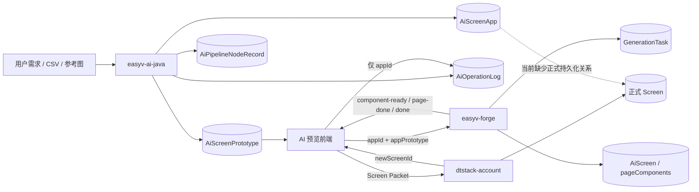

# EasyV AI 大屏生产领域 Ontology V1 设计

> 状态：M5 实施基线（2026-08-31；领域运行时与只读 adapter 已实现，Ontology catalog 使用 `ontology-java-multidomain-v2`）
> 基线日期：2026-08-31
> 目标仓库：`ontology-agent`
> 首个接入领域：EasyV AI 大屏生产链路
> 前置架构基线：[Java Architecture Baseline](../architecture/java-architecture-baseline.md) / [Multi-domain Runtime Architecture](../architecture/multi-domain-runtime-architecture.md)
> 实施状态：M3/M4/M5 已完成；M6 展示验收与生产验证不在本文宣称范围内

## 1. 结论

本次移植的目标不是把原物业行业的表名替换成 EasyV 表名，也不是再实现一套 NL2SQL，而是验证 `ontology-agent` 能否成为一个**领域可装载的 AI 原生语义与执行引擎**：

1. 业务事实仍由各业务系统拥有；
2. Ontology 统一定义实体、关系、指标、时间、证据和权限语义；
3. 智能体只在已激活、已授权、可审计的能力边界内规划与执行；
4. 结论必须能回溯到确定性查询结果，而不是由 LLM 自行拼接跨系统事实；
5. 物业领域继续作为回归样本，EasyV 作为第二个真实领域，证明核心架构不是单行业硬编码。

V1 选择“**AI 大屏从需求输入到生成、预览与另存使用的生产质量分析**”作为最小闭环。它与现有四个项目的真实业务链路一致，既能展示实体、关系和指标问数，又能暴露跨系统血缘、权限、时间口径与证据一致性等生产级问题。

本文只定义 EasyV 领域实例；平台内核、Domain Pack 通用契约、第三领域接入标准和 Java 分层规则以上述两份架构基线为准。本文不得被解释为“增加一组 EasyV metadata 即可完成接入”。

## 2. 范围与非目标

### 2.1 V1 范围

- 对 EasyV AI 大屏生产过程进行只读问数；
- 覆盖原生原型生成、Forge 大屏生成、用户反馈和另存行为；
- 支持 creator-owned 用户范围内的质量概览、失败分布和下钻；space/team scope 尚无已确认的授权来源，保持未实现；
- 对回答中的关键结论返回结构化证据引用；
- 使用确定性 workflow 完成范围解析、指标查询、证据校验和结论渲染；
- 形成可复用的 EasyV Domain Pack 边界，为后续接入其他领域提供真实依据。

### 2.2 V1 非目标

- 不一次性建模 EasyV 的全部产品、协作、组件市场、数据源和发布领域；
- 不把 LLM 作为跨库 Join、权限判断或指标计算引擎；
- 不把当前 `is_save_as_edit` 解释为精确的 `AiApplication -> Screen` 血缘；
- 不在尚未确认物理数据库、网络和授权拓扑前直连生产库；
- 不在 V1 中执行停止任务、重试生成、保存大屏等写动作；
- 不为了“通用化”而一次性重写现有物业分析链路。

## 3. 源码确认的当前状态

### 3.1 `ontology-agent` 已具备的通用控制面

当前项目已经具备一组可复用能力：

- Ontology 定义、版本、发布、激活和执行时版本固定；
- 异步 Job、Event、SSE 与审计链路；
- Main Agent 调用受控工具，工具内部执行确定性分析 workflow；
- PostgreSQL 事实与 Neo4j 可重建关系投影；
- 证据引用、一致性检查、追问上下文和 UI 映射；
- API/Worker 分离及独立 Flyway migration 入口。

这些能力适合作为跨领域控制面保留，不需要因 EasyV 接入而推倒重建。

### 3.2 当前运行时已注册 Property 与 EasyV 两个 Domain Pack

M3 已将物业运行面归入 `property.internal`；M4/M5 已完成 EasyV 的 creator-owned scope、typed facts、
只读 PostgreSQL adapter、确定性 workflow、evidence/claim contract、follow-up policy 与 Spring AI adapter。
当前运行时事实为：

- `AnalysisService` 初始入口使用显式 candidate selection；零候选、不支持和多候选均 fail loud，不依赖注册顺序；
- Property `AnalysisRuntimeCapability` 固定声明 `project`、`collection-rate`、`project-collection-rate` 等物业语义，这是领域内部契约；
- `OntologyBootstrapRepository` 已发布 `ontology-java-multidomain-v2`，在同一 catalog 中保留 Property 并追加 EasyV 定义；
- Property `AnalysisWorkflow` 固定编排 ERP 事实、Cube 指标、Neo4j 关系和结论生成；
- Property `SpringAiConclusionProvider` 固定识别物业收费率相关 claim；
- EasyV 仅声明四类聚合 evidence 和只读 Tool Call，不创建业务写 Action；生产版本、权限和数据完整性仍未知。

因此，当前更准确的判断是：**Property 与 EasyV 已是两个真实 Domain Pack；EasyV 当前只冻结 creator-owned、只读、可证据化的能力，不把未确认的 space/team 授权或生产状态写成事实。**

## 4. EasyV 真实业务链路

### 4.1 四仓职责

| 仓库 | 领域职责 | V1 关注事实 |
|---|---|---|
| `easyv-ai-java` | 自然语言/文件到大屏原型 | AI 应用、原型任务、阶段执行、操作结果、评分 |
| `easyv-forge` | 原型到可运行页面组件 | 应用生成任务、状态、进度、失败原因、页面组件产物 |
| `easyvadmin-monorepo` | AI 预览和工作台另存 | SSE 消费、组件合并、另存行为发起 |
| `dtstack-account` | 大屏正式资产导入与保存 | 新 Screen 创建、ID 重分配、引用改写 |

### 4.2 请求与数据流



关键观察：

1. `appId` 是 Java 原型应用与 Forge 生成请求共同使用的关联键，但不是跨服务正式外键；
2. Forge 通过 SSE 持续产出组件、页面和完成事件，并持久化任务与屏幕级结果；
3. 前端另存时把 Packet 发送给平台后端，平台重新分配 Screen、组件、过滤器和蓝图 ID，并返回 `newScreenId`；
4. 随后的反馈更新仅携带 `appId`，现有链路未把 `appId -> newScreenId` 保存为正式血缘；
5. 因此，当前只能证明“某 AI 应用发生过另存编辑行为”，不能证明“它对应哪一个正式 Screen”。

## 5. 领域边界与统一语言

V1 的 Bounded Context 命名为 `EasyV AI Generation`，负责解释 AI 大屏生产过程，不接管各业务系统的写模型。

### 5.1 核心术语

| 术语 | 定义 | 非等价概念 |
|---|---|---|
| AI 应用（AiApplication） | 用户一次可持续编辑、生成和评价的大屏 AI 工作对象，以 `appId` 标识 | 不等于正式 Screen |
| 原型生成任务（PrototypeGenerationTask） | Java 上游把输入转为屏幕原型的一次执行，以 `generationTaskId/taskId` 标识 | 不等于 Forge 任务 |
| 阶段执行（PipelineNodeExecution） | 原型流水线某个 step/branch 的一次记录 | 不等于整个任务结果 |
| 应用生成任务（ApplicationGenerationTask） | Forge 把原型物化为页面组件的一次任务 | 不等于上游原型任务 |
| 生成产物（GeneratedArtifact） | 原型、页面、组件配置等可追踪输出 | 不等于正式保存资产 |
| 生成反馈（GenerationFeedback） | 用户对某次 AI 操作的评分、评价或另存行为标记 | 不直接证明产物质量因果 |
| 正式大屏（SavedScreen） | 平台后端持久化并纳入权限体系的 Screen 资产 | V1 暂无精确 AI 血缘 |
| 分析范围（AnalysisScope） | 当前调用者被允许分析的 space/team/user 范围 | 不能沿用物业 project/area 假映射 |

### 5.2 身份与权限维度

`spaceId`、`teamId`、`userId` 首先是授权和归属维度，而不是为了图谱展示而制造的业务主体。只有真实查询、关系下钻或权限裁剪需要时，才将其投影为图节点。

## 6. Ontology V1

### 6.1 实体定义

下表是根据四仓源码推导的**候选 Source of Truth**，只证明代码中存在相应映射或调用链；它不证明目标开发/生产环境中表一定存在、数据完整，也不证明 ontology-agent 已获读取授权。P0/P1 必须分别核验部署版本、物理 schema 与权限。

| 实体类型 | 业务主键 | 主要属性 | Source of Truth |
|---|---|---|---|
| `AiApplication` | `appId` | appName、userId、spaceId、teamId、scopeType、selectedTemplateId/name、createdAt、updatedAt | `easyv_saas.ai_screen_app`（Java） |
| `ScreenPrototype` | `appId`（唯一） | screenPrototypeJson、screenTemplateJson、screenStructureXml、createdAt | `easyv_saas.ai_screen_prototype` 当前快照（Java） |
| `PrototypeGenerationTask` | `taskId` | appId、sessionId、taskType、terminalStatus、startedAt、finishedAt | 由 app 的 `generationTaskId`、节点和操作日志归并 |
| `PipelineNodeExecution` | node record ID | taskId、sessionId、stepName、branch、status、duration、output、createdAt | `easyv_saas.ai_pipeline_node_record`（Java） |
| `ApplicationGenerationTask` | `taskId`（唯一） | internalId、appId、status、pagesProgress、failureReason、startedAt、finishedAt | `easyv_saas.generation_tasks`（Forge） |
| `GeneratedScreenDraft` | Forge screen ID / `appId`（唯一） | appId、当前原型/页面/组件配置、创建更新时间 | `easyv_saas.ai_screen` 当前快照（Forge）；表中无 taskId |
| `GeneratedPage` | appId + page index/ID | title、index、status、componentCount | Forge 持久化产物 |
| `GeneratedComponent` | component ID | page、componentType、chartFamily、status；`sourceId/sourceColumns` 目前主要见于 Java/前端中间契约 | Forge 持久化产物/changeset；sourceId/sourceColumns 尚未确认是 Forge 正式输入 |
| `GenerationFeedback` | operation log ID | appId、taskId、actionType、rating、description、remark、isSaveAsEdit、operatedAt | `easyv_saas.dt_ai_operation_log`（Java） |
| `SavedScreen` | screenId | name、groupId、creator、createdAt | `dtstack-account`，Phase 2 血缘对象 |

说明：`PrototypeGenerationTask.terminalStatus/startedAt/finishedAt` 不是直接照搬某一张表的字段，必须由明确的任务级物化规则生成，不能让 LLM 临时推断。

### 6.2 关系定义

| 关系 | From | To | 基数 | V1 可用性 |
|---|---|---|---|---|
| `BELONGS_TO_SPACE` | AiApplication | Space | N:1 | 可用，需权限事实 |
| `BELONGS_TO_TEAM` | AiApplication | Team | N:1 | 可用，需权限事实 |
| `CREATED_BY` | AiApplication | User | N:1 | 可用，需权限事实 |
| `HAS_PROTOTYPE` | AiApplication | ScreenPrototype | 1:1 | 可用，`appId` 唯一 |
| `EXECUTED_AS` | AiApplication | PrototypeGenerationTask | 1:N | 需任务事实归并 |
| `HAS_NODE` | PrototypeGenerationTask | PipelineNodeExecution | 1:N | 可用 |
| `MATERIALIZED_BY` | AiApplication | ApplicationGenerationTask | 1:N | 可用作请求关联，基于 `appId`；非正式 FK |
| `MATERIALIZES_CURRENT_DRAFT` | ApplicationGenerationTask | GeneratedScreenDraft | N:1 | 只能按 `appId` 连到当前快照，不能证明历史任务版本或任务级 FK |
| `CONTAINS_PAGE` | GeneratedScreenDraft | GeneratedPage | 1:N | 需产物结构化 |
| `CONTAINS_COMPONENT` | GeneratedPage | GeneratedComponent | 1:N | 需产物结构化 |
| `HAS_FEEDBACK` | AiApplication | GenerationFeedback | 1:N | 可用 |
| `SAVED_AS` | AiApplication | SavedScreen | 1:N | **当前阻塞：缺少持久化 `appId -> screenId`** |

### 6.3 不应伪造的关系

- 不因 `is_save_as_edit = true` 推导某个确定 `screenId`；
- 不把同一用户、相近时间创建的 Screen 猜测为 AI 应用产物；
- 不把 Forge 当前 `ai_screen` 快照归属于某个确定的历史 generation task，因为该表没有 `taskId`；
- 不把 `teamId` 映射成物业 `projectId` 来复用现有权限代码；
- 不把操作失败直接归因于模型失败，因为现有操作日志结果还受到积分结算结果影响；
- 不把评分或另存相关性表述为因果结论。

## 7. 指标契约

所有比率必须同时返回分子、分母、过滤条件、时间口径和数据新鲜度。V1 禁止只返回一个无法解释的百分比。

### 7.1 可落地指标

状态说明：`Source-confirmed` 仅表示源码中已找到支撑字段与静态口径，不表示查询/视图已经实现，也不表示开发库已经验证；`Requires View` 表示必须先建立并验证派生事实；`Blocked` 表示缺少不可替代的真实关系或事实。

| 指标 | 口径 | 状态 |
|---|---|---|
| Forge 任务完成率 | `completed / (completed + failed)`；`cancelled` 单列，pending/running 不进入终态分母 | Source-confirmed |
| Forge 任务取消率 | `cancelled / all_created_tasks`，同时返回未终态数量 | Source-confirmed |
| Forge 任务 P50/P95 时长 | 对 completed/failed 分组计算 `finishedAt - startedAt` | Source-confirmed |
| Forge 失败原因分布 | failed 任务按 `failureReason` 分组 | Source-confirmed |
| 原型阶段失败分布 | terminal failed task 按失败记录的 `stepName` 分组 | Requires View |
| 原型阶段耗时 P50/P95 | 按 `stepName + branch + status` 聚合节点 `duration` | Source-confirmed；仍需确认记录开关 |
| 操作结算成功率 | `execute_result = success / action attempts`，明确它同时要求业务成功和积分结算成功 | Source-confirmed |
| 评分覆盖率 | 有有效 rating 的操作数 / 可评价操作数 | Source-confirmed |
| 平均评分及分布 | 按 actionType、template、team、时间聚合 rating | Source-confirmed |
| AI 另存行为率 | `is_save_as_edit = true` 的 eligible AI 应用 / eligible AI 应用总数 | Source-confirmed；不等于正式 Screen 转化率 |
| 文件辅助应用占比 | 当前 `ai_screen.appPrototypeFiles` 非空的应用 / 全部可分析 AI 应用 | Source-confirmed；当前快照口径 |
| 页面/组件复杂度 | 从已持久化 prototype/pageComponents 提取 pageCount、componentCount、chartFamilyCount | Requires View |

### 7.2 必须先物化再提供的指标

#### 原型任务成功率

建议生成任务级事实 `easyv_prototype_task_fact`：

- 成功：同一 `taskId` 存在 `branch = MAIN`、`stepName = PipelineCompleted`、`status = SUCCESS` 的终态记录；
- 失败：同一 `taskId` 存在主链路 `status = FAILED` 的终态失败记录；
- 同一任务必须按确定性规则归并为一个终态；
- 没有终态记录的任务归类为 `incomplete/unknown`，不得静默计入成功或失败；
- Candidate、Chat、Supplement 等旁路节点必须依据 branch/taskType 排除，不能仅凭 step 名猜测。

指标：

```text
prototype_completion_rate = succeeded_terminal_tasks
                            / (succeeded_terminal_tasks + failed_terminal_tasks)
```

同时返回 `incomplete/unknown` 数量，防止记录开关、异步落库失败或历史数据不完整被掩盖。

#### 端到端完成率

以 `AiApplication.createdAt` 为 cohort time，按 `appId` 连接：

1. 上游存在成功的 PrototypeGenerationTask；
2. Forge 存在 completed 的 ApplicationGenerationTask；
3. 同一 app 有多次尝试时，必须同时给出 `first_attempt` 与 `eventual_success` 两种口径。

V1 不把“另存”加入端到端成功定义，避免被当前血缘缺口污染。

### 7.3 当前阻塞指标

| 指标 | 阻塞原因 | 解锁条件 |
|---|---|---|
| AI 到正式 Screen 的精确转化率 | 未持久化 `appId -> newScreenId` | 平台导入成功后写入正式 lineage fact |
| AI Screen 后续编辑/发布/访问表现 | 无精确 Screen 血缘 | 同上，并接入 Screen 生命周期事实 |
| 原型任务精确端到端耗时 | 上游缺少统一可信的任务级 start/finish 事实口径 | 建立任务级物化事实并校验历史完整性 |
| 失败后的修复轮次/修复成功率 | Forge subTask history 是否稳定持久化尚未确认 | 明确持久化契约后再建指标 |

### 7.4 `execute_result` 的特殊语义

`AiOperationLog.execute_result` 不是纯粹的“模型/流水线业务成功”：当前实现以 `businessSuccess && settleSucceeded` 记录最终成功，积分扣减失败也会把操作记录为失败。因此：

- 对外命名应为“操作结算成功率”或明确显示组合语义；
- 原型业务成功率应优先使用任务终态事实；
- 需要分析积分系统影响时，单独展示 settlement failure，而不是归到模型失败。

## 8. 时间语义

| 时间字段 | 业务含义 | 推荐用途 |
|---|---|---|
| `AiApplication.createdAt` | AI 工作对象首次创建 | 应用 cohort |
| `PipelineNodeExecution.createdAt` | 节点记录落库时间 | 阶段趋势/诊断，不默认等于执行开始 |
| `PipelineNodeExecution.duration` | 单节点耗时 | 阶段性能 |
| `ApplicationGenerationTask.createdAt` | Forge 任务创建 | 任务 cohort/排队分析 |
| `startedAt` | Forge 开始执行 | 排队时长起点 |
| `finishedAt` | Forge 进入终态 | 执行时长终点 |
| `GenerationFeedback.operatedAt` | 评价或操作发生 | 反馈趋势 |
| `SavedScreen.createdAt` | 正式资产创建 | Phase 2 转化 cohort |

每次问数必须显式选择一个 cohort time。自然语言中的“本周生成”默认不能同时混用应用创建时间、节点落库时间和 Forge 完成时间。

## 9. 证据模型

### 9.1 Evidence Types

| evidenceType | 证据内容 | 最小引用键 |
|---|---|---|
| `easyv-ai-application` | AI 应用归属与模板 | appId |
| `easyv-prototype-task` | 上游任务终态与时间 | taskId、appId |
| `easyv-pipeline-node` | 阶段状态、耗时、错误 | recordId、taskId、stepName |
| `easyv-forge-task` | Forge 状态、进度、失败原因 | generationTaskId、appId |
| `easyv-generated-artifact` | 页面、组件与字段绑定 | appId、pageId、componentId |
| `easyv-generation-feedback` | 评分、评价、另存标记 | operationLogId、appId |
| `easyv-saved-screen-lineage` | AI 应用到正式大屏 | appId、screenId；Phase 2 |

### 9.2 证据一致性规则

- 百分比结论必须有分子与分母证据；
- 失败归因必须引用实际失败任务或失败节点，不能只引用聚合值；
- 图关系只能提供导航和集合裁剪，关键数值仍回到 PostgreSQL/语义层事实；
- 当上游任务成功而 Forge 失败时，结论必须区分两个阶段；
- 当操作日志失败但任务终态成功时，优先提示“业务完成、结算/记录失败”的组合状态；
- 数据源缺失、时间范围不一致或权限范围不一致时 fail loud，不返回伪完整答案；
- 每个回答携带 ontologyVersion、scope、timeRange、sourceFreshness 和 queryExecutionId。

## 10. 三个首发问数场景

### 10.1 生产质量总览

用户问题示例：

> 本周我们团队 AI 大屏生成情况怎么样？哪个阶段最慢？

确定性执行计划：

1. 解析并校验当前用户的 space/team scope；
2. 固定 ontologyVersion 和本周 cohort time；
3. 查询上游原型任务终态、阶段耗时和数据完整性；
4. 查询 Forge 任务完成率、失败率、取消率和 P95；
5. 按 `appId` 计算 first-attempt/eventual end-to-end 指标；
6. 校验证据分子、分母、时间范围和 scope；
7. LLM 只负责组织结论、解释口径并给出证据链接。

### 10.2 失败归因与下钻

用户问题示例：

> 最近 7 天为什么失败变多？给我看最主要的失败阶段和案例。

回答必须分层：

- 上游：按 pipeline step 分布；
- Forge：按 failureReason 分布，例如 resource unavailable、selection failed、schema validation failed、compile failed；
- 结算：单独列积分结算失败；
- 案例：返回 taskId/appId、阶段、错误摘要和发生时间；
- 未证明因果时使用“相关”“集中于”，不使用“导致”。

### 10.3 反馈与使用意愿

用户问题示例：

> 哪类模板评分更高？使用文件输入是否更容易被另存编辑？

允许分析：template、是否带文件、page/component complexity、rating、isSaveAsEdit 的分组相关性。

必须声明：

- `isSaveAsEdit` 是行为标记，不是精确 Screen 转化；
- 评分样本存在主动评价偏差；
- 文件、模板和复杂度与结果的关系是观察性相关，不是因果实验。

## 11. 权限与分析范围

现有物业能力以 org/project/area 与 ERP authorization 为核心，EasyV 不能复用名义相似但语义错误的 scope。

EasyV Domain Pack 必须提供独立 `ScopeResolver`：

1. 从可信调用身份获取 userId；
2. V1 只允许 `EASYV_ANALYST` 可信 principal 的正数 userId，并冻结 `accessMode=creator-owned`；
3. 将冻结 scope 注入所有事实适配器；
4. 在证据和审计中保存有效 scope，而不是只保存用户自然语言；
5. 拒绝跨用户越权查询，拒绝由模型生成未经验证的 scope ID。

`spaceId/teamId` 的真实授权来源和接口仍未确认，不能写入当前冻结 snapshot，也不能映射成物业
`projectId/areaId`；数据库字段存在不等于当前调用者有权读取。

## 12. 数据接入方案

### 12.1 原则

- 业务系统继续拥有原始写模型；
- Ontology 分析侧消费只读、可追溯、版本化的数据产品；
- 不让智能体动态扫描任意业务表；
- 不在运行时由 LLM 自行决定跨库 Join；
- PostgreSQL 保存 canonical analytical facts，Neo4j 只做可重建关系投影；
- 所有物化记录保留 source system、source key、source updatedAt 和 ingestedAt。

### 12.2 建议的分析事实

| 事实/视图 | 用途 | Phase |
|---|---|---|
| `easyv_ai_application_fact` | 应用、归属、模板与 cohort | P1 |
| `easyv_prototype_task_fact` | 上游任务级终态和完整性 | P1 |
| `easyv_pipeline_node_fact` | 阶段失败与耗时 | P1 |
| `easyv_forge_generation_task_fact` | Forge 状态、进度、失败与时长 | P1 |
| `easyv_component_fact` | 页面/组件/图表族/绑定复杂度 | P1/P2 |
| `easyv_generation_feedback_fact` | 评分、评价、另存行为 | P1 |
| `easyv_saved_screen_lineage_fact` | `appId -> screenId` 精确血缘 | P4 |

### 12.3 传输方式的决策边界

在确认部署拓扑前不锁定传输实现：

- 首选由 source owner 提供脱敏、稳定的只读 fact view/API；
- 若来源位于同一受控 PostgreSQL 且 source owner/安全责任人允许：使用独立 readonly role + allowlist schema/view，并由 RLS、scope view 或服务端谓词强制权限；
- 若来源跨服务/跨库：使用批量 ETL、CDC 或服务提供的只读导出契约；
- 若只能通过服务访问：由领域 adapter 调用稳定 API，并将查询版本、响应摘要和 freshness 写入 evidence；
- 无论采用哪种方式，都不得让 ontology-agent 写入来源业务表；禁止 `INSERT/UPDATE/DELETE/TRUNCATE`、DDL、锁表和长事务；
- 数据库凭据只进入服务端/本地受控配置，不进入前端、Git、文档或命令回显，也不复用业务应用通用写账号；
- 开发库验证结论必须标记为“开发环境观测”，不得推断生产数据、权限配置或部署状态。

## 13. EasyV Domain Pack 边界

Domain Pack 不是一份只有实体名的 YAML。一个可执行领域至少包含：

```text
EasyVGenerationDomainPack
├── ontology definitions        实体、关系、指标、时间、证据定义
├── scope resolver              space/team/user 授权解析
├── fact adapters               上游、Forge、反馈和平台事实读取
├── capability validator        意图、参数、版本和数据可用性校验
├── deterministic workflow      问数步骤与失败语义
├── evidence consistency        分子/分母、scope、时间和来源检查
└── conclusion contract         允许的 claim 与引用方式
```

这是第二个真实领域，已经构成抽取 capability boundary 的现实依据；但仍不构成重写所有现有类型的理由。

### 13.1 M4 领域契约审查结论（2026-08-30）

M4 的结论是：EasyV V1 先只提供一个**只读、可证据化的能力**，不把四个仓库的业务表直接暴露给 Agent，也不把生成、停止或保存接口包装成 Action。

```text
domainKey   = easyv
capabilityKey = generation-quality-analysis
displayName = AI 大屏生成质量分析
invocation  = easyv-generation-quality-analysis / easyvGenerationQualityAnalysis / exactCount=1
```

这个能力的职责是按已授权的 space/team/user 范围，回答生成质量、阶段耗时、失败分布、评分与另存行为等问题。它不承诺精确的 `appId -> screenId` 血缘，也不把 `execute_result` 当成纯模型成功。

### 13.2 EasyV V1 的实体、关系与可执行语义

实体仍以 5.1 的定义为准；运行时只允许使用下列最小集合：

| 运行时对象 | 主键/范围 | 可执行用途 | 证据要求 |
|---|---|---|---|
| `AiApplication` | `appId` | cohort、模板、space/team/user 分组 | `easyv-ai-application` |
| `PrototypeGenerationTask` | `taskId` + `appId` | 上游任务终态与尝试口径 | `easyv-prototype-task` |
| `PipelineNodeExecution` | record ID + `taskId` | 阶段耗时、失败阶段和错误摘要 | `easyv-pipeline-node` |
| `ApplicationGenerationTask` | Forge `taskId` + `appId` | completed/failed/cancelled、失败原因和时长 | `easyv-forge-task` |
| `GeneratedScreenDraft` / `GeneratedPage` / `GeneratedComponent` | Forge screen/page/component ID | 当前产物复杂度与字段绑定 | `easyv-generated-artifact` |
| `GenerationFeedback` | operation log ID + `appId` | rating、评价和另存行为 | `easyv-generation-feedback` |

允许的关系是 `AiApplication -> PrototypeGenerationTask -> PipelineNodeExecution`、
`AiApplication -> ApplicationGenerationTask -> GeneratedScreenDraft -> GeneratedPage -> GeneratedComponent`，以及
`AiApplication -> GenerationFeedback`。这些关系中跨服务的 `appId` 连接必须标为 correlation，而不是正式外键；`SAVED_AS` 继续保持 Blocked，直到平台导入成功边界写入正式 lineage fact。

能力的可执行 metric/claim/evidence 最小闭包如下：

- metrics：Forge 完成率、取消率、P50/P95 时长、失败原因分布、原型阶段失败/耗时、评分覆盖率、平均评分/分布、AI 另存行为率；每个结果都带 numerator、denominator、filters、time semantics、freshness。
- claims：`generation-quality`、`stage-bottleneck`、`failure-concentration`、`feedback-association`、`business-success-settlement-distinct`；不得产生物业 `collection-rate` 等 claim，也不得把观察性相关表述为因果。
- evidence：只能使用 9.1 定义的 EasyV evidence type；聚合值必须能回溯到分子、分母及其 scope/time range。缺任务终态、缺失败记录、跨范围或 freshness 不满足时，返回可诊断失败，不返回伪完整结果。

### 13.3 Scope snapshot、selection eligibility 与追问

EasyV 不复用 `AccessScope.projectIds/areaIds` 作为业务范围。M4 已确认 V1 只能冻结 creator-owned
用户范围，当前 snapshot 形状为：

```json
{
  "domainKey": "easyv",
  "schemaVersion": 1,
  "values": {
    "userId": "<trusted-positive-principal-user>",
    "accessMode": "creator-owned"
  }
}
```

`spaceIds/teamIds` 不是当前冻结形状；未来若确认独立授权来源，必须新增 EasyV 自己的 snapshot schema
与校验规则，不能把 `teamId` 映射成物业 `projectId`。每个 EasyV fact adapter 必须接收这个已校验的
snapshot，不能从自然语言再次解析权限。

能力选择必须是服务端可验证的候选选择：

1. 注册存在、pinned catalog 中 descriptor/binding 已发布且激活；
2. 问题与 capability 的初始意图匹配；
3. EasyV scope resolver 能从可信 principal 得到非空、可查询范围；
4. P1 fact provider 的 schema/version/freshness 检查通过；
5. 候选恰好一个才创建 binding；零个返回 unsupported，多于一个返回 ambiguity；禁止 `bindOnly`、按注册顺序默认物业或静默选择第一个。

初始请求创建的 session 可继续保存用户身份的 ownership scope，但**能力 scope 只能以提交时生成的 domain snapshot 为准**。提交后把 `domainKey + capabilityKey + ontologyVersionId + resolvedScope` 固定到 binding；重试与追问只复用这份 binding。EasyV 追问策略只允许修改时间、cohort、过滤维度和展示粒度等已支持上下文，不能重新选 domain/capability、扩大 scope 或混入 Property evidence。

### 13.4 M5 最小代码改造计划（文件级，历史实施记录）

以下保留第二能力落地前的最小改造计划及边界；当前实现已按此计划完成，表格不再表示待实施工作，
也不表示 M6 展示验收已经完成：

| 文件/目录 | 最小改造 | 不做的事 |
|---|---|---|
| `capability/api/CapabilityRegistration.java`、`CapabilityRegistry.java` | 把“初始问题校验”收敛为可枚举、可解释的 candidate/selection contract；支持按选中的 `CapabilityId` resolve scope、validate catalog/scope | 不引入动态插件、反射或远程 SPI |
| `capability/internal/application/StaticCapabilityRegistry.java` | 索引 `(domainKey, capabilityKey)`，提供零/一/多候选的明确错误；保留重复注册和版本漂移 fail loud | 不保留 `onlyRegistration()/bindOnly()` 作为第二能力入口 |
| `analysis/AnalysisService.java` | 删除 `projectIds/areaIds` 的通用入口门禁；提交时向 registry 请求唯一候选并通过该 registration 生成 binding；session 仅保存选择意图/ownership，不把 Property scope 当 EasyV scope | 不在 Service 中增加 `if (easyv)` / `if (property)` |
| `auth/AccessScope.java`、`analysis/AnalysisSession.java` | 保留现有 Property 登录与 session ownership 语义；不得再用 project/area 判断所有领域“可分析”。若 M4 证明授权服务能直接按 userId 解析，则无需扩展该类型 | 不把未知的 space/team 字段硬塞进物业 DTO |
| `property/internal/application/PropertyCapabilityRegistration.java` | 适配新的 candidate contract，保持物业 scope、初始语言和 catalog 校验行为等价 | 不修改 Property 指标、ERP/Cube/Neo4j 事实口径 |
| `property/internal/*` 与 `easyv/internal/*` | 新增 EasyV registration、typed `EasyVScopeResolver` port/adapter、facts、deterministic workflow、claim/evidence validator、follow-up policy；目录结构沿现有 Domain Pack | 不复制 `AnalysisService`、不共享 Property internal 类型 |
| `ontology/bootstrap` 与 `ontology` 测试 fixture | 在 P1 golden facts 和业务确认后增加 EasyV definition/version；发布校验验证 descriptor 的完整引用 | 不先用 metadata 或 YAML 冒充可执行能力 |
| `execution/AnalysisWorker.java`、`execution/ExecutionRepository.java` | 以现有通用 binding/descriptor/result/evidence 机制承载 EasyV，补 EasyV contract regression tests；除非测试发现真实缺口，不改主链 | 不新增 EasyV 分支、Action runtime 或来源库写入 |
| `AnalysisController.java` 与 Web contract tests | 映射 candidate zero/ambiguous、scope invalid、data unavailable 等稳定错误；只有前端确实需要人工选择时才增加显式 capability 参数 | 不让客户端直接提交未经 registry 校验的 capability ID |

如果 M4 发现授权只能通过独立权限 API 获取，则只新增 EasyV adapter 调用 `principal.userId()`；如果授权信息必须随认证 session 携带，才进一步修改 `AuthSession` 持久化。两者不能在没有来源证据时同时预建。

### 13.5 M5 验收测试矩阵（历史实施记录）

| 层级 | 场景 | 断言 |
|---|---|---|
| Registry unit | Property 与 EasyV 各有一个匹配候选 | 返回明确 `CapabilityId`，不依赖注册顺序 |
| Registry unit | 零候选 / 多候选 | 分别返回 unsupported / `CAPABILITY_SELECTION_AMBIGUOUS`，无 binding |
| Scope contract | EasyV creator-owned user 范围 | snapshot 的 domain/schema/userId/accessMode 严格校验；空用户、越权用户、跨域值失败；space/team 保持未确认 |
| Property regression | 物业项目/区域范围与收费率问题 | 原有 scope、语言校验、descriptor、结果和追问行为保持等价 |
| Submission contract | EasyV submit 后 catalog 变化 | job 只使用提交时 ontology + capability + scope snapshot；版本漂移明确失败 |
| Worker contract | EasyV 正常结果 | 只调用 descriptor 声明的 tool 一次；result/evidence binding、scope ref、claim 集合一致 |
| Worker failure | 缺 provider、部分事实、终态不完整、跨范围事实 | 失败事件与 snapshot 含 binding/trace/source；不返回默认 0 或伪成功 |
| Follow-up contract | EasyV 时间/过滤追问 | 复用原 binding/scope/version；不重新路由、不扩大 scope、不混入 Property evidence |
| Persistence | Job、snapshot、follow-up 重载 | binding 完整可反序列化；缺失/篡改 fail loud |
| Read-only integration | P1 fact view/API 读取 | 使用 allowlist/readonly 边界、记录 freshness 与 source key；验证无业务库写入 |
| Cross-domain acceptance | 同一运行时先 Property 后 EasyV | 两者可明确选择，实体、指标、scope、claim、evidence 不串域 |

M5 已以选择、权限、冻结、追问、证据和失败语义的测试证据收口；未确认的生产部署、生产权限和
展示契约仍保持 Blocked。

### 13.6 M4/P1 开发数据库只读核验（2026-08-30）

本节只记录本次开发环境核验的边界与结果，不把连接失败解释为数据不存在，也不推断生产环境。

**安全措施与配置证据**

- 已读取项目 `AGENTS.md`、`CLAUDE.md`，并以 `rg -l` 定位 `easyv-ai-java/easyv-ai/src/main/resources/application-dev.yml` 与数据源配置类；未读取或输出密码、完整连接串、token 或密钥。
- `application-dev.yml` 的 profile 文件名、注释（saas-dev 集群）和 JDBC 数据库名 `easyv` 共同表明目标是开发环境；目标 host 属于私网地址，本文不披露完整 host。配置中的目标端口为非默认映射端口；没有根据注释中的其他端口自行猜测替代目标。
- 宿主机 PostgreSQL 客户端不可用，因此仅在临时目录准备客户端依赖；凭据只在进程内使用，未写入仓库、文档或命令回显。
- 计划中的数据库查询门禁为 `BEGIN TRANSACTION READ ONLY`、短 `statement_timeout`/`lock_timeout` 和 `idle_in_transaction_session_timeout`，并需先验证 `transaction_read_only`；首次握手失败时未进入事务，也未执行任何 SQL，恢复后按同一门禁完成核验。

**连接结果**

- 时间线：首次尝试时 TCP 可达但 PostgreSQL 握手超时；随后端点恢复，`sslmode=disable` 成功连接。端点明确返回非 SSL 响应，未猜测或切换其他端口。
- 当前连接在 `BEGIN TRANSACTION READ ONLY` 内验证 `transaction_read_only=on`；`statement_timeout=3s`、`lock_timeout=1s`、`idle_in_transaction_session_timeout=5s` 均已生效。
- 当前配置角色不是独立只读角色：角色属性为 superuser、可建库、可建角色、可登录且 bypass RLS；对五张 Java 候选表的 `SELECT/INSERT/UPDATE/DELETE` 均为 true。本轮仍严格限制在 READ ONLY 事务内，未执行写操作。

**开发库观测（非生产结论）**

- 可见 schema 为 `easyv_saas`；五张 Java 候选表均存在。`ai_screen_app` 449 行，`app_id` 非空且无重复，`generation_task_id` 空 94 行、非空 distinct 355；创建时间约覆盖 2026-06-29 至 2026-08-30。
- `ai_screen_prototype` 355 行，`app_id` 非空且无重复；按 `app_id` 与应用表连接时 355 个应用有原型、94 个应用没有原型。`ai_screen_session` 510 行，`session_id` 无重复，`app_id` distinct 449 但重复 excess 61；`status` 当前全部为 `ACTIVE`，关键时间/任务字段未见空值。
- `ai_pipeline_node_record` 8,663 行、`task_id` distinct 860；分支为 `MAIN=5,384`、`CANDIDATE=2,157`、`CHAT=1,098`、`LAYOUT=24`，状态为 `SUCCESS=8,606`、`FAILED=57`，`duration_ms` 空 1,655 行。`MAIN + PipelineCompleted` 当前 414 个 task 全为 `SUCCESS`；主链按 task 聚合仍有 43 个含失败记录，不能只用 `PipelineCompleted` 计算失败率。节点时间约覆盖 2026-06-17 至 2026-08-30；阶段耗时 P50/P95（毫秒）示例：`Step1=20,832/37,229`、`Step2-Main=39,864/113,233`、`ThemeMetricGen=16,813.5/35,569`、`Step6=6,861.5/29,040.85`。
- `dt_ai_operation_log` 1,347 行；`app_id` 空 300 行、`task_id` 无空值且无重复，`execute_result` 为成功 915/失败 432；有效 rating 22 行（1..5），`is_save_as_edit` 非空 70 行（false 62、true 8），`fail_reason` 非空 311 行。操作时间约覆盖 2026-06-29 至 2026-08-30；失败原因只做哈希分组，未读取原文。
- 同库可见 Forge 表 `easyv_saas.generation_tasks`：101 行，状态 `completed=86`、`failed=15`，`cancel_requested` 当前全为 false；`app_id` 非空 distinct 58，按 `app_id` 与 Java 应用表连接有 87 行/47 个 distinct 应用匹配。Forge `task_id` 与 Java `ai_screen_app.generation_task_id` 当前无匹配，不应把两者当作同一任务主键。终态任务 `started_at` 空 4 行、`finished_at` 无空值，执行时长 P50/P95 约 24,855/52,574 毫秒；失败原因仅作 5 个哈希桶的数量聚合。
- 同库可见 Forge 当前快照 `easyv_saas.ai_screen`：50 行，`app_id` 无重复，`generation_status=completed` 43、`failed` 7；46 个应用能按 `app_id` 与 Java 应用表匹配。该表没有 `screen_id` 列。正式资产表 `easyv_saas.dt_easyv_screen` 有 177 个非空 `screen_id`，但没有 `app_id`/`task_id` 连接列；可见 schema 的 `source_id` 列未发现。因此当前开发数据也不能证明 `appId -> screenId` 或 `sourceId` 持久化关系。

关系观测仅表示当前开发库按字段值连接的结果，不表示正式外键：应用与 session 连接到 413 个应用；应用 `generation_task_id` 与节点 `task_id` 连接到 323 个应用；应用与操作日志按 `app_id` 连接到 446 个应用。应用、Forge task 和节点之间存在缺失/多次尝试，必须使用确定性任务级物化规则，不能让 LLM 临时归并。

**P1 候选的当前结论**

- 源码事实仍是：`ai_screen_app` 有 `app_id/generation_task_id`，`ai_pipeline_node_record` 有 `task_id/step_name/branch/status/duration_ms`，`dt_ai_operation_log` 有 `app_id/task_id/execute_result/fail_reason/rating/is_save_as_edit`；源码字段不等于正式外键或生产完整性。
- 开发库已足以支持候选指标的可执行性评估：Forge 完成/失败、终态时长、失败哈希分布、原型阶段状态/耗时、操作结算结果、评分覆盖和另存行为均有实际行与时间范围；节点记录存在缺失 duration、主链失败未形成 `PipelineCompleted`、Forge 与 Java task ID 不同。当前 adapter 对部分缺失耗时保留有效样本并披露覆盖率，仅在 timed 样本为零时失败；`incomplete/unknown` 仍需与任务层、操作结算层区分。
- `sourceId`/`sourceColumns` 仍是 Java/前端产物契约字段，未证明为独立业务列；`screenId` 只在正式资产表侧出现，开发库没有 `app_id -> screen_id` 可证连接。`SAVED_AS` 与正式 Screen 转化率继续 **Blocked**。
- 本轮数据库审计已完成，但生产部署版本、生产权限、历史保留策略和生产数据完整性仍未知；开发环境观测不得推断生产行为。

### 13.7 M5c Ontology Catalog 实施证据（2026-08-31，历史子阶段记录）

本子阶段只实施 `ontology/bootstrap` 的 catalog baseline；EasyV runtime 与事实库 adapter 在随后 M5
子阶段完成。已发布的
`ontology-java-baseline-v1`（`1.0.0`）保持 ID、semver、定义和计数不变；空库直接生成新的
`ontology-java-multidomain-v2`（`2.0.0`）。已有严格 canonical v1 时，bootstrap 在同一事务中创建未发布 v2，复制完整 Property 定义并追加 EasyV 定义，完成发布完整性与能力 catalog 校验后再退役 v1、发布 v2、写入 publish record 和 audit event。非 canonical/半成品状态 fail loud，不覆盖；重复调用在 v2 ready 后无写入，已 pin v1 的任务仍可通过 `ontologies.published(v1)` 读取 deprecated 版本。

legacy v1 的完整性校验只针对其冻结的 Property capability；不会因为当前 registry 已启用新的 EasyV capability 而把合法 v1 误判为不完整。v2 发布候选才执行当前完整 registry 的联合校验。

v2 的最小 EasyV 定义包含：`easyv-ai-application`、`prototype-generation-task`、`pipeline-node-execution`、
`application-generation-task`、`generation-feedback`；运行时对齐的核心 key 为
`easyv-ai-application`、`easyv-generation-quality`、`easyv-generation-time`。指标变体覆盖 Forge 完成/失败、终态耗时、流水线阶段耗时/失败、评分覆盖、另存行为以及业务结果与结算结果区分；时间语义固定为 source event/create time。tool/plan/evidence 仅声明当前只读分析所需的范围、事实读取、完整性校验和证据渲染，不加入 Screen lineage、sourceId 或 action 定义。

实现证据由 bootstrap 持久化测试覆盖：Property 与 EasyV 定义同时存在，发布后 v2 catalog 可被严格 validate，blocked lineage/action key 不出现，重复 bootstrap 保持定义与 audit 计数不变；审计失败时版本、定义和 publish record 一并回滚。生产版本、生产 catalog 和部署升级结果仍未知。

### 13.8 M5 EasyV Runtime 实施证据（2026-08-31）

- `easyv/internal/application` 已实现 creator-owned scope、typed `EasyVGenerationFacts`、确定性 workflow、五类受限 claim、EvidenceReference 与只允许时间变化的 follow-up policy；`easyv/internal/adapter/out/llm` 仅允许一次 Spring AI Tool Call。
- `easyv/internal/adapter/out/postgres/EasyVCanonicalFactAdapter` 当前从已发布且 execution-pinned 的 canonical facts 读取四类 source；部分 duration 缺失会显式披露 timed/eligible 覆盖率，只有全量缺失才返回 duration missing。此前已删除的旧 source-reader 仅作为历史实现背景，不代表当前 runtime 仍直连源表。Application 删除口径已冻结：源 `is_delete='1'` 作为 tombstone 写入 `facts.easyv_ai_application.is_deleted`，随 product version 保留；问数只统计 `not is_deleted` 的 active Application。Prototype / Pipeline / Forge / Feedback 无独立删除字段，跟随 active Application 归属。
- Java 21 定向测试覆盖 scope、日期、follow-up、workflow freshness/空事实/范围一致性与 PostgreSQL Testcontainers；这些是源码和开发环境证据，不代表 M6 展示契约或生产验证完成。

## 14. 最小代码演进方向

### 14.1 保留不动

- Session/Job/Event/SSE 执行外壳；
- Ontology 版本发布与运行时 pin；
- 审计、证据引用和图同步模式；
- 物业收费率 workflow，继续作为回归能力；
- 现有 API 契约，除非 EasyV 场景证明其无法表达必要输入。

### 14.2 需要形成的最小边界

```java
interface AnalysisCapability {
    String key();
    ValidationResult validate(AnalysisRequest request, RuntimeOntology ontology);
    AnalysisResult execute(AnalysisExecutionContext context);
}
```

公共上下文只承载真实共性：

- execution/session identity；
- pinned ontology version；
- authenticated principal 与 resolved scope；
- time range/timezone/cohort definition；
- audit/evidence collector。

领域输入、计划、事实 DTO 和 claim 类型保留强类型，不把所有数据退化成 `Map<String, Object>`。

### 14.3 推荐的能力选择方式

1. Main Agent 先根据已激活 ontology/tool binding 选择 capability key；
2. 服务端 registry 校验该 capability 是否存在且与 pinned version 匹配；
3. capability validator 校验问题、scope、时间和必要数据；
4. workflow 执行确定性查询；
5. conclusion provider 只能消费结构化结果和 evidence。

不建议把新的 EasyV 判断继续追加到 `AnalysisService` 的 `if/else`，也不建议先建立插件框架、动态 classloader 或远程扩展市场。

## 15. Action Ontology 的后续位置

V1 只读问数不需要 Action Ontology。后续若展示“停止失败任务”“按原输入重试”等动作，必须新增正式契约，而不是把已有 HTTP endpoint 直接暴露给 LLM。

最小 Action Definition 至少包括：

- actionKey、version、targetType；
- input schema 和 output schema；
- permission binding；
- preconditions；
- risk level 与是否人工确认；
- idempotency key 规则；
- 执行 adapter 与 timeout；
- audit payload、result 和 failure semantics。

候选动作：

| 动作 | 现有业务入口 | 前置缺口 |
|---|---|---|
| 停止 Forge 生成 | 已有 stop endpoint | 目标任务权限、可停止状态、确认和审计 |
| 重新生成应用 | 已有 generate 流程 | 输入快照、费用提示、幂等和重试边界 |
| 打开失败详情 | UI navigation | 安全的深链与 scope 校验；它不是业务写操作 |

正式 Screen 保存不建议作为首个 Action：其 Packet 导入、ID 重写、权限和资产生命周期更复杂，应在血缘闭环后单独设计。

## 16. 分阶段实施计划

### P0：冻结真实契约

- 确认四仓当前生效分支和部署版本；
- 确认表名、schema、主键、字段时区和历史保留策略；
- 确认 pipeline record 在目标环境的开启状态与完整率；
- 确认 space/team/user 的授权来源；
- 用一批脱敏数据复核 task terminal 归并规则；
- 与业务方签字确认指标名、分母、取消任务和多次尝试口径。

验收：形成字段级数据字典和 10 个已人工核对的跨系统 app/task 样本。

### P1：只读分析事实与 Ontology 基线

门禁：P1 涉及数据库读取，只有主阶段 M3 的 Property 行为等价通过后才能执行；P0 的纯源码/契约整理可以提前进行。

- 创建 EasyV 分析事实/视图及增量策略；
- 建立任务终态、数据完整性和 freshness 检查；
- 发布 EasyV Ontology draft/version；
- 建立 PostgreSQL canonical facts 与 Neo4j 可重建投影；
- 为每个指标编写 golden query 和边界用例。

验收：SQL/语义层能独立回答首发三类问题，且结果经人工复核。

### P2：第二个运行时 Capability

- 使用 M2/M3 已验证的 `AnalysisCapability` 与 Registry 边界，不在 EasyV 接入时再次抽象平台；
- 保持物业实现行为不变；
- 实现 EasyV scope resolver、fact adapters、workflow 和 claim contract；
- 增加跨领域路由、版本固定、权限拒绝、数据缺失和证据一致性测试。

验收：同一运行时可明确选择 property 与 EasyV 两个能力，互不混用实体、指标和权限。

### P3：演示体验与可观测性

- UI 展示计划、阶段、数据源、关键证据和失败原因；
- 提供三个固定场景与可追问路径；
- 准备脱敏、可重复的数据快照；
- 记录 executionId、ontologyVersion、scope、source freshness 和耗时；
- 进行断源、越权、空数据和部分失败演练。

验收：演示不是预录 happy path，关键失败可解释、可定位且不返回伪成功。

### P4：精确 Screen 血缘与受控动作（可选）

- 在平台导入成功边界持久化 `appId -> newScreenId`；
- 补偿历史数据时只使用可证明映射，不做相似时间猜测；
- 接入正式 Screen 生命周期指标；
- 选择一个低风险动作完成权限、确认、幂等、审计和失败闭环。

验收：能从 AI 应用精确导航到正式 Screen，并能审计每次动作的请求者、目标、输入、结果和失败。

## 17. 演讲与演示主线

建议不从“多 Agent 有多少角色”开始，而从一次真实业务问题展开：

1. **问题**：本周团队 AI 大屏生成质量如何；
2. **Ontology**：同一句“生成成功”在上游、Forge、结算和另存中有不同语义；
3. **Execution**：智能体按 scope 和 pinned version 执行确定性计划；
4. **Evidence**：从团队概览下钻到 app、task、stage 和 failure reason；
5. **Boundary**：明确告诉观众为什么当前不能回答“最终生成了哪个 Screen”；
6. **Evolution**：物业与 EasyV 共存，证明变化的是 Domain Pack，不是复制一套系统；
7. **Action**：说明写操作如何进入权限、确认、幂等和审计边界，而不是现场直接调用接口。

一个合适的现场结构是：架构背景 3 分钟、Ontology 与业务链路 5 分钟、三轮问数/追问 8 分钟、血缘缺口与下一步 3 分钟。具体时长可按最终分享安排调整。

## 18. 实施前待确认事项

1. 分享对象、总时长，以及更偏架构评审还是成果展示；
2. 演示使用开发环境实时数据，还是冻结的脱敏快照；
3. 四个系统的目标环境是否共库、跨库或跨网络；
4. pipeline node record 在目标环境是否持续开启、保留多久；
5. 一个用户可分析哪些 space/team，授权接口由哪个服务负责；
6. “成功率”采用 first attempt、eventual success，还是两者同时展示；
7. cancelled 是否进入业务失败口径；
8. 是否要在本次成果中展示任何真实写动作；
9. 是否允许补齐 `appId -> screenId` 正式血缘，以及由哪个服务拥有该关系。

## 19. 验证边界

本文结论来自 2026-08-31 的四仓源码索引、Java runtime 实现和 EasyV 开发库只读核验：

- 已确认：类型、调用链、持久化字段、SSE 事件、平台导入边界和现有 ontology runtime 结构；
- 未确认：生产部署版本、生产数据库拓扑、历史数据完整性、线上配置、真实生产权限接口与生产指标值；
- 开发库查询使用 READ ONLY 边界；高权限开发角色仅在显式 development override 下通过角色门禁，未执行业务写操作；
- 因此本文是带实现证据的领域基线，不是生产数据审计报告；不宣称 M6 展示契约或生产 EasyV 问数已完成。

## 20. 源码索引

### 20.1 仓库根映射

| 代号 | 本次分析路径 |
|---|---|
| `ontology-agent` | `/Users/dsy/Documents/dell-code/ontology-agent` |
| `easyv-ai-java` | `/Users/dsy/Documents/easy-v/easyv-ai-java` |
| `easyv-forge` | `/Users/dsy/Documents/easy-v/easyv-forge` |
| `easyvadmin-monorepo` | `/Users/dsy/Documents/easy-v/easyvadmin-monorepo` |
| `dtstack-account` | `/Users/dsy/Documents/easy-v/dtstack-account` |

### 20.1.1 本次复核 Git 基线

| 仓库 | 分支 | HEAD（short SHA） | 工作区 |
|---|---|---|---|
| `ontology-agent` | `main` | `9899d203df4d` | dirty（含本次文档修改） |
| `easyv-ai-java` | `fix/gc/pool-result-and-capability-guidance` | `d48420aeec88` | dirty |
| `easyv-forge` | `main` | `6820ccf3294c` | clean |
| `easyvadmin-monorepo` | `feat/gc/address-list-global-search-backend` | `c8e2d8fca27d` | dirty |
| `dtstack-account` | `dev/gc` | `91a18e789ff3` | clean |

> dirty 状态只表示工作区存在未提交变更；本次未读取或展示变更内容，也不将未提交内容当作部署事实。

### 20.2 `ontology-agent`

- `backend-java/src/main/java/com/dip3/ontologyagent/analysis/AnalysisService.java:37-53`：初始问题通过 Registry candidate selection 选择 Property 或 EasyV，提交时固定 capability binding；
- `backend-java/src/main/java/com/dip3/ontologyagent/property/internal/domain/AnalysisRuntimeCapability.java`：Property 实体、指标、计划、工具和证据类型；
- `backend-java/src/main/java/com/dip3/ontologyagent/ontology/bootstrap/OntologyBootstrapRepository.java:146-285`：物业基线定义；
- `backend-java/src/main/java/com/dip3/ontologyagent/property/internal/application/AnalysisWorkflow.java`：Property 分析 workflow、证据一致性与渲染；
- `backend-java/src/main/java/com/dip3/ontologyagent/easyv/internal/application/EasyVGenerationWorkflow.java`：EasyV 四源 facts、覆盖率、五类 claim 与确定性渲染；
- `backend-java/src/main/java/com/dip3/ontologyagent/easyv/internal/adapter/out/postgres/EasyVCanonicalFactAdapter.java`：EasyV 已发布 canonical facts reader 与 freshness/耗时边界；来源库只由 ingestion connector 读取；Application tombstone 保留在 facts，问数只统计 active 行；
- `backend-java/src/main/java/com/dip3/ontologyagent/property/internal/adapter/out/llm/SpringAiConclusionProvider.java`：Property claim contract；
- `backend-java/src/main/java/com/dip3/ontologyagent/capability/api/FollowUpPolicy.java`：按冻结 capability binding 分派追问策略的公共 Port；
- `backend-java/src/main/resources/db/migration/V1__init.sql:535-737`：Ontology/Metric/Tool/Plan/Evidence 注册表；
- `docs/data-contracts/graph-sync-baseline.md`：PostgreSQL canonical facts 与 Neo4j projection 边界；
- `docs/java-backend-phase-3-operational-closure.md`：当前静态验证与 live provider/生产数据验证边界。

### 20.3 `easyv-ai-java`

- `dtstack-bean/src/main/java/com/dtstack/easyv/dtstackbean/entity/saas/AiScreenApp.java:26-91`：AI 应用标识、归属、模板和生成任务；
- `dtstack-bean/src/main/java/com/dtstack/easyv/dtstackbean/entity/saas/AiScreenPrototype.java:23-72`：原型、模板和 XML 产物；
- `dtstack-bean/src/main/java/com/dtstack/easyv/dtstackbean/entity/saas/AiPipelineNodeRecord.java:20-92`：task/session/step/branch/status/output/duration；
- `dtstack-bean/src/main/java/com/dtstack/easyv/dtstackbean/entity/saas/AiOperationLog.java:21-85`：操作结果、失败、评分、另存标记、app/task；
- `easyv-ai/src/main/java/com/dtstack/easyv/ai/enums/ScreenAiEventType.java:6-24`：prompt completion、prototype generation、chat refactor、metric generation；
- `easyv-ai/src/main/java/com/dtstack/easyv/ai/tool/screen/PointsDeductService.java:30-60`：操作与积分结算边界；
- `easyv-ai/src/main/java/com/dtstack/easyv/ai/tool/screen/PointsDeductService.java:93-123`：`execute_result` 同时受业务结果和结算结果影响；
- `easyv-ai/src/main/java/com/dtstack/easyv/ai/tool/screen/ScreenPlanningPipelineService.java:620-700`：最终产物持久化、失败记录与结算；
- `easyv-ai/src/main/java/com/dtstack/easyv/ai/tool/screen/ScreenPlanningPipelineService.java:811-882`：`PipelineCompleted` 虚拟 step 的持久化；
- `easyv-ai/src/main/java/com/dtstack/easyv/ai/tool/screen/harness/PipelineMessageRecorder.java:263-279`：失败任务的 FAILED 信号记录；
- `easyv-ai/src/main/resources/application.yml:66-82`：默认 pipeline record 配置（本次未读取配置值）；
- `easyv-ai/src/main/resources/application-prod.yml:145-158` 与 `application-prod-online.yml:145-158`：源码中的生产 profile 配置（本次未读取配置值）；实际部署值仍需环境验证。

补充的运行时契约锚点：

- `easyv-ai/src/main/java/com/dtstack/easyv/ai/controller/AgentToolController.java:95-108`：自然语言/文件请求进入 pipeline SSE；
- `easyv-ai/src/main/java/com/dtstack/easyv/ai/tool/screen/ScreenPlanningPipelineService.java:132-180`：生成 taskId、建立 session、执行主 pipeline；`:620-635`：最终产物保存；
- `easyv-ai/src/main/java/com/dtstack/easyv/ai/tool/screen/Step5ResultEnricher.java:136-180`：`sceneType/sourceId/sourceColumns/description` 的回填与描述优先级；
- `easyv-ai/src/main/java/com/dtstack/easyv/ai/tool/screen/PrototypeConfirmationViewAssembler.java:44-55`：确认视图输出 `sourceColumns`。

### 20.4 `easyv-forge`

- `prisma/schema.prisma:21-57`：`AiScreen` 与 `GenerationTask` 持久化模型；
- `src/api/application.controller.ts:50-94`：应用生成入口、计费和入队；
- `src/api/application.controller.ts:110-183`：SSE 与 stop endpoint；
- `src/application/application-generation.service.ts:57-79,97-152,163-250`：按页面/组件编排并发出事件；
- `src/generation/events.ts:45-80`：`component-ready`、`page-done`、`done`、`failed` 事件；
- `src/generation-task/application-generation.processor.ts:65-150`：任务运行与事件持久化；
- `src/generation-task/generation-task.service.ts:99-193,195-294,296-361,368-420`：任务创建/复用、增量快照、终态与失败原因；
- `src/prototype/prototype-to-mapping.ts:74-89`：`chartFamily/description/dataType` 映射；
- `src/data-transform/component-data-contract.service.ts:79-145` 与 `src/data-transform/component-binding-adapter.service.ts:79-115`：组件字段契约与 `fieldsMapping` 校验；
- `src/llm/schemas/component-data.schema.ts:33-47,101-122`：AI/TRANSFORM 数据、字段映射和静态行结构；
- `src/agents/data-source.agent.ts:686-750,867-895`：DataSource 决策、AI static mock 与无绑定失败边界；
- `src/compiler/core.ts:933-1024`：最终组件数据字段映射校验与编译。

### 20.5 `easyvadmin-monorepo`

- `apps/easyv-workspace/src/pages/AiGenerateScreen/AiGenerateScreen.tsx:321-351`：创建 Java `appId`；
- `apps/easyv-workspace/src/pages/AiGenerateScreen/api/config.ts:14-43`：Java/Forge 入口和 SSE API 映射；
- `apps/easyv-workspace/src/pages/AiGenerateScreen/utils/screenPipeline.ts:989-1052`：Java 结果到 Forge `appPrototype.pages`；
- `apps/easyv-workspace/src/pages/AiGenerateScreen/AiScreenPreviewStep/applicationGeneration.ts:236-430,459-466`：可恢复 SSE、组件合并和 Forge 入队；
- `apps/easyv-workspace/src/pages/AiGenerateScreen/hooks/useApplicationGenerationFlow.ts:198-292`：应用生成前端流程；
- `apps/easyv-workspace/src/pages/AiGenerateScreen/AiScreenPreviewStep/AiScreenPreviewStep.tsx:235-288`：另存获取 `newScreenId` 后仅按 `appId` 更新反馈；
- `apps/easyv-workspace/src/pages/AiGenerateScreen/AiScreenPreviewStep/utils.ts:187-255`：AI 产物到 Screen Packet 的转换；
- `apps/easyv-workspace/src/services/screens.ts:180-205`：Screen Packet 导入请求。

### 20.6 `dtstack-account`

- `apps/easyv-backend/src/screen/screen.controller.ts:1057-1094`：`POST /packet/:groupId`、权限、数量守卫与新 Screen ID；
- `apps/easyv-backend/src/screen/screen.service.ts:1244-1280`：事务内 ScreenImporter、引用替换与 group 更新；
- `apps/easyv-backend/src/common/utils/screen.importer.ts:233-275,354-378,442-460`：Packet 解析、绑定替换、Screen 创建与 old→new ID map；
- `apps/easyv-backend/src/common/utils/screen.importer.ts:1040-1071,1095-1158,1228-1325`：Screen、container、component、AI-agent 引用改写；
- `apps/easyv-backend/src/common/utils/screen.utils.ts:22-125`：组件引用和交互表达式 `fixInteractions` 改写。
